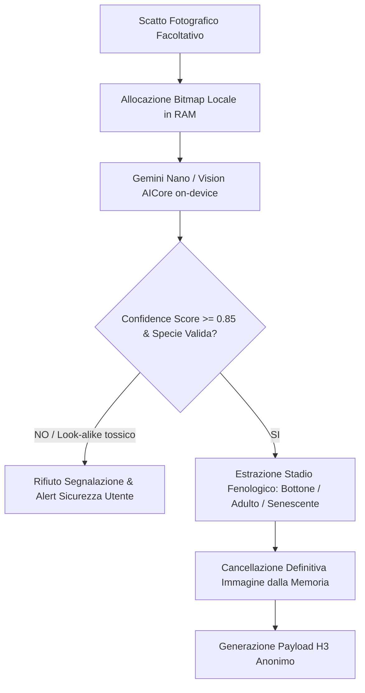
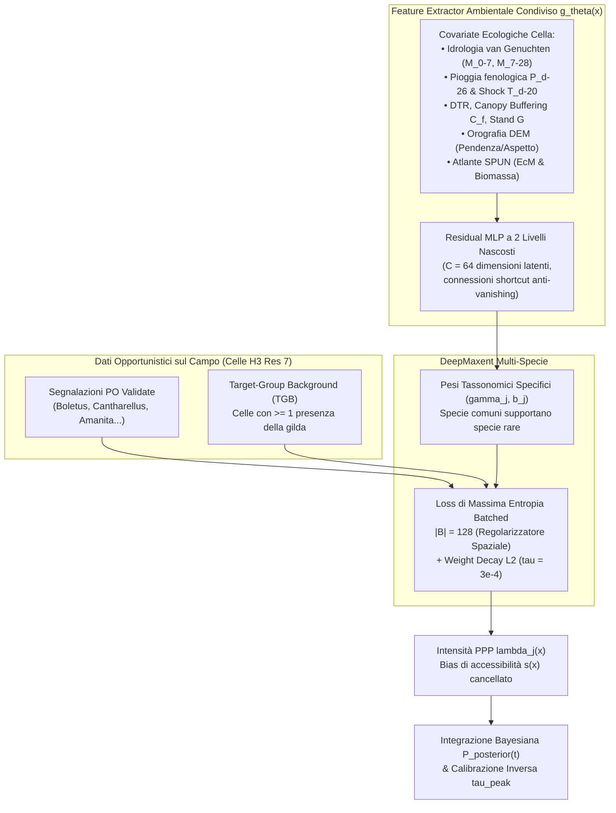
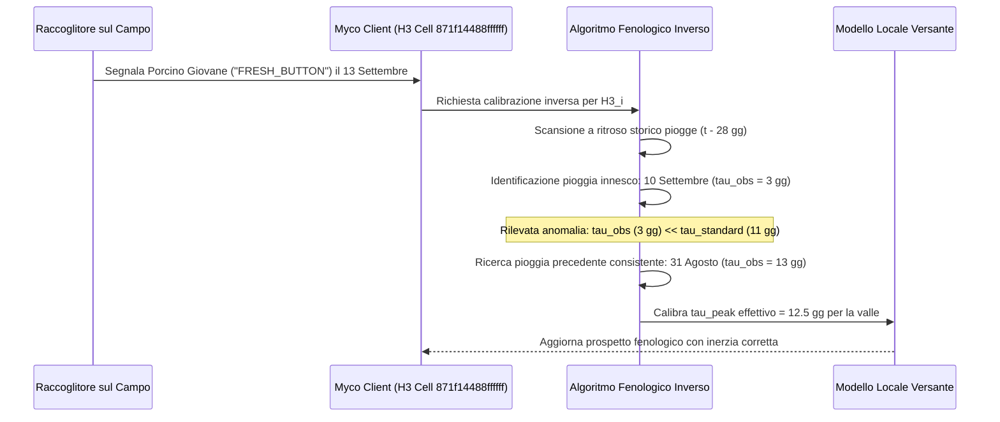

# Architettura Modulo Citizen Science & Uber H3

**Progetto:** Myco (`github.naturewhisp.myco`)  
**Componente:** Sottosistema Citizen Science, Spatially-Discretized Crowdsourcing & Local Phenology Calibration  
**Stato:** Blueprint Architetturale per Sviluppo Futuro (Roadmap Post-v1.2 / Milestone v1.3)  
**Data:** Settembre 2026  

---

## 1. Visione e Requisiti Fondamentali

### 1.1 Il "Dilemma del Fungaiolo" e la Privacy Differenziale
Nel dominio della raccolta dei macromiceti epigei (in particolare *Boletus edulis*, *Amanita caesarea*, *Cantharellus cibarius*), la riservatezza delle stazioni di crescita note come *"fungaie"* rappresenta un vincolo umano e culturale non negoziabile: nessun cercatore esperto condividerà mai coordinate geografiche precise $(\text{lat}, \text{lon})$ dei propri ritrovamenti se esiste il minimo rischio che altri possano individuarne l'esatta collocazione geodetica.

Al contempo, il modello agrometeorologico e fenologico di Myco soffre di una fisiologica incertezza dovuta alla risoluzione delle stazioni meteo e alla variabilità microclimatica della lettiera forestale. Il dato di osservazione sul campo (*ground truth*) è lo strumento più potente per colmare il divario tra stima teorica e realtà biologica.

Per conciliare questi due requisiti antitetici, Myco adotta il paradigma della **Privacy Differenziale Spaziale** implementata tramite il sistema di indicizzazione geospaziale discreto **Uber H3 (Discrete Global Grid System - DGGS)**.

---

## 2. Specifiche del Modello Spaziale Uber H3

### 2.1 Perché la Griglia Esagonale H3
A differenza delle griglie cartesiane ortogonali basate su latitudine/longitudine o delle celle quadrate (es. Slippy Map tiles / Geohash):
1. **Equidistanza dei Vicini:** Ogni cella esagonale possiede esattamente 6 celle contigue i cui baricentri distano la medesima lunghezza $d$. Non esiste l'asimmetria delle diagonali tipica delle griglie quadrate ($1$ vs $\sqrt{2}$).
2. **Adiacenza Uniforme:** Nessun punto di singolarità o spigolo condiviso, minimizzando le distorsioni nella modellazione di dispersione delle spore e propagazione dei fronti micotici.
3. **Invarianza di Scala:** Decomposizione gerarchica su 16 risoluzioni (da scala continentale a millimetrica).

```
          / \     / \
        /     \ /     \
       |   H3  |   H3  |
       |  k-1  |  k+1  |
        \     / \     /
          \ /     \ /
           |  H3   |
           |Centro |
          / \     / \
        /     \ /     \
       |   H3  |   H3  |
        \     / \     /
          \ /     \ /
```

### 2.2 Selezione della Risoluzione 7 (Gold Standard)
Per la discretizzazione delle osservazioni micologiche, Myco seleziona tassativamente la **Risoluzione H3: 7**:
* **Area Media della Cella:** $\approx 5{,}16\text{ km}^2$.
* **Lunghezza del Lato Esagonale:** $\approx 1{,}22\text{ km}$.
* **Diametro di Copertura / Raggio di Anonimizzazione:** $\approx 2{,}5 \dots 5{,}0\text{ km}$.
* **Significato Ecologico:** Su scala orografica montano-collinare, un'area di $5\text{ km}^2$ coincide tipicamente con un intero versante montano o una porzione omogenea di valle (es. la dorsale Monte Mindino - Val Casotto). Rende assolutamente **impossibile individuare il singolo canalone, albero o fungaia specifica**, ma è perfettamente omogenea dal punto di vista dell'evento piovoso e della finestra termica.

### 2.3 Distruzione Istantanea delle Coordinate di Bordo
L'applicazione rispetta un'invariante di riservatezza a livello di runtime:
1. Quando l'utente preme *"Segnala Ritrovamento"* sul campo, il sensore GPS registra la coordinata WGS84 volatile $(lat_{raw}, lon_{raw})$.
2. Il modulo locale calcola immediatamente l'indice H3 univoco a 64-bit:
   $$\text{h3Index} = \text{H3Core.geoToH3Address}(lat_{raw}, lon_{raw}, 7)$$
3. Le coordinate puntuali $lat_{raw}$ e $lon_{raw}$ vengono **azzerate e distrutte immediatamente dalla memoria RAM**.
4. Nessun file di log, cache SQLite, SharedPreferences o pacchetto di rete conterrà mai le coordinate GPS del ritrovamento.

---

## 3. Pipeline di Validazione On-Device (Google AI Edge Gemini Nano)

Per evitare segnalazioni fraudolente (*poisoning attacks*), errori di identificazione da parte di cercatori inesperti o spam, il sistema impiega l'intelligenza artificiale a bordo del dispositivo prima di autorizzare la sottomissione.



### 3.1 Isolamento e Zero-Cloud per le Immagini
* L'immagine del carpoforo scattata dalla fotocamera viene elaborata **esclusivamente nella RAM locale dello smartphone** tramite le API di Google AI Edge (`PlatformAiEngine`).
* Nessuna fotografia viene mai inviata al server cloud o salvata su server esterni. L'immagine serve unicamente come oracolo di validazione immediata sul terminale.
* Il modello esegue la classificazione verificando:
  1. Presenza effettiva di un basidiocarpo/ascoma fungino reale (anti-spam).
  2. Compatibilità visiva con la specie dichiarata (es. *Boletus edulis* sensu lato vs *Tylopilus felleus* o *Amanita phalloides*).
  3. Classificazione dello stadio fenologico:
     * `FRESH_BUTTON` (primordio o carpoforo giovane a cappello chiuso, $d \le 4\text{ cm}$);
     * `MATURE_EXPANDED` (esemplare adulto a imenio maturo);
     * `OVERRIPE_SENESCENT` (esemplare spugnoso o in decomposizione).

---

## 4. Contratto Dati e Schema di Sottomissione

Il payload inviato all'ingester cloud è compatto, quantizzato temporalmente e privo di qualsiasi identificativo hardware o di tracciamento.

### 4.1 Modello DTO (`MushroomSightingSubmission.kt`)
```json
{
  "h3_index": "871f14488ffffff",
  "species_id": "boletus_edulis",
  "phenological_stage": "FRESH_BUTTON",
  "elevation_bracket": "800_1000M",
  "canopy_category": "DECIDUOUS_BEECH",
  "timestamp_epoch_day": 20710,
  "verification_tier": "ON_DEVICE_AI_CONFIRMED",
  "entropy_nonce": "e3b0c44298fc1c14"
}
```

### 4.2 Invarianti di Sicurezza del Protocollo
* **Quantizzazione Temporale al Giorno (`timestamp_epoch_day`):** L'orario esatto (ore, minuti, secondi) viene troncato all'inizio del giorno UTC (Epoch Day). Questo impedisce l'analisi di mobilità e l'incrocio con orari di sosta dell'autoveicolo.
* **Zero Identificativi:** Nessun `device_id`, `advertising_id`, `android_id` o cookie di sessione.
* **Routing Tramite Oblivious HTTP (OHTTP) / Privacy Proxy:** L'indirizzo IP del dispositivo client viene schermato a monte tramite relay OHTTP per impedire la correlazione geografica a livello di rete.

---

## 5. Modellazione Predittiva DeepMaxent & Target-Group Background (TGB) per Dati Opportunistici (Presence-Only)

### 5.1 Il Problema del Bias di Accessibilità nei Dati Citizen Science
Le segnalazioni spontanee caricate dai raccoglitori di funghi costituiscono dati biologici di sola presenza (**Presence-Only, PO**). Questo tipo di campionamento opportunistico presenta due gravi distorsioni sistematiche:
1. **Bias di Accessibilità Umana ($s(x)$):** I foraggiatori esplorano quasi esclusivamente boschi adiacenti a strade carrozzabili, mulattiere note, sentieri CAI, aree di sosta e canaloni facili, ignorando versanti impervi o remoti anche se ecologicamente perfetti. Un algoritmo di machine learning ingenuo tenderebbe a correlare la presenza dei funghi con la vicinanza alle strade anziché con l'umidità del suolo o la biomassa miceliare.
2. **Assenza di Veri Negativi:** I raccoglitori non segnalano mai dove *non* hanno trovato funghi, impedendo l'applicazione diretta di classificatori binari supervisionati tradizionali (Random Forest, SVM, logistic regression pura).

Per risolvere formalmente queste criticità a livello scientifico, Myco adotta il framework **DeepMaxent** accoppiato alla strategia **Target-Group Background (TGB)**, seguendo la rigorosa formulazione matematica validata da Ryckewaert et al. (2024).



### 5.2 Formulazione Matematica dei Processi di Poisson Inomogenei (PPP)
La distribuzione spaziale delle presenze per la specie $j \in \{1, \dots, N\}$ è modellata come un Processo Puntuale di Poisson Inomogeneo con funzione di intensità $\lambda_j(x)$ condizionata dal vettore delle covariate ambientali ed ecologiche $x \in \mathbb{R}^P$:
$$\lambda_j(x) = \exp\left(\gamma_j^T g_\theta(x) + b_j\right)$$

dove:
* $x \in \mathbb{R}^P$ è il vettore di covariate della cella esagonale H3 che aggrega:
  - Serie di ricarica idrica profonda ponderata fenologicamente ($P_{d-26}$);
  - Condizionamento termico cardinale a medio termine ($T_{d-20}$);
  - Umidità volumetrica del suolo van Genuchten a doppio orizzonte ($M_{0-7}, M_{7-28}$);
  - Esponenziale termico asimmetrico e inibizione notturna da chilling ($T_{\min}, \text{DTR}$);
  - Copertura canopica $C_f$, area basimetrica $G$, pendenza ed esposizione orografica DEM;
  - Biodiversità ectomicorrizica e densità ifale sotterranea dell'atlante SPUN.
* $g_\theta: \mathbb{R}^P \to \mathbb{R}^C$ è una rete neurale condivisa di estrazione delle caratteristiche ambientali (*Residual MLP* con 2 strati latenti, $C = 64$, connessioni di salto residuali $z_{l+1} = z_l + h_l(z_l)$ e attivazioni GELU).
* $\gamma_j \in \mathbb{R}^C$ è il vettore dei pesi lineari specifici per la specie $j$.
* $b_j \in \mathbb{R}$ è il termine di bias specifico per la specie $j$.

### 5.3 Correzione Analitica del Bias di Campionamento tramite Target-Group Background (TGB)
Sia $s(x) \in [0, 1]$ la probabilità latente di campionamento (accessibilità orografica, vicinanza stradale) nel punto $x$. L'intensità effettivamente osservata di sottomissioni per la specie $j$ è:
$$\lambda_{j,\text{obs}}(x) = s(x) \cdot \lambda_j(x)$$

Poiché la probabilità di assenza non è osservabile, il modello Maxent convenzionale campiona punti di background uniformemente nello spazio geografico, rischiando di confondere l'inaccessibilità umana con l'inidoneità ecologica del fungo.

**La strategia Target-Group Background (TGB):**
Myco definisce il background campionando **esclusivamente tra le celle H3 in cui è stata registrata almeno una presenza valida di qualsiasi macromicete epigeo appartenente alla gilda micologica** (`SPECIES_CATALOG`).
Dato che il gruppo target di raccoglitori condivide la medesima attitudine di mobilità e campionamento sul territorio per tutte le specie fungine epigee, la funzione $s(x)$ è identica per tutte le specie della gilda.

Sotto campionamento TGB, la probabilità condizionale che un'osservazione appartenente alla gilda nel sito $x$ sia specificamente della specie $j$ è data da:
$$P(Y=j \mid x, \text{sighting} \in \text{TGB}) = \frac{s(x) \lambda_j(x)}{\sum_{k=1}^N s(x) \lambda_k(x)} = \frac{\lambda_j(x)}{\sum_{k=1}^N \lambda_k(x)}$$

**Proprietà Fondamentale:** La funzione di bias di accessibilità $s(x)$ **si cancella analiticamente** sia a numeratore che a denominatore. L'inferenza risultante riflette il puro potenziale biologico ed ecologico, completamente depurato dall'accessibilità antropica.

### 5.4 Funzione di Perdita Batched e Regolarizzazione $L_2$
Per consentire l'addestramento scalabile ed evitare il calcolo intrattabile della funzione di partizione spaziale sull'intero dominio geografico continuo, l'ottimizzazione stocastica minimizza la perdita di massima entropia normalizzata su mini-batch casuali $B \subset \text{TGB}$ di dimensione $|B|$:
$$\mathcal{L}_{\text{DeepMaxent}}(B) = -\frac{1}{|B| N} \sum_{i \in B} \sum_{j=1}^N y_{ij} \log\left(\frac{\exp(\gamma_j^T g_\theta(x_i) + b_j)}{\sum_{k \in B} \exp(\gamma_j^T g_\theta(x_k) + b_j)}\right) + \frac{\tau}{2} \sum_{j=1}^N \|\gamma_j\|_2^2$$

dove $y_{ij} = 1$ se la specie $j$ è stata osservata nel sito $i \in B$, altrimenti $0$.

* **Batch Size come Regolarizzatore Spaziale:** In DeepMaxent, la dimensione del mini-batch $|B|$ determina il numero di campioni di pseudo-assenza utilizzati per approssimare il denominatore di normalizzazione. Seguendo le risultanze empiriche di Ryckewaert et al. (2024), Myco adotta $|B| = 128$ ($|B| \in [100, 250]$). Un batch size compatto induce una naturale regolarizzazione spaziale (*spatial smoothing*), prevenendo picchi puntiformi di iper-adattamento sulle singole coordinate dei raccoglitori.
* **Weight Decay $\tau = 3 \times 10^{-4}$:** Il coefficiente di decadimento $L_2$ ottimale garantisce la convergenza e preserva la plasticità del feature extractor neurale, massimizzando l'indice AUC e la capacità predittiva anche su specie a bassa frequenza di campionamento (*Morchella esculenta*, *Boletus pinophilus*).

### 5.5 Validazione Incrociata con Spatial Blocking a 10-Fold
L'autocorrelazione spaziale nei dati ecologici invalida la classica k-fold cross-validation casuale, provocando una sovrastima ottimistica delle metriche di accuratezza.
DeepMaxent in Myco impiega un protocollo di **Spatial Blocking Cross-Validation a 10-fold**:
1. Il territorio (es. macroregione alpina e appenninica) viene suddiviso in blocchi geografici contigui di celle H3 a risoluzione 4 ($\sim 11.000\text{ km}^2$).
2. I blocchi vengono assegnati a 10 partizioni bilanciate.
3. Il modello viene addestrato su 9 partizioni ed esaminato sulla decima partizione spazialmente disgiunta, garantendo che le prestazioni valutate (AUC, True Skill Statistic, Boyce Index) riflettano la reale capacità di generalizzazione su vallate e montagne mai campionate in precedenza.

---

## 6. Modello Matematico di Integrazione Bayesiana

L'aggregatore riceve le segnalazioni per ciascuna cella $H3_i$ e aggiorna la distribuzione di probabilità fenologica combinando il modello deterministico meteorologico con l'evidenza empirica di campo e le predizioni DeepMaxent-TGB.

### 6.1 Aggiornamento della Probabilità al Giorno $t$
Sia $P_{\text{meteo}}(t) \in [0, 1]$ la probabilità a priori calcolata dall'algoritmo agrometeorologico unificato di Myco:
$$P = 100 \times \left(\frac{W}{100}\right)^{1.2} \times H \times A \times S \times T$$

In presenza di un insieme di segnalazioni validate $K = \{s_1, s_2, \dots, s_n\}$ pervenute nella cella $H3_i$ negli ultimi 3 giorni, la verosimiglianza $L(K \mid \text{Buttata})$ viene formulata come:
$$L(K \mid \text{Buttata}) = 1.0 - \prod_{j=1}^n \left(1.0 - w(s_j)\right)$$
dove $w(s_j)$ è il peso della singola segnalazione definito in `VerificationTier` e `PhenologicalStage`:
* $w = 0{,}85$ per segnalazioni con foto validata on-device da Gemini Nano (`ON_DEVICE_AI_CONFIRMED`);
* $w = 0{,}40$ per segnalazioni manuali dell'utente senza immagine (`MANUAL_UNCONFIRMED`);
* $w = 1{,}00$ per segnalazioni convalidate da micologo esperto (`EXPERT_VERIFIED`);
* Moltiplicatore stadio: $\times 1{,}20$ se `FRESH_BUTTON` (prova certa di buttata nascente); $\times 0{,}70$ se `OVERRIPE_SENESCENT` (buttata ormai al termine).

La probabilità a posteriori $P_{\text{posterior}}(t)$ diventa:
$$P_{\text{posterior}}(t) = 1.0 - (1.0 - P_{\text{meteo}}(t)) \times (1.0 - L(K \mid \text{Buttata}))$$

---

## 7. Ricalibrazione Retroattiva dell'Inerzia Biologica ($\tau_{peak}$ Auto-Tuning)

L'innovazione più rilevante del modulo H3 è la **retro-propagazione temporale** dell'osservazione sul campo per calibrare l'inerzia biologica reale del versante montano.



### 7.1 Algoritmo di Calibrazione Inversa
Quando viene registrato un esemplare giovane (`FRESH_BUTTON`) al giorno $T_{\text{obs}}$:
1. L'algoritmo interroga la serie storica delle precipitazioni efficaci $P_{\text{eff}}(t)$ della cella H3 per i 28 giorni precedenti: $t \in [T_{\text{obs}} - 28, T_{\text{obs}}]$.
2. Calcola la funzione di correlazione crociata per identificare l'evento idrico che massimizza la probabilità di innesco primordiale.
3. Se l'evento scatenante identificato è caduto al giorno $T_{\text{rain}}$, la latenza empirica misurata vale:
   $$\tau_{\text{empirico}} = T_{\text{obs}} - T_{\text{rain}}$$
4. Il valore di $\tau_{peak}$ per la specie in quella determinata cella H3 e nel suo anello geospaziale adiacente (H3 k-ring 1, raggio $\sim 10\text{ km}$) viene aggiornato mediante media mobile esponenziale pesata:
   $$\tau_{peak}^{(\text{nuovo})} = (1 - \lambda) \cdot \tau_{peak}^{(\text{catalogo})} + \lambda \cdot \tau_{\text{empirico}}$$
   con fattore di apprendimento $\lambda = 0{,}25$.

In questo modo, se in una specifica vallata o per una specifica annata la siccità estiva ha allungato l'inerzia a 14 giorni, o se un temporale caldo l'ha accorciata a 8 giorni, l'algoritmo di Myco si sintonizza sulla velocità reale del micelio sotterraneo di quel territorio.

---

## 8. Tabella di Marcia per l'Implementazione (Milestone v1.3)

| Fase | Pacchetto / Modulo | Attività Pianificata |
| :--- | :--- | :--- |
| **Fase A** | `model/` | Contratti dati, DTO e configurazioni DeepMaxent-TGB (`CitizenScienceModel.kt`). |
| **Fase B** | `platform/geo/` | Integrazione libreria H3-Core (wrapper Kotlin multiplatform a zero allocazione). |
| **Fase C** | `ui/components/` | Sviluppo del dialog `FieldSightingDialog.kt` con selettore stadio fenologico e badge privacy *"Cella H3 anonima raggio 5 km"*. |
| **Fase D** | `network/ai/` | Prompt specializzato Gemini Nano per validazione micologica locale e stima dello stadio fenologico da fotocamera. |
| **Fase E** | `repository/` | Creazione di `CitizenScienceRepository.kt` con supporto per accodamento offline e sincronizzazione asincrona. |
| **Fase F** | `utils/` | Implementazione del filtro bayesiano, inferenza DeepMaxent e ricalibratore di $\tau_{peak}$ in `MushroomAlgorithms.kt`. |

