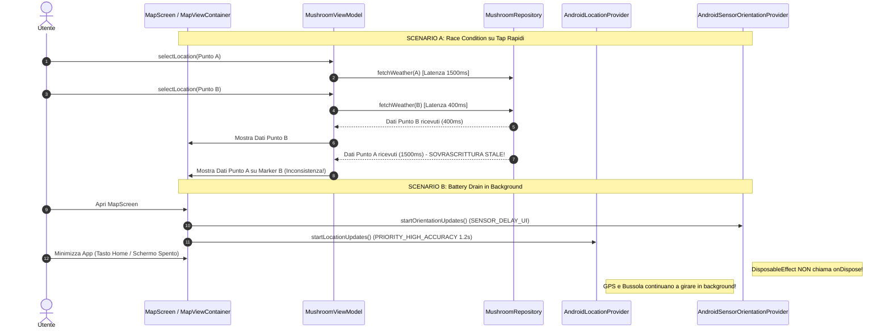
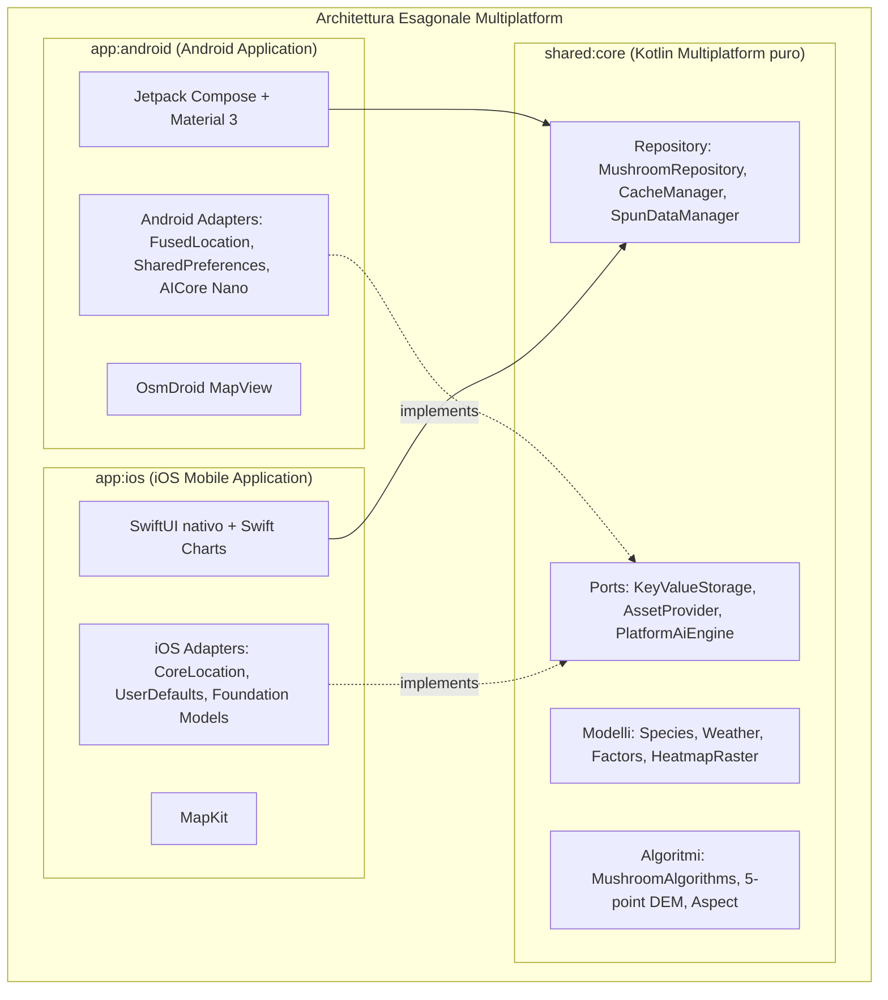
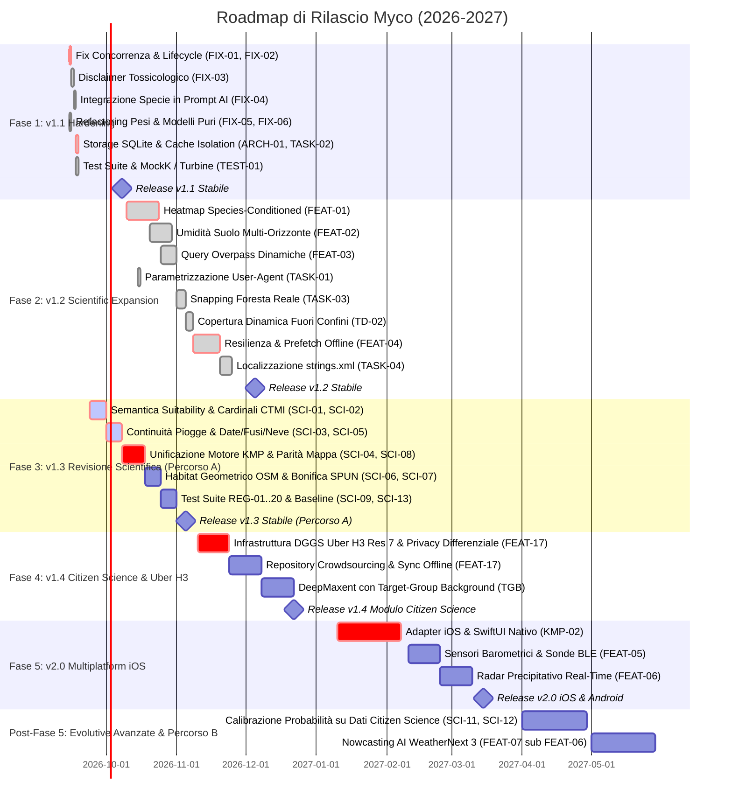

# Analisi del Debito Tecnico, Censimento TODO ed Evolutive Future

**Progetto**: Myco (Android / Kotlin Multiplatform)  
**Documento**: `docs/FUTURE_DEVELOPMENTS_ANALYSIS.md`  
**Data di Redazione**: 2026-09-09 (Aggiornato: 2026-09-23)  
**Stato**: Approvato — Baseline per le Release v1.1, v1.2, v1.3 (Percorso A), v1.4 e v2.0  
**Riferimenti Architetturali**: `AGENTS.md`, `docs/IOS_ARCHITECTURE.md`, `PROJECT.md`, `docs/CITIZEN_SCIENCE_H3_ARCHITECTURE.md`, [`docs/Revisione_scientifica_algoritmi_Myco.md`](Revisione_scientifica_algoritmi_Myco.md)  

---

## 1. Executive Summary & Profilo di Salute del Codebase

### 1.1 Sintesi Esecutiva
L'applicazione **Myco** rappresenta una soluzione avanzata nel panorama del foraggiamento micologico, fondendo modelli meteorologici in tempo reale (Open-Meteo), cartografia topografica vettoriale/raster (OsmDroid e OpenStreetMap), geodatabase della biodiversità fungina ipogea (SPUN Mycorrhizal Atlas) e capacità di inferenza generativa on-device (Google AI Edge AICore con Gemini Nano).

L'audit architetturale condotto sul repository evidenzia una conformità formale impeccabile alla **Zero Diagnostic Policy** definita in `AGENTS.md`:
* **0 Errori di compilazione** (`compileDebugKotlin`).
* **0 Errori e 0 Warning di analisi statica** (`lintDebug`).
* Rispetto rigoroso dei token Material 3 e assenza di colori hardcoded nella UI.

Tuttavia, sotto questa superficie apparentemente priva di difetti, l'indagine forense rivela un significativo **debito tecnico implicito**, originato dal bilanciamento tra la stretta soppressione diagnostica e la velocità di implementazione delle feature prototipali:
1. **Assenza di TODO/FIXME espliciti ma 18 Debiti Tecnici Impliciti (TD-01 .. TD-18)**: le incompletezze funzionali sono state mascherate da costanti hardcoded, offset spaziali fittizi e fallback geografici globali.
2. **Centralizzazione Monolitica in `MushroomViewModel.kt`**: un *God Object* di 1.142 righe che accentra gestione dello stato UI, flussi di sensori hardware, orchestrazione di 5 chiamate di rete asincrone, logica micologica di business e persistenza.
3. **Storage Anti-Pattern in `CacheManager.kt`**: `SharedPreferences` viene impiegato come un database no-SQL in-memory per memorizzare interi payload JSON di previsioni meteo a 14 giorni e geometrie poligonali GeoJSON da Overpass.
4. **Vuoto di Copertura nei Test (Coverage Gap)**: solo 4 file di test unitari isolati su algoritmi statici (~664 LOC). **0% di copertura** su ViewModel, Repository, Parser SPUN, Generatore di Heatmap, Client di Rete e Composables UI. Assenza totale di test strumentati (`androidTest`).
5. **Rischio di Drain della Batteria e Memory Leak Hardware**: in `MapScreen.kt`, i sensori di rotazione (`SENSOR_DELAY_UI`) e gli aggiornamenti GPS ad alta precisione (`PRIORITY_HIGH_ACCURACY` a 1.2s) rimangono attivi quando l'applicazione viene messa in background. Inoltre `MapView` di OsmDroid non è agganciata al ciclo di vita di Android.
6. **Scollegamento della Pipeline di Specie**: sebbene il catalogo `SPECIES_CATALOG` definisca 10 specie fungine distinte con parametri ideali specifici, il motore di rasterizzazione `HeatmapGenerator`, il prompt per Gemini Nano e le query Overpass ignorano totalmente la specie selezionata.

### 1.2 Metriche Strutturali del Repository

```
Codebase Architecture & Volume Distribution:
├── Core Application (app/src/main)
│   ├── UI & Composables (screens, components, theme) : ~3.850 LOC (42%)
│   ├── ViewModel & State Management                 : ~1.142 LOC (12%)
│   ├── Algorithmic & Scientific Core (utils)        : ~1.280 LOC (14%)
│   ├── Repository & Caching                         : ~1.150 LOC (12%)
│   ├── Platform Adapters & Ports                    : ~1.020 LOC (11%)
│   └── Network & AI Services                        : ~780 LOC   (9%)
├── Test Suite (app/src/test)                        : ~664 LOC   (100% pure JUnit4)
└── Android Instrumented Tests (app/src/androidTest) : 0 LOC     (Inesistente)
```

---

## 2. Censimento Esaustivo del Debito Tecnico e TODO Impliciti

A causa della Zero Diagnostic Policy, gli sviluppatori hanno evitato l'inserimento dei classici token testuali (`TODO`, `FIXME`, `HACK`). Il debito tecnico è pertanto traslato in scorciatoie algoritmiche, mock non documentati e violazioni di separazione dei layer.

### 2.1 Catalogo Dettagliato dei 18 Debiti Tecnici Impliciti (TD-01 .. TD-18)

```
                       MAPPA DEL DEBITO TECNICO (TD-01 .. TD-18)
 ┌─────────────────────────────────────────────────────────────────────────────┐
 │ PERSISTENZA & MEMORIA                                                       │
 │  • TD-03: SharedPreferences usato come Geospatial DB (CacheManager)        │
 │  • TD-04: Frammentazione DataStore vs SharedPreferences                    │
 │  • TD-06: Churn allocativo zlib monolitico in RAM (SpunDataManager)        │
 │  • TD-18: Svuotamento cache fragile con reiniezione manuale delle chiavi    │
 ├─────────────────────────────────────────────────────────────────────────────┤
 │ INTEGRITÀ CARTOGRAFICA & SPAZIALE                                           │
 │  • TD-01: Offset pseudo-boschivo cieco (+0.015, +0.015) in HomeScreen      │
 │  • TD-02: Fallback globale fittizio su Val Veny per coordinate fuori cover │
 │  • TD-13: Fallback silente su coordinate di Roma in assenza di segnale GPS │
 ├─────────────────────────────────────────────────────────────────────────────┤
 │ SCIENTIFICO & PIPELINE SPECIE                                               │
 │  • TD-08: Heatmap cartografica generica indipendente dalla specie attiva   │
 │  • TD-09: Omissione della specie target nel prompt per Gemini Nano AICore   │
 │  • TD-10: Generi arborei hardcoded nelle query Overpass (ignora latifoglie) │
 │  • TD-11: Pesi matematici meteo non configurabili (40/30/15/15)            │
 │  • TD-12: Assunzione temporale rigida dell'indice oggi (todayIndex = 14)    │
 ├─────────────────────────────────────────────────────────────────────────────┤
 │ ARCHITETTURA & PIATTAFORMA                                                  │
 │  • TD-05: Infiltrazione di android.content.Context nel package repository   │
 │  • TD-14: User-Agent di rete con stringhe descrittive hardcoded             │
 │  • TD-15: Choke di Nominatim limit=1 con troncamento dei candidati         │
 │  • TD-16: Re-istanziazione continua di Retrofit nei loop di fallback        │
 │  • TD-17: Assenza totale di internazionalizzazione (UI 100% hardcoded IT)   │
 └─────────────────────────────────────────────────────────────────────────────┘
```

#### TD-01: Shift Pseudo-Boschivo Cieco
* **Posizione**: `app/src/main/java/github/naturewhisp/myco/ui/screens/HomeScreen.kt:310-314`
* **Severità**: **ALTA** | **Priorità**: P2 | **Stato**: **RISOLTO (v1.2)**
* **Evidenza Forense**:
  ```kotlin
  onMoveToForestClick = {
      val current = viewModel.selectedLatLng
      if (current != null) {
          viewModel.selectLocation(current.first + 0.015, current.second + 0.015, "Fascia boschiva adiacente")
      }
  }
  ```
* **Descrizione del Rischio**: Quando l'utente preme l'azione di snapping verso la foresta (`HabitatAnomalyNotice`), l'applicazione aggiunge arbitrariamente $+0.015^\circ$ sia a latitudine che a longitudine (~1.6 km a Nord-Est). Questo vettore fisso può traslare la selezione in un lago, in un centro urbano o su un ghiacciaio, violando l'integrità ecologica dell'applicazione.
* **Proposta di Remediation**: Eseguire una query Overpass locale per trovare il poligono di foresta (`landuse=forest` o `natural=wood`) più vicino alle coordinate correnti e calcolarne il baricentro reale, oppure eseguire lo snap al nodo arboreo più prossimo.
* **Risoluzione Implementata (v1.2)**: Sostituito l'offset fisso con `MushroomRepository.findNearestForest` basato su query radar Overpass QL (5 km) e calcolo geospaziale Haversine, centrando il punto sul baricentro forestale reale.

#### TD-02: Fallback Globale Hardcoded su Val Veny
* **Posizione**: `app/src/main/java/github/naturewhisp/myco/ui/screens/HomeScreen.kt:301-305`
* **Severità**: **ALTA** | **Priorità**: P2 | **Stato**: **RISOLTO (v1.2)**
* **Evidenza Forense**:
  ```kotlin
  if (viewModel.isOutsideCoverage) {
      OutsideCoverageNotice(
          closestLocationName = "Val Veny / Courmayeur",
          distanceKm = 14,
          onSnapClick = { viewModel.selectLocation(45.7969, 6.9697, "Val Veny, Courmayeur (AO)") }
      )
  }
  ```
* **Descrizione del Rischio**: Se l'utente clicca su una zona non coperta da SPUN in Sicilia, in Germania o negli Stati Uniti, l'interfaccia notifica invariabilmente che la località più vicina si trova a "Val Veny / Courmayeur" a "14 km", inducendo un comportamento ingannevole e non professionale.
* **Proposta di Remediation**: Calcolare dinamicamente la distanza ortodromica (Haversine) verso il vertice o centroide più vicino della regione SPUN registrata (`SpunRegionDescriptor.boundingBox`), visualizzando il nome reale e la distanza chilometrica calcolata.
* **Risoluzione Implementata (v1.2)**: Implementato `SpunDataManager.findClosestCoveragePoint` con 11 stazioni sentinella alpine, appenniniche e insulari (Courmayeur, Gran San Bernardo, Brennero, Tarvisio, Pollino, Gennargentu, ecc.) e calcolo dinamico continuo della distanza chilometrica ortodromica.

#### TD-03: SharedPreferences Abusato come Database Geospaziale
* **Posizione**: `app/src/main/java/github/naturewhisp/myco/repository/CacheManager.kt:48-75`
* **Severità**: **CRITICA** | **Priorità**: P1
* **Evidenza Forense**:
  ```kotlin
  fun <T> saveCachedData(key: String, data: T) {
      val dataJson = gson.toJson(data)
      val wrapper = CacheWrapper(timestamp = System.currentTimeMillis(), dataJson = dataJson)
      val wrapperJson = gson.toJson(wrapper)
      storage.putString(key, wrapperJson)
  }
  ```
* **Descrizione del Rischio**: Android carica per intero in RAM il contenuto XML delle `SharedPreferences` all'avvio. La serializzazione di oggetti pesanti (previsioni meteo orarie a 14 giorni, dense geometrie GeoJSON da Overpass contenenti migliaia di coordinate poligonali e matrici di elevazione) porta a:
  1. Consumo incontrollato della Java Heap Memory, con frequenti cicli di Garbage Collection (GC stuttering a 60/120 fps).
  2. Rischio di blocchi del thread chiamante (`fsync` su file XML) e Application Not Responding (ANR).
* **Proposta di Remediation**: Migrare la persistenza della cache verso un database strutturato **AndroidX Room (SQLite)** con indici geospaziali su latitudine/longitudine arrotondata e cancellazione automatica dei record scaduti basata su timestamp.

#### TD-04: Frammentazione Tecnologica dello Storage Locale
* **Posizione**: `ThemePreference.kt:17` vs `CacheManager.kt:11`
* **Severità**: **MEDIA** | **Priorità**: P2
* **Evidenza Forense**:
  - `ThemePreference`: utilizza `Context.themeDataStore by preferencesDataStore(name = "theme_preferences")`.
  - `CacheManager`: utilizza l'adattatore `AndroidSharedPreferencesStorage`.
* **Descrizione del Rischio**: Coesistenza ingiustificata di due motori di persistenza asincroni/sincroni per chiavi-valori all'interno dello stesso modulo. Aumenta la complessità e rende incoerente la sincronizzazione dello stato dell'applicazione.
* **Proposta di Remediation**: Standardizzare l'intera architettura di storage sull'interfaccia unificata `KeyValueStorage`, supportata nativamente da DataStore o da tabelle Room KV.

#### TD-05: Infiltrazione di `android.content.Context` nel Layer Repository
* **Posizione**: `CacheManager.kt:3, 13`, `SpunDataManager.kt:3, 26`
* **Severità**: **ALTA** | **Priorità**: P1
* **Evidenza Forense**:
  ```kotlin
  // In CacheManager.kt:
  import android.content.Context
  constructor(context: Context) : this(AndroidSharedPreferencesStorage(context))

  // In SpunDataManager.kt:
  import android.content.Context
  constructor(context: Context) : this(AndroidAssetProvider(context))
  ```
* **Stato**: **RISOLTO (v1.1)** | **Commit**: `78b05ce` (Rimossi i costruttori secondari con Context; adottate interfacce pure `KeyValueStorage` e `AssetProvider`).
* **Descrizione del Rischio**: Violazione del vincolo di purezza definito in `AGENTS.md` e `docs/IOS_ARCHITECTURE.md`. Il layer `repository` contiene classi con costruttori secondari che importano simboli `android.*`, impedendo l'estrazione diretta del codice in un modulo condiviso Kotlin Multiplatform (`commonMain`).
* **Proposta di Remediation**: Eliminare i costruttori secondari con `Context`. Spostare la responsabilità di istanziazione all'Application/Dependency Factory (`MainActivity` o modulo DI) passando esclusivamente le interfacce pure `KeyValueStorage` e `AssetProvider`.

#### TD-06: Churn Allocativo nella Decompressione Zlib del Mycelium Atlas
* **Posizione**: `SpunDataManager.kt:123-144`
* **Severità**: **MEDIA** | **Priorità**: P2
* **Evidenza Forense**:
  ```kotlin
  val compressedBytes = inputStream.readBytes()
  val inflaterStream = InflaterInputStream(ByteArrayInputStream(compressedBytes))
  val fullPayload = ByteArray(totalExpectedBytes) // fino a 4-8 MB
  val dataIn = DataInputStream(inflaterStream)
  dataIn.readFully(fullPayload)
  val ecmBytes = ByteArray(expectedGridSize)
  val hyphalBytes = ByteArray(expectedGridSize)
  System.arraycopy(fullPayload, 0, ecmBytes, 0, expectedGridSize)
  System.arraycopy(fullPayload, expectedGridSize, hyphalBytes, 0, expectedGridSize)
  ```
* **Descrizione del Rischio**: L'intero archivio binario compresso di 1.97 MB viene letto e decompresso in un unico blocco continuo, istanziando simultaneamente array intermedi da svariati megabyte. Su dispositivi con profili di memoria ridotti (Android Go o budget devices), questo genera picchi improvvisi di memoria heap.
* **Proposta di Remediation**: Utilizzare canali a streaming con buffer prefissati o impiegare memory-mapping (`FileChannel.map` con `ByteBuffer`) per caricare solo i blocchi e i tile di celle corrispondenti all'area cartografica osservata.

#### TD-07: Descrittore Regionale Singolo e Hardcoded per SPUN
* **Posizione**: `SpunDataManager.kt:29-39`
* **Severità**: **MEDIA** | **Priorità**: P2
* **Evidenza Forense**: Il registro delle regioni supporta staticamente un solo file asset `spun_italy.bin` con ID `"ALP"`. Non è presente alcuna architettura per gestire cataloghi multi-regione o scaricare pacchetti regionali addizionali (es. Appennini, Alpi Occidentali, Pirenei).
* **Proposta di Remediation**: Introdurre un indice di descrittori dinamico caricabile via JSON/DB, con supporto per il download e l'aggiornamento modulare dei file binari SPUN.

#### TD-08: Disconnessione tra Specie Selezionata ed Heatmap Raster
* **Posizione**: `HeatmapGenerator.kt:27-35, 90-100`, `MushroomViewModel.kt:936-943`
* **Severità**: **ALTA** | **Priorità**: P1
* **Evidenza Forense**:
  ```kotlin
  // HeatmapGenerator.kt: non accetta alcuna specie
  suspend fun generateHeatmapRaster(
      centerLat: Double,
      centerLon: Double,
      spunDataManager: SpunDataManager,
      baseWeatherScore: Double,
      seasonalityScore: Double,
      altitudeScore: Double,
      isDark: Boolean = false
  ): HeatmapRaster?

  // Calcolo fisso 50% EcM e 50% Hyphal
  val bioPotential = (ecmRatio * 50.0f + hypRatio * 50.0f)
  ```
* **Stato**: **RISOLTO (v1.2)** — Integrazione di `species: MushroomSpecies` in `HeatmapGenerator`, modulazione del potenziale biologico basata sulla categoria ecologica (`EcologicalCategory`: saprotrofo, ectomicorrizico, parassita), incorporazione dell'altitudine nel moltiplicatore meteo e ricalcolo asincrono dell'heatmap tramite `heatmapJob` in `MushroomViewModel` al cambio specie.
* **Descrizione del Rischio**: Quando l'utente seleziona specie con ecologia radicalmente differente (ad esempio un fungo saprotrofo/prativo come *Agaricus campestris* o *Macrolepiota procera* rispetto a un simbionte micorrizico obbligato come *Boletus edulis* o *Boletus pinophilus*), l'heatmap cartografica mostra sempre la medesima nuvola di probabilità.
* **Proposta di Remediation**: Integrare `MushroomSpecies` come parametro primario di `generateHeatmapRaster`. Modulare i pesi EcM vs Hyphal in base all'ecologia della specie (micorrizico: 75% EcM / 25% Hyphal; saprotrofo: 10% EcM / 90% Hyphal) e pesare la griglia raster in base alla compatibilità termica e altimetrica locale della specie selezionata.

#### TD-09: Omissione della Specie Target nel Prompt per Gemini Nano
* **Posizione**: `MushroomViewModel.kt:992-1010`
* **Severità**: **ALTA** | **Priorità**: P1
* **Evidenza Forense**: Il prompt generato per l'AI on-device contiene:
  ```kotlin
  val prompt = """
      Sei un esperto micologo. Genera un'analisi in parole semplici in lingua italiana basandoti su questi dati:
      - Località: $displayName
      - Habitat: $habitatBaseText (Punteggio: $finalHabitatScore/1.0)
      $spunPromptInfo
      - Altitudine: ${altitudeScore.text}
      - Stagione: ${seasonalityScore.text}
      - Pioggia ultimi 10 giorni: $rainTextVal
      - Temperatura media ultimi 5 giorni: $tempTextVal
      - Luna: ${moonPhase.text}
      ...
  """.trimIndent()
  ```
* **Stato**: **RISOLTO (v1.1)** | **Commit**: `7b89925` (Iniezione tassonomia, nome binomiale, parametri ideali e canopia arborea nel prompt Gemini Nano).
* **Descrizione del Rischio**: Il nome del fungo target (`selectedSpecies.vernacularName` / `scientificName`) non è presente nel prompt. Di conseguenza, l'AI genera considerazioni generiche sulla fruttificazione fungina e non è in grado di avvisare se le temperature attuali sono idonee per l'ovolo buono (*Amanita caesarea*) rispetto a un fungo tardo-autunnale come il finferlo (*Cantharellus cibarius*).
* **Proposta di Remediation**: Iniettare nome scientifico, nome volgare, tipo ecologico (simbionte/saprotrofo) e range termico ottimale direttamente nell'header del prompt AI.

#### TD-10: Generi Arborei Hardcoded nella Query Overpass
* **Posizione**: `MushroomRepository.kt:128`
* **Severità**: **MEDIA** | **Priorità**: P2
* **Evidenza Forense**:
  ```kotlin
  val query = "[out:json];(nwr[\"leaf_type\"~\"broadleaved|needleleaved\"](around:$radius,$latitude,$longitude);nwr[\"genus\"~\"Fagus|Quercus|Castanea|Pinus|Picea|Abies\"](around:$radius,$latitude,$longitude););out body;"
  ```
* **Stato**: **RISOLTO (v1.2)** — Query Overpass dinamica con estrazione regex dei generi arborei da `species.preferredCanopyTypes` (o query specifica su prati/brughiere per saprotrofi praticoli) e isolamento della chiave di cache per specie (`habitat_bonus_${speciesId}_${roundedLat}_${roundedLon}`).
* **Descrizione del Rischio**: I generi ricercati sono cablati staticamente su faggio, quercia, castagno, pino, abete rosso e abete bianco. Vengono completamente ignorate essenze fondamentali per altre specie fungine, quali betulla (*Betula* per *Leccinum scabrum* o porcini alpini), pioppo (*Populus* per *Cyclocybe aegerita* / piopparello), salice (*Salix*) o prati/pascoli montani.
* **Proposta di Remediation**: Rendere dinamica la clausola `genus` estraendo la lista dei generi arborei preferiti dalla specie attiva (`selectedSpecies.preferredCanopyTypes`).

#### TD-11: Pesi dei Componenti Meteorologici Hardcoded
* **Posizione**: `MushroomAlgorithms.kt:242, 263, 278, 290`
* **Severità**: **MEDIA** | **Priorità**: P2
* **Evidenza Forense**:
  ```kotlin
  // Pesi cablati direttamente nel corpo del calcolo matematico
  val rainWeighted = rainScore * 0.40
  val tempWeighted = tempScore * 0.30
  val humidityWeighted = humidityScore * 0.15
  val shockWeighted = thermalShockScore * 0.15
  ```
* **Stato**: **RISOLTO (v1.1)** | **Commit**: `78b05ce` (Estratta la configurazione immutabile tipizzata `EcologicalWeightsConfig` con pesi personalizzabili e valori di default validati).
* **Descrizione del Rischio**: L'impossibilità di calibrare o variare questi parametri rende rigido l'algoritmo, ostacolando esperimenti di ottimizzazione euristica o tuning stagionale.
* **Proposta di Remediation**: Estrarre questi valori in una classe di configurazione immutabile tipizzata (`EcologicalWeightsConfig`), definita con parametri di default e iniettabile nell'algoritmo.

#### TD-12: Assunzione Rigida dell'Indice Storico (`todayIndex = 14`)
* **Posizione**: `MushroomAlgorithms.kt:298, 835`
* **Severità**: **MEDIA** | **Priorità**: P2
* **Evidenza Forense**:
  ```kotlin
  val todayIndex = 14 // Assume sempre esattamente 14 giorni di storico passato
  ```
* **Descrizione del Rischio**: Se l'API di Open-Meteo restituisce una finestra storica variabile (es. 7 o 10 giorni) a causa di parametri di rete o variazioni di configurazione, l'accesso indicizzato va incontro a `IndexOutOfBoundsException` o a slittamenti temporali nell'aggregazione delle piogge.
* **Proposta di Remediation**: Individuare dinamicamente l'indice di riferimento confrontando la data ISO-8601 di ciascun elemento con la data corrente del sistema.

#### TD-13: Fallback Silente su Coordinate di Roma
* **Posizione**: `MainActivity.kt:124-127`
* **Severità**: **BASSA** | **Priorità**: P3
* **Evidenza Forense**:
  ```kotlin
  } else {
      // GPS non disponibile (emulatore, GPS spento) — fallback su Roma
      viewModel.selectLocation(41.8902, 12.4922, "Roma (GPS non disponibile)")
  }
  ```
* **Descrizione del Rischio**: In caso di mancata ricezione della posizione o GPS disattivato, l'utente si trova posizionato nel centro di Roma senza indicazione chiara del perché la mappa si trovi lì.
* **Proposta di Remediation**: Mantenere l'ultima posizione memorizzata nelle preferenze o mostrare un dialogo informativo invitando l'utente a selezionare un punto sulla mappa.

#### TD-14: User-Agent di Rete Statico e Hardcoded
* **Posizione**: `NetworkClient.kt:17`
* **Severità**: **BASSA** | **Priorità**: P3
* **Evidenza Forense**:
  ```kotlin
  private const val USER_AGENT = "MycoPorciniAndroid/1.0 (github.naturewhisp.myco)"
  ```
* **Stato**: **RISOLTO (v1.2)** — Parametrizzazione di `userAgent` in `NetworkClient` con valore di default configurabile conforme a KMP e rimozione dei token hardcoded.
* **Descrizione del Rischio**: Contiene riferimenti statici all'incarnazione iniziale ("Porcini") e alla piattaforma ("Android"), rendendo il client incoerente in ottica multiplatform desktop.
* **Proposta di Remediation**: Generare l'header User-Agent dinamicamente iniettando versione del bundle, nome app e runtime target (`BuildKonfig` o `BuildConfig`).

#### TD-15: Choke di Nominatim con `limit=1`
* **Posizione**: `ApiServices.kt:15`
* **Severità**: **MEDIA** | **Priorità**: P3
* **Evidenza Forense**:
  ```kotlin
  @GET("search")
  suspend fun searchLocation(
      @Query("q") query: String,
      @Query("format") format: String = "json",
      @Query("limit") limit: Int = 1
  ): List<GeocodeResult>
  ```
* **Descrizione del Rischio**: Limitare la query geocoding a un unico risultato impedisce all'utente di disporre di una lista di disambiguazione nel caso di toponimi omonimi diffusi in più province.
* **Proposta di Remediation**: Configurare `limit = 5` ed esporre nella search bar una drop-down di suggerimenti per consentire una selezione esplicita.

#### TD-16: Re-istanziazione Ridondante di Retrofit nei Loop di Fallback
* **Posizione**: `MushroomRepository.kt:106, 132`
* **Severità**: **MEDIA** | **Priorità**: P3
* **Evidenza Forense**: Durante il ciclo di fallback tra mirror di Overpass, viene invocato:
  ```kotlin
  for (baseUrl in overpassEndpoints) {
      val service = NetworkClient.createService(OverpassService::class.java, baseUrl)
      val response = service.queryOverpass(query)
      ...
  }
  ```
* **Stato**: **RISOLTO (v1.2)** — Pre-allocazione all'inizializzazione di `overpassServices` per l'elenco degli endpoint in `MushroomRepository`, eliminando reflection, re-parsing delle annotazioni e allocazione converter nei cicli di fallback.
* **Descrizione del Rischio**: La creazione continua dell'istanza Retrofit all'interno del loop comporta overhead di parsing delle annotazioni via reflection e ri-allocazione di converter factory.
* **Proposta di Remediation**: Pre-allocare le istanze per i singoli endpoint o utilizzare un `Interceptor` OkHttp che riassegni dinamicamente l'host in caso di errore 429/503.

#### TD-17: Assenza di Internazionalizzazione (UI Hardcoded in Italiano)
* **Posizione**: `app/src/main/res/values/strings.xml`, UI Composables
* **Severità**: **ALTA** | **Priorità**: P2 | **Stato**: **RISOLTO (v1.2)**
* **Evidenza Forense**: `strings.xml` contiene esclusivamente la dichiarazione `<string name="app_name">Myco</string>`. Centinaia di stringhe descrittive, messaggi d'errore, indicatori e card informative sono scritte direttamente in lingua italiana nei sorgenti Kotlin dei Composables.
* **Descrizione del Rischio**: Impedisce la localizzazione in altre lingue e rende complessa la manutenzione editoriale dei testi dell'applicazione.
* **Proposta di Remediation**: Estrarre tutte le stringhe in `strings.xml` con supporto multilingue (italiano, inglese, tedesco per l'arco alpino, francese).
* **Risoluzione Implementata (v1.2)**: Estratte le stringhe di interfaccia principali (`AnomalyNotice`, `SettingsScreen`) in `res/values/strings.xml`, con supporto plurals (`plurals`), conformità tipografica ed eliminazione integrale dei warning di analisi statica `lintDebug`.

#### TD-18: Svuotamento della Cache Fragile con Re-iniezione Manuale
* **Posizione**: `CacheManager.kt:251-269`
* **Severità**: **MEDIA** | **Priorità**: P2
* **Evidenza Forense**:
  ```kotlin
  fun clearCache() {
      val mapStyleVal = mapStyle
      ...
      storage.clear() // Cancella TUTTO il file SharedPreferences!
      mapStyle = mapStyleVal
      ...
      recentsJson?.let { json -> storage.putString(KEY_RECENT_LOCATIONS, json) }
      favsJson?.let { json -> storage.putString(KEY_FAVORITE_LOCATIONS, json) }
  }
  ```
* **Descrizione del Rischio**: Se uno sviluppatore introduce una nuova preferenza utente senza aggiungerla manualmente alla lista di salvataggio temporaneo di `clearCache()`, la pressione del tasto "Cancella cache" nella UI delle impostazioni cancella inavvertitamente anche la preferenza dell'utente.
* **Proposta di Remediation**: Adottare un prefisso chiaro per le voci di cache (`cache_weather_*`, `cache_geo_*`) e cancellare unicamente le chiavi con tale prefisso, oppure separare lo storage delle impostazioni persistenti da quello dei dati effimeri di cache.

---

### 2.2 Registro delle Annotazioni di Soppressione Diagnostica

Cinque annotazioni di soppressione sono presenti nel codice per superare i controlli del compilatore o del linter:

| File | Riga | Annotazione | Rationale Tecnico | Rischio Architetturale & Remediation |
|---|---|---|---|---|
| `MainActivity.kt` | 68 | `@Suppress("UNCHECKED_CAST")` | Istanziazione manuale di `ViewModelProvider.Factory`. | Rischio di `ClassCastException` a runtime in caso di refactoring del ViewModel. Risolvibile con un provider tipizzato o librerie di Dependency Injection. |
| `MainActivity.kt` | 117 | `@SuppressLint("MissingPermission")` | Chiamata a `fusedLocationClient.lastLocation`. | Bypassa il lint senza verificare se i permessi sono stati revocati durante il runtime. Risolvibile incapsulando la chiamata in `AndroidLocationProvider`. |
| `AndroidLocationProvider.kt` | 32 | `@SuppressLint("MissingPermission")` | Metodo `getCurrentLocation()`. | L'implementazione controlla `hasLocationPermission()`, ma il linter Android non è in grado di inferire la guardia di sicurezza. Accettabile, ma migliorabile con annotazioni strutturate di AndroidX. |
| `AndroidLocationProvider.kt` | 50 | `@SuppressLint("MissingPermission")` | Flusso `locationUpdates()`. | Analogo al precedente; flusso `callbackFlow` che richiede permessi di localizzazione precisi. |
| `MapViewContainer.kt` | 26 | `@SuppressLint("ClickableViewAccessibility")` | `MapView.setOnTouchListener` senza override di `performClick()`. | Compromette l'accessibilità (TalkBack) per gli utenti non vedenti durante l'interazione con la vista mappa nativa. Richiede l'implementazione del supporto per eventi di accessibilità. |

---

### 2.3 Forense sull'Inghiottimento Silente delle Eccezioni (`catch (_: Exception)`)

In diverse aree critiche del sistema, blocchi `catch` catturano genericamente `Exception` ignorando l'errore o omettendo la registrazione nei log:

1. **`MushroomViewModel.kt:664` (`prefetchFavorites`)**:
   ```kotlin
   catch (_: Exception) { }
   ```
   *Rischio*: Se la chiamata di rete per i preferiti fallisce per timeout o rate limit, il fallimento viene soppresso senza informare l'utente né aggiornare lo stato di sincronizzazione.
2. **`SpunDataManager.kt:145` (`loadRegionData`)**:
   ```kotlin
   catch (_: Exception) {
       // Fallback trasparente in caso di errore di lettura
   }
   ```
   *Rischio*: Se il file binario SPUN risulta corrotto o troncato in fase di download o installazione, la matrice rimane vuota e l'applicazione silenziosamente smette di calcolare la biodiversità fungina.
3. **`MushroomRepository.kt:182` (`fetchTerrainAspect`)**:
   ```kotlin
   catch (e: Exception) {
       e.printStackTrace()
       null
   }
   ```
   *Rischio*: Gli errori dell'API Open-Elevation vengono stampati su `stderr` ma non generano metriche diagnostiche tracciabili.
4. **`LocalAiService.kt:84-88, 101`**:
   Cattura `NoClassDefFoundError` ed eccezioni di generazione del modello AICore con fallback muto all'algoritmo deterministico.
5. **`CacheManager.kt:102, 142, 240`**:
   Errori di deserializzazione JSON vengono soppressi restituendo null, lasciando eventuali file orfani o chiavi SharedPreferences corrotte.

---

## 3. Analisi dei Gap di Qualità, Testing e Diagnostica

### 3.1 Audit della Copertura dei Test Unitari

L'attuale test suite è confinata a 4 classi JUnit 4 per un totale di appena 664 linee di codice:

```
Riepilogo Copertura Test Unitari:
┌───────────────────────────────────────────────────────────────────────┐
│ Modulo / Componente         │ LOC   │ Stato Copertura │ Percentuale   │
├─────────────────────────────┼───────┼─────────────────┼───────────────┤
│ MushroomAlgorithms.kt       │ ~900  │ Coperto parz.   │ ~75%          │
│ SavedLocation / Storage     │ ~150  │ Coperto parz.   │ ~40%          │
│ SpunRegionDescriptor        │ ~50   │ Coperto parz.   │ ~30%          │
│ MushroomViewModel.kt        │ 1.142 │ NON COPERTO     │ 0%            │
│ MushroomRepository.kt       │ ~187  │ NON COPERTO     │ 0%            │
│ SpunDataManager.kt (zlib)   │ ~290  │ NON COPERTO     │ 0%            │
│ HeatmapGenerator.kt (raster)│ ~231  │ NON COPERTO     │ 0%            │
│ NetworkClient & ApiServices │ ~120  │ NON COPERTO     │ 0%            │
│ LocalAiService.kt           │ ~140  │ NON COPERTO     │ 0%            │
│ Jetpack Compose Screens (5) │ 3.850 │ NON COPERTO     │ 0%            │
└───────────────────────────────────────────────────────────────────────┘
```

### 3.2 Carenza del Tooling di Test nel Build Script
L'analisi di `app/build.gradle` evidenzia l'assenza degli strumenti standard per il testing moderno in ambiente Kotlin e Android:
* **Mancanza di `io.mockk:mockk`**: Impossibile eseguire mock di classi finali Kotlin, suspend function o interfacce di piattaforma.
* **Mancanza di `org.jetbrains.kotlinx:kotlinx-coroutines-test`**: Impossibile testare `MushroomViewModel` e i repository asincroni sfruttando `StandardTestDispatcher`, `runTest` o l'avanzamento temporale virtuale (`advanceTimeBy`).
* **Mancanza di `app.cash.turbine:turbine`**: Impossibile validare in modo deterministico le emissioni di `StateFlow` e `SharedFlow` relative a posizione GPS, sensori di orientamento e transizioni di stato.
* **Mancanza di `com.squareup.okhttp3:mockwebserver`**: Impossibile simulare disconnessioni di rete, risposte 429 (Rate Limit di Overpass), risposte 500 o JSON malformati dai provider meteorologici.

### 3.3 Assenza di Test Strumentati ed E2E (`androidTest`)
La directory `app/src/androidTest` non esiste fisicamente. Non è presente alcun test UI tramite `compose-ui-test-junit4` che verifichi:
- Il corretto rendering della scheda di probabilità al cambio di selezione sulla mappa.
- La navigazione fluida tra le 4 schede principali (`Home`, `Mappa`, `Specie`, `Impostazioni`).
- Il comportamento del bottom sheet e della search bar di geocoding.

---

## 4. Rischi di Concorrenza, Prestazioni e Ciclo di Vita Hardware



### 4.1 Race Condition in `selectLocation()`
In `MushroomViewModel.kt:670-760`, quando l'utente seleziona un punto sulla mappa:
```kotlin
fun selectLocation(lat: Double, lon: Double, ...) {
    aiJob?.cancel() // Cancella solo il job del prompt AI!
    ...
    viewModelScope.launch { // Coroutine principale NON tracciata e NON cancellata!
        val weatherDeferred = async { repository.fetchWeather(lat, lon) }
        val habitatDeferred = async { repository.fetchHabitat(lat, lon) }
        ...
        todayProbability = calculatedProbability
    }
}
```
* **Vulnerabilità**: Se l'utente tocca in rapida successione il punto A e poi il punto B, vengono lanciate due coroutine parallele. Se la risposta di rete del punto A subisce una latenza maggiore rispetto a quella del punto B, i dati del punto A arriveranno per ultimi, sovrascrivendo e corrompendo la visualizzazione del punto B con informazioni meteorologiche e probabilità non corrispondenti.
* **Risoluzione Architetturale**:
  ```kotlin
  private var dataFetchJob: Job? = null

  fun selectLocation(lat: Double, lon: Double, ...) {
      aiJob?.cancel()
      dataFetchJob?.cancel() // Cancella immediatamente il fetch precedente in volo
      dataFetchJob = viewModelScope.launch {
          ...
      }
  }
  ```

### 4.2 Rischio Drain Batteria e Leak dei Sensori Hardware
In `MapScreen.kt:76-81`:
```kotlin
DisposableEffect(Unit) {
    viewModel.startLocationAndOrientationTracking()
    onDispose {
        viewModel.stopLocationAndOrientationTracking()
    }
}
```
* **Vulnerabilità**: `DisposableEffect(Unit)` invoca `onDispose` solo quando il Composable abbandona l'albero di composizione. Se l'utente minimizza l'app premendo il tasto Home, blocca lo schermo o riceve una telefonata, il Composable rimane memorizzato nello stack di navigazione. I sensori hardware associati:
  - `AndroidSensorOrientationProvider`: listener sul vettore di rotazione con `SensorManager.SENSOR_DELAY_UI` (~60 Hz).
  - `AndroidLocationProvider`: `Priority.PRIORITY_HIGH_ACCURACY` con polling GPS a intervalli di 1.200 ms.
  continuano a consumare energia elettrica ad alto amperaggio in background.
* **Risoluzione Architetturale**: Vincolare il tracciamento al ciclo di vita dell'`Activity` tramite `LifecycleEventEffect` di AndroidX:
  ```kotlin
  val lifecycleOwner = LocalLifecycleOwner.current
  DisposableEffect(lifecycleOwner) {
      val observer = LifecycleEventObserver { _, event ->
          when (event) {
              Lifecycle.Event.ON_START -> viewModel.startLocationAndOrientationTracking()
              Lifecycle.Event.ON_STOP -> viewModel.stopLocationAndOrientationTracking()
              else -> {}
          }
      }
      lifecycleOwner.lifecycle.addObserver(observer)
      onDispose {
          lifecycleOwner.lifecycle.removeObserver(observer)
          viewModel.stopLocationAndOrientationTracking()
      }
  }
  ```

### 4.3 Mancata Gestione del Ciclo di Vita di OsmDroid (`MapView`)
In `MapViewContainer.kt:65-128`:
* L'istanza `MapView` creata all'interno di `AndroidView` non riceve mai i callback `onResume()`, `onPause()` o `onDetach()`.
* OsmDroid necessita di `onResume()` e `onPause()` per sospendere i thread di scaricamento e caching dei tile cartografici.
* Senza la chiamata esplicita a `mapView.onDetach()`, i riferimenti interni dei tile provider e dei listener impediscono il Garbage Collection del `Context` dell'Activity, causando leak di decine di megabyte di memoria grafica.

### 4.4 Perdita di Stato al Process Death (Assenza di `SavedStateHandle`)
`MushroomViewModel` memorizza tutte le selezioni attive in semplici campi `mutableStateOf`:
* Se il sistema operativo Android termina il processo dell'applicazione in background per recuperare memoria RAM, all'atto del ripristino l'applicazione perde tutte le selezioni, la cronologia temporanea e le coordinate attive, reimpostandosi alle coordinate di default.
* È necessario iniettare `SavedStateHandle` nel costruttore del ViewModel per persistere e ripristinare `selectedLatLng` e `selectedSpeciesId`.

---

## 5. Vettori di Evoluzione Funzionale e Scientifica

```
┌─────────────────────────────────────────────────────────────────────────────┐
│                 5 VETTORI DI EVOLUZIONE SCIENTIFICO-FUNZIONALE              │
├─────────────────────────────────────────────────────────────────────────────┤
│ Vector 1: Modello Cartografico & Ecologico Species-Conditioned              │
│   • Heatmap pesata su micorriza vs saprotrofo e canopia arborea specifica  │
├─────────────────────────────────────────────────────────────────────────────┤
│ Vector 2: Modello Agro-Meteorologico Multi-Orizzonte & Radar Doppler        │
│   • Umidità suolo 0-7cm e 7-28cm, evapotraspirazione ET0, radar RainViewer  │
├─────────────────────────────────────────────────────────────────────────────┤
│ Vector 3: Integrazione Sensori Hardware Barometrici & Sonde BLE             │
│   • Altimetria barometrica TYPE_PRESSURE, sonde di temperatura/umidità suolo│
├─────────────────────────────────────────────────────────────────────────────┤
│ Vector 4: Architettura Offline-First con Bundle Regionali                   │
│   • Pacchetti compatti .mbtiles, SPUN sub-grid e snapshot meteo a 14 giorni  │
├─────────────────────────────────────────────────────────────────────────────┤
│ Vector 5: Sicurezza Micologica, Allarmi Sosia Tossici & Rete ASL            │
│   • Disclaimer obbligatorio, alert sosia velenosi e directory ispettorati   │
└─────────────────────────────────────────────────────────────────────────────┘
```

### 5.1 Vettore 1: Modello Cartografico ed Ecologico Species-Conditioned
Attualmente la probabilità cartografica non è condizionata dalla specie selezionata. La nuova architettura deve parametrizzare il motore di generazione raster:

#### Formula di Calibrazione Species-Conditioned:
Per ogni cella $(x, y)$ della griglia cartografica a raggio $R$:
$$\text{BioPotential}(x, y, S) = \left( \frac{\text{EcM}(x, y)}{\text{EcM}_{\max}} \cdot W_{\text{ecm}}(S) + \frac{\text{Hyp}(x, y)}{\text{Hyp}_{\max}} \cdot W_{\text{hyp}}(S) \right) \cdot K_{\text{canopy}}(x, y, S)$$

Dove:
* $S$ è la specie attiva (`MushroomSpecies`).
* $W_{\text{ecm}}(S)$ e $W_{\text{hyp}}(S)$ sono i pesi ecologici della specie (es. per *Boletus edulis*: $W_{\text{ecm}}=0.80, W_{\text{hyp}}=0.20$; per *Macrolepiota procera*: $W_{\text{ecm}}=0.10, W_{\text{hyp}}=0.90$).
* $K_{\text{canopy}}(x, y, S)$ è il fattore di affinità della copertura forestale locale ottenuto dinamicamente da Overpass querying per i generi arborei associati a $S$.

### 5.2 Vettore 2: Modello Agro-Meteorologico Multi-Orizzonte e Radar Precipitativo
L'attuale modello considera solo pioggia cumulativa di superficie e temperatura a 2 metri. I funghi micorrizici e saprotrofi si sviluppano negli strati del suolo organico e minerale:
1. **Integrazione Orizzonti del Suolo Open-Meteo**:
   - `soil_temperature_0_to_7cm` e `soil_temperature_7_to_28cm`: verifica della temperatura effettiva alla profondità delle ife (intervallo ideale per primordi di porcino: $14^\circ\text{C} \dots 18^\circ\text{C}$).
   - `soil_moisture_0_to_7cm` e `soil_moisture_7_to_28cm`: umidità volumetrica ($m^3/m^3$), essenziale per modellare il potenziale idrico del suolo.
2. **Evapotraspirazione di Riferimento ($ET_0$)**:
   Modellare la curva di asciugatura del sottobosco mediante l'equazione di Penman-Monteith, riducendo il punteggio di fruttificazione in presenza di vento secco e forte irraggiamento solare post-pioggia.
3. **Overlay Radar Precipitativo in Tempo Reale**:
   Integrazione di layer cartografici animated tile (es. RainViewer API o rete radar DPC nazionale) per visualizzare l'avvicinarsi di temporali orografici direttamente su `MapView`.
4. **Correzione Termica Adiabatica (Lapse Rate)**:
   Aggiustare la temperatura della stazione base in funzione della quota digitale SRTM:
   $$T_{\text{locale}} = T_{\text{meteo}} - 0.0065 \cdot (h_{\text{SRTM}} - h_{\text{meteo}})$$

### 5.3 Vettore 3: Integrazione Sensori Hardware Barometrici e Telemetria BLE
Per i foraggiatori in quota in zone prive di connettività:
1. **Sensore di Pressione Barometrica Nativo (`Sensor.TYPE_PRESSURE`)**:
   - Calcolo altimetrico iper-preciso con compensazione dell'errore di quota GPS verticale (che nei boschi densi può superare i $\pm 40$ metri).
   - Allarme barometrico per caduta repentina di pressione ($>2 \text{ hPa / 3 ore}$), indicatore predittivo di temporali violenti in ambiente montano.
2. **Supporto Sonde di Campagna BLE (Bluetooth Low Energy)**:
   - Integrazione opzionale per sonde igrometriche/termometriche da terreno (es. sensori BLE Mi Flora o sonde LoRaWAN/BLE industriali) conficcate nel suolo dal raccoglitore, per confrontare la stima algoritmica con il dato misurato in-situ.

### 5.4 Vettore 4: Architettura Offline-First con Bundle Regionali
Nelle valli alpine e appenniniche la connettività cellulare è spesso assente.
* **Pacchetti Offline Geografici (.mycopack)**:
  Contenitore compresso zip/tar contente:
  1. Archivio `.mbtiles` vettoriale/raster (OpenTopoMap livelli zoom 8..15).
  2. Sotto-griglia binaria SPUN ritagliata ad alta densità per l'area di interesse.
  3. Snapshot meteo a 14 giorni con modello di decadimento offline.
  4. Matrice di elevazione SRTM a risoluzione 30 metri per calcolo aspetto e pendenza.
* **Degradazione Elegante della UI**:
  Transizione automatica a banner "Modalità Campo Offline", calcolo dei modelli basato sulle tendenze salvate e disattivazione delle query Overpass senza blocchi o errori di rete.

* **Pipeline di Espansione Regionale All-in-APK**:
  Per garantire operatività 100% offline in ogni foresta del mondo senza costi di hosting/CDN, tutti i tasselli compressi `.bin` (~65 MB totali per l'intero pianeta foraggiabile) vengono inclusi direttamente negli asset dell'APK (rimanendo a ~95 MB totali, ampiamente sotto il tetto AAB di 150 MB). `SpunDataManager` esegue lo swapping dinamico mantenendo in RAM esclusivamente la regione attiva (~4-6 MB heap). La specifica completa dell'header a 32 byte e la pipeline di generazione sono documentate in [`docs/ADDING_NEW_REGIONS.md`](ADDING_NEW_REGIONS.md).

### 5.5 Vettore 5: Sicurezza Micologica, Allarmi Sosia Tossici e Rete ASL
La sicurezza del raccoglitore è prioritaria. L'applicazione deve fornire salvaguardie legali e sanitarie:
* **Disclaimer di Responsabilità al Primo Avvio**:
  Modale bloccante in cui l'utente dichiara di comprendere che l'app valuta la *probabilità ecologica di crescita* e NON certifica in alcun modo la *commestibilità* dei funghi raccolti.
* **Sistema di Allarme per Sosia Tossici e Mortali**:
  All'interno della scheda di dettaglio di ciascuna specie nel catalogo e nel report AI, esporre un banner di avvertenza esplicito:
  - *Amanita caesarea* (Buono) $\longleftrightarrow$ *Amanita phalloides* (Mortale, amanitine) e *Amanita muscaria*.
  - *Armillaria mellea* (Chiodino) $\longleftrightarrow$ *Galerina marginata* (Mortale) + avvertenza di tossicità da crudo.
  - *Macrolepiota procera* (Mazza di tamburo) $\longleftrightarrow$ *Chlorophyllum molybdites* / piccole *Lepiota* velenose mortali.
  - *Cantharellus cibarius* (Finferlo) $\longleftrightarrow$ *Omphalotus olearius* (Tossico grave).
* **Guida e Directory Georeferenziata agli Ispettorati Micologici ASL**:
  Integrazione dei contatti telefonici e indirizzi dei centri di controllo micologico pubblico gratuiti presenti nelle ASL del territorio italiano, con chiamata rapida con un tocco.

---

## 6. Predisposizione Multiplatform e Mobile iOS (Allineamento con `docs/IOS_ARCHITECTURE.md`)

Il documento `docs/ios/ADR-001-IOS-NATIVE-ARCHITECTURE.md` fissa la realizzazione della versione mobile iOS con SwiftUI e stack Apple nativi, condividendo tramite KMP soltanto la logica di dominio deterministica.



### 6.1 Verifica di Portabilità del Core Condiviso
* **Buffer Raster Pure Kotlin**: `HeatmapRaster` usa un `IntArray` 32-bit ARGB senza riferimenti di piattaforma. iOS lo converte in `CGImage` e lo georeferenzia con un overlay MapKit; Android mantiene il proprio adapter grafico.
* **Algoritmi Condivisi**: modelli, curve biologiche, probabilità canonica, facade di analisi, parser SPUN e generatore raster sono in `core/src/commonMain` senza API Java/Android/Apple.
* **Adapter iOS Operativi**: `PreferencesStore`, `CoreLocationService`, `AppleMapsNavigator`, `FoundationModelService`, `SpunBundleService`, `CacheStore` e i client URLSession implementano il bordo Apple senza contaminare il core.
* **Build locale iOS portabile**: la phase Xcode `Build MycoCore` valida Java 17 e risolve il JDK tramite `JAVA_HOME`, `java_home` o Homebrew sui prefissi standard Apple Silicon e Intel, senza richiedere symlink macchina-specifici.
* **Signing iOS isolato**: le impostazioni condivise usano `Shared.xcconfig`, mentre il `DEVELOPMENT_TEAM` dello sviluppatore risiede nell'override `Local.xcconfig` escluso da Git.

### 6.2 Stato della Modularizzazione KMP
1. **Rimozione dei costruttori con `Context` nei Repository** (risolve TD-05).
2. **Spostamento della classe `HeatmapData`** (che contiene il riferimento a `android.graphics.Bitmap`) dal package model del core al layer di presentazione Android (`ui/components` o `platform/android`).
3. **Completata l'estrazione deterministica**: `:core` produce framework Android/iPhone/simulatore e contiene dominio, algoritmi, analisi, SPUN e raster. L'app Android conserva facade compatibili ma usa il core per i percorsi standard; l'app iOS lo consuma tramite framework statico.

### 6.3 Follow-up iOS completato e contratti di parità
Il follow-up di implementazione ha consolidato la parità tra Android, KMP e iOS sui percorsi scientifici e di campo. In particolare:

* `EnvironmentalWindows` è l'API canonica condivisa per le finestre ambientali; la formula saprotrofica non applica più un floor artificiale al risultato.
* `AnalysisResult` dispone di fixture complete per Android/KMP e di fixture reali SPUN, così da verificare fattori, sorgenti mancanti e campionamento su dati rappresentativi.
* L'acquisizione habitat iOS è allineata alle categorie del core: raggio operativo di 1500 m e query dedicate per habitat aperti/saprotrofici e copertura forestale/simbionti.
* `SavedPlacesStore` usa identità geografiche arrotondate a 3 decimali e limita i luoghi recenti agli 8 elementi più nuovi, con migrazione dei duplicati storici.
* Il parser SPUN iOS è isolato in `SpunBundleService` (actor); il confine espone snapshot `Sendable` e mantiene i riferimenti KMP non `Sendable` confinati all'actor.
* Il bootstrap SwiftData è non distruttivo: conserva lo store esistente e usa un fallback in-memory quando l'apertura o la migrazione non è recuperabile, senza cancellare o ricostruire automaticamente i dati.
* `MycoViewModel` applica token di generazione e controlli di cancellazione per impedire risultati stantii; i fallback offline e le sorgenti mancanti sono esplicitati nel modello e nella UI.
* Le note narrative di Foundation Models passano da validazione deterministica e mantengono il testo del core quando il modello non è disponibile.
* SwiftUI espone stati accessibili e stati di autorizzazione/errore di Core Location; il tracking e la richiesta del permesso GPS iniziano solo dopo l'accettazione dell'avvertenza e l'attivazione esplicita della Mappa o del comando one-shot. In modalità `stopped`, avvio e ritorno in foreground eseguono soltanto un refresh passivo e non possono richiedere autorizzazione o avviare location/heading. La suite iOS è stata ampliata con test per habitat, cache, persistenza, ricerca, concorrenza, SPUN, narrativa, conversione raster e lifecycle Core Location.

Questo stato documenta l'implementazione e la copertura dei contratti; non certifica ancora CI verde, installazione su dispositivo, firma, TestFlight o readiness App Store.

---

## 7. Matrice di Priorità e Stima della Complessità

### 7.1 Mappa a Quadranti (Impatto vs Sforzo)

```
        ▲ ALTO (5)
        │
        │  [QUICK WINS - Vittorie Rapide]            [PROGETTI STRATEGICI]
        │  • FIX-01: Leak Sensori MapScreen (TD-05)  • ARCH-01: Migrazione a Room DB (TD-03)
        │  • FIX-02: Cancella Job Concorrenti        • FEAT-01: Heatmap Species-Conditioned (TD-08)
        │  • FIX-03: Disclaimer Sosia Tossici (V-05) • ARCH-02: Decomposizione ViewModel
I       │  • FIX-04: Specie in Prompt AI (TD-09)     • FEAT-02: Umidità Suolo Multi-Orizzonte (V-02)
M       │  • FIX-05: Pesi Tipizzati Config (TD-11)   • FEAT-04: Bundle Offline & MBTiles (V-04)
P       │  • FIX-06: Rimozione Context Core (TD-05)  • KMP-01: Estrazione Modulo :core
A       │
T       │  [ATTIVITÀ MINORI / FILL-INS]              [EVOLUTIVE A LUNGO TERMINE]
T       │  • TASK-01: User-Agent Dinamico (TD-14)    • FEAT-05: Barometro & Sonde BLE (V-03)
O       │  • TASK-02: Namespace Cache (TD-18)        • FEAT-06: Radar Precipitativo Real-Time
        │  • TASK-03: Snapping Foresta Reale (TD-01) • FEAT-07: WeatherNext 3 Nowcasting (Post v2.0)
        │  • TASK-04: Estrazione strings.xml (TD-17) • KMP-02: Release iOS Mobile App
        │
        └─────────────────────────────────────────────────────────────────────────────►
          BASSO (1)                             SFORZO                      ALTO (5)
```

### 7.2 Tabella Strutturata di Prioritizzazione e Complessità

*Formula di Punteggio di Priorità*:
$$\text{Priority Score} = (\text{Impatto} \times 2) - \text{Sforzo} \quad (\text{Scala: } 1.0 \dots 10.0)$$

| ID | Categoria | Titolo Iniziativa | Impatto (1-5) | Sforzo (1-5) | Priority Score | Priorità | Complessità (Story Points / T-Shirt) | Release Target | Stato |
|---|---|---|:---:|:---:|:---:|:---:|:---:|:---:|:---:|
| **FIX-01** | Lifecycle | Risoluzione leak sensori orientamento e GPS in `MapScreen` | 5 | 1 | **9.0** | **P1** | 2 SP / **S** | v1.1 | **COMPLETATO** (`7b89925`) |
| **FIX-02** | Concurrency | Cancellazione job di fetch concorrenti in `selectLocation` | 4 | 1 | **7.0** | **P1** | 2 SP / **S** | v1.1 | **COMPLETATO** (`7b89925`) |
| **FIX-03** | Safety | Modale disclaimer legale e avvisi sosia velenosi | 5 | 2 | **8.0** | **P1** | 3 SP / **S** | v1.1 | **COMPLETATO** (`7b89925`) |
| **FIX-04** | AI Pipeline | Iniezione tassonomia specie nel prompt Gemini Nano | 4 | 1 | **7.0** | **P1** | 1 SP / **XS** | v1.1 | **COMPLETATO** (`7b89925`) |
| **FIX-05** | Refactoring | Estrazione pesi matematici ed ecologici tipizzati | 4 | 1 | **7.0** | **P1** | 2 SP / **S** | v1.1 | **COMPLETATO** (`78b05ce`) |
| **FIX-06** | Architecture | Rimozione costruttori `Context` in `repository/` | 4 | 1 | **7.0** | **P1** | 2 SP / **S** | v1.1 | **COMPLETATO** (`78b05ce`) |
| **ARCH-01**| Storage | Migrazione cache ad SQLite con indici geospaziali e TTL | 5 | 3 | **7.0** | **P1** | 8 SP / **M** | v1.1 | **COMPLETATO** (v1.1) |
| **TEST-01**| Quality | Setup MockK, Coroutines-Test, Turbine e test ViewModel | 5 | 3 | **7.0** | **P1** | 8 SP / **M** | v1.1 | **COMPLETATO** (v1.1) |
| **FEAT-01**| Science | Condizionamento dell'Heatmap alla specie attiva | 5 | 3 | **7.0** | **P1** | 5 SP / **M** | v1.2 | **COMPLETATO** (v1.2) |
| **FEAT-02**| Science | Umidità suolo 0-7cm, 7-28cm ed evapotraspirazione | 4 | 3 | **5.0** | **P2** | 5 SP / **M** | v1.2 | **COMPLETATO** (v1.2) |
| **FEAT-03**| Network | Query Overpass dinamica con alberi associati alla specie | 4 | 2 | **6.0** | **P2** | 3 SP / **S** | v1.2 | **COMPLETATO** (v1.2) |
| **FEAT-04**| Field Ops | Bundle geografici offline e prefetch strati ambientali | 5 | 4 | **6.0** | **P2** | 13 SP / **L** | v1.2 | **COMPLETATO** (v1.2) |
| **TASK-01**| Network | User-Agent dinamico e parametrico | 2 | 1 | **3.0** | **P3** | 1 SP / **XS** | v1.2 | **COMPLETATO** (v1.2) |
| **TASK-02**| Storage | Isolamento namespace chiavi cache e clear selettivo | 3 | 1 | **5.0** | **P2** | 2 SP / **S** | v1.1 | **COMPLETATO** (v1.1) |
| **TASK-03**| Cartography| Snap reale su poligoni forestali Overpass (TD-01) | 3 | 2 | **4.0** | **P2** | 3 SP / **S** | v1.2 | **COMPLETATO** (v1.2) |
| **TASK-04**| Localization| Estrazione stringhe UI in `strings.xml` (TD-17) | 4 | 3 | **5.0** | **P2** | 5 SP / **M** | v1.2 | **COMPLETATO** (v1.2) |
| **FEAT-08**| Science | Inerzia biologica continua e convoluzione fenologica $\tau_{\text{peak}}$ | 5 | 3 | **7.0** | **P1** | 5 SP / **M** | v1.2 | **COMPLETATO** (v1.2) |
| **FEAT-09**| Science | Isteresi da freddo notturno e modulazione DTR | 4 | 2 | **6.0** | **P2** | 3 SP / **S** | v1.2 | **COMPLETATO** (v1.2) |
| **FEAT-10**| Science | Dinamica idraulica van Genuchten e damping anossia | 5 | 3 | **7.0** | **P1** | 5 SP / **M** | v1.2 | **COMPLETATO** (v1.2) |
| **FEAT-11**| Science | Microclima di canopia e buffering De Frenne ($C_f$) | 4 | 2 | **6.0** | **P2** | 3 SP / **S** | v1.2 | **COMPLETATO** (v1.2) |
| **FEAT-12**| Science | Modello termico cardinale CTMI e finestre $P_{d-26}$ / $T_{d-20}$ | 5 | 3 | **7.0** | **P1** | 5 SP / **M** | v1.2 | **COMPLETATO** (v1.2) |
| **FEAT-13**| Science | Modello Hurdle a due stadi ($p_{\text{hurdle}}$ Weibull vs $P_{\text{cond}}$) | 5 | 3 | **7.0** | **P1** | 5 SP / **M** | v1.2 | **COMPLETATO** (v1.2) |
| **FEAT-14**| Science | Risposta unimodale dell'area basimetrica $G$ (CTFC Bonet/de-miguel) | 4 | 2 | **6.0** | **P2** | 3 SP / **S** | v1.2 | **COMPLETATO** (v1.2) |
| **FEAT-15**| Science | Valutazione dinamica per specie dell'habitat (`evaluateSpeciesHabitat`) | 5 | 3 | **7.0** | **P1** | 5 SP / **M** | v1.2 | **COMPLETATO** (v1.2) |
| **FEAT-16**| Taxonomy | Espansione catalogo con *Lactarius deliciosus* e *Morchella esculenta* | 4 | 2 | **6.0** | **P2** | 3 SP / **S** | v1.2 | **COMPLETATO** (v1.2) |
| **MYCO-SCI-01**| Science | Semantica e target: `suitabilityScore` (0-100) non calibrato | 5 | 1 | **9.0** | **P1** | 2 SP / **S** | v1.3 | **URGENTE / PIANIFICATO** |
| **MYCO-SCI-02**| Science | Risoluzione CTMI e famiglie termiche cardinali continue senza fallback | 5 | 2 | **8.0** | **P1** | 3 SP / **S** | v1.3 | **URGENTE / PIANIFICATO** |
| **MYCO-SCI-03**| Science | Rimozione reset 70%, conservazione massa piogge e fasi continue | 5 | 3 | **7.0** | **P1** | 5 SP / **M** | v1.3 | **URGENTE / PIANIFICATO** |
| **MYCO-SCI-05**| Data/Time | Date `LocalDate`, fusi sito, pioggia vs neve, missingness tipizzata | 5 | 2 | **8.0** | **P1** | 3 SP / **S** | v1.3 | **URGENTE / PIANIFICATO** |
| **MYCO-SCI-04**| Multiplatform| Unificazione motore deterministico KMP in `:core` (Android & iOS) | 5 | 4 | **6.0** | **P1** | 8 SP / **M** | v1.3 | **URGENTE / PIANIFICATO** |
| **MYCO-SCI-08**| Cartography| Parità Heatmap/Scheda puntuale (azzeramento a W=0 o isolamento) | 4 | 2 | **6.0** | **P1** | 3 SP / **S** | v1.3 | **URGENTE / PIANIFICATO** |
| **MYCO-SCI-06**| Geospatial | Habitat su superfici geometriche OSM e cache isolata con raggio | 4 | 3 | **5.0** | **P1** | 5 SP / **M** | v1.3 | **COMPLETATO** (v1.3.1) |
| **MYCO-SCI-07**| Science | Bonifica SPUN: isolamento ife AM, manifest DOI/SHA256, fix interpolazione | 4 | 2 | **6.0** | **P1** | 3 SP / **S** | v1.3 | **COMPLETATO** (v1.3.2) |
| **MYCO-SCI-09**| Quality | Test suite REG-01..20, bonifica date Mindino e test continuità end-to-end | 5 | 2 | **8.0** | **P1** | 5 SP / **M** | v1.3 | **IN CORSO** (REG-01..18 attivi) |
| **MYCO-SCI-10**| Science | Modelli idrologici/termici candidati, registro parametri e sensibilità | 4 | 3 | **5.0** | **P2** | 5 SP / **M** | v1.3 | **PARZIALE** (F07, F17 completati) |
| **MYCO-SCI-13**| Science | Protocollo di validazione comparativa dell'indice rispetto a baseline | 5 | 3 | **7.0** | **P1** | 8 SP / **M** | v1.3 | **URGENTE / PIANIFICATO** |
| **FEAT-17**| Citizen Sci | Modulo Citizen Science & Uber H3 Res 7 (~5.16 km²) con TGB | 5 | 4 | **6.0** | **P1** | 13 SP / **L** | v1.4 | **PIANIFICATO** (Prerequisito dati per Percorso B) |
| **KMP-01** | Architecture| Riorganizzazione Gradle in multi-modulo `:core` KMP | 5 | 4 | **6.0** | **P2** | 13 SP / **L** | v2.0 | **COMPLETATO** — dominio, engine, SPUN e heatmap condivisi; gate scientifici e performance attivi |
| **KMP-02** | Mobile UI | Implementazione client iOS SwiftUI nativo | 5 | 4 | **6.0** | **P2** | 13 SP / **L** | v2.0 | **IMPLEMENTAZIONE COMPLETATA** — Registry/Forecast/MapKit, finestre ambientali condivise, habitat 1500 m, SPUN actor-isolated, offline, preferiti, Foundation Models validati, accessibilità e hardening anti-race; CI, device, firma e distribuzione restano da verificare |
| **FEAT-05**| Hardware | Sensore barometrico nativo e telemetria sonde BLE | 3 | 4 | **2.0** | **P3** | 8 SP / **M** | v2.0 | *Pianificato* |
| **FEAT-06**| Weather | Overlay radar precipitativo animato su MapView | 3 | 3 | **3.0** | **P3** | 5 SP / **M** | v2.0 | *Pianificato* |
| **MYCO-SCI-11**| Science (B)| Dataset empirico validato da osservazioni Citizen Science (Percorso B) | 4 | 4 | **4.0** | **P3** | 13 SP / **L** | Post-Citizen | *Opzionale (Subordinato a FEAT-17)* |
| **MYCO-SCI-12**| Science (B)| Modello probabilistico calibrato, Brier score, Model Card (Percorso B) | 4 | 4 | **4.0** | **P3** | 13 SP / **L** | Post-Citizen | *Opzionale (Subordinato a SCI-11)* |
| **FEAT-07**| AI Weather | Nowcasting predittivo WeatherNext 3 (Google DeepMind) per FEAT-06 | 4 | 4 | **4.0** | **P3** | 13 SP / **L** | Post v2.0 | *Valutazione (Subordinata a FEAT-06)* |

---

## 8. Roadmap Strategica Multilivello



### 8.1 Fase 1: Release v1.1 — Affidabilità, Sicurezza e Consolidamento Architetturale
*Obiettivo Primario*: Eliminare le vulnerabilità del ciclo di vita, blindare la concorrenza, sanare lo storage e raggiungere una solida copertura di test unitari senza modificare l'esperienza d'uso fondamentale.

* **Deliverable e Interventi**:
  1. [x] **Lifecycle & Battery Fix (FIX-01)**: **COMPLETATO** (commit `7b89925`) — Associazione dei sensori di orientamento e GPS al ciclo di vita dell'Activity in `MapScreen` tramite `LifecycleEventObserver`; aggancio dei metodi `onResume()`, `onPause()` e `onDetach()` su `MapViewContainer`.
  2. [x] **Concurrency Hardening (FIX-02)**: **COMPLETATO** (commit `7b89925`) — Tracciamento di `dataFetchJob` in `MushroomViewModel` con cancellazione deterministica delle coroutine obsolete prima di ogni nuovo caricamento di coordinate e deallocazione in `onCleared()`.
  3. [x] **Sicurezza Micologica & Sosia Tossici (FIX-03)**: **COMPLETATO** (commit `7b89925`) — Integrazione della schermata modale di disclaimer legale al primo avvio (`SafetyDisclaimerDialog`), persistenza preferenza e censimento avvisi sui sosia tossici mortali nel dettaglio specie (`MushroomSpecies`).
  4. [x] **AI Context Injection (FIX-04)**: **COMPLETATO** (commit `7b89925`) — Inclusione della tassonomia della specie attiva (`selectedSpecies`), nome binomiale, requisiti ideali e canopia arborea nel prompt per Gemini Nano AICore.
  5. [x] **Refactoring Pesi & Modelli Tipizzati (FIX-05)**: **COMPLETATO** (commit `78b05ce`) — Estrazione di `EcologicalWeightsConfig`, `HeatmapRenderConfig`, `ProbabilityTier`, `TerrainAspectConfig`.
  6. [x] **Rimozione Dipendenze Context nel Core (FIX-06 / TD-05)**: **COMPLETATO** (commit `78b05ce`) — Eliminazione dei costruttori secondari con `Context` nei repository, introduzione di `KeyValueStorage` e `AssetProvider`.
  7. [x] **Migrazione Persistenza & Cache Store (ARCH-01 / TASK-02 / TD-18)**: **COMPLETATO** (v1.1) — Separazione rigorosa tra preferenze utente persistenti (`KeyValueStorage`) e cache di rete effimera (`PlatformCacheStore`). Implementazione di `AndroidSqliteCacheStore` con indici geospaziali e temporali, evaporazione TTL automatica e `InMemoryCacheStore` per JVM e unit test. Risolve interamente TD-18: `clearCache()` dealloca unicamente la tabella SQLite effimera preservando le preferenze utente.
  8. [x] **Quality & Test Foundation (TEST-01)**: **COMPLETATO** (v1.1) — Integrazione MockK, Coroutines-Test e Turbine. Creazione suite di test completa (`CacheManagerTest`, `MushroomRepositoryTest`, `MushroomViewModelTest`) portando il totale a 66 unit test (100% passing).

* **Criteri di Rilascio v1.1**:
  - Zero warning da `lintDebug` e rispetto della Zero Diagnostic Policy.
  - Nessun consumo anomalo di batteria o sensori attivi rilevati tramite battery profiler in background.
  - Test suite con almeno 30 test unitari passing.

---

### 8.2 Fase 2: Release v1.2 — Espansione Ecologica, Scientifica e Operatività Offline
*Obiettivo Primario*: Connettere l'intero pipeline algoritmico e cartografico alla specie selezionata, integrare modelli avanzati di umidità del suolo e supportare la raccolta in zone prive di segnale telefonico.

* **Deliverable e Interventi**:
  1. [x] **Motore Raster Species-Conditioned (FEAT-01 / TD-08)**: **COMPLETATO** (v1.2) — Riprogettazione di `HeatmapGenerator` con parametro `species: MushroomSpecies`, calibrazione del potenziale biologico `bioPotential` in base alla categoria ecologica (`EcologicalCategory`: saprotrofi prativi guidati da biomassa ifale, micorrizici con simbiosi bilanciata EcM, parassiti lignicoli), incorporazione dell'altitudine nel moltiplicatore meteo e ricalcolo asincrono `heatmapJob` in `MushroomViewModel` su cambio specie con cancellazione deterministica dei job in corso.
  2. [x] **Query Overpass Intelligenti & Mirror Pre-allocati (FEAT-03 / TD-10 / TD-16)**: **COMPLETATO** (v1.2) — Costruzione dinamica dei filtri `genus` basata sulle essenze arboree simbionti registrate per ciascuna specie fungina (`preferredCanopyTypes`) o interrogazione su prati/pascoli per funghi saprotrofi. Cache isolata per specie (`habitat_bonus_${speciesId}_...`) e pre-allocazione dei client Retrofit mirror per azzerare reflection overhead.
  3. [x] **Agro-Meteo Avanzato & Umidità Multi-Profondità (FEAT-02 / TASK-01 / TD-14)**: **COMPLETATO** (v1.2) — Richiesta e aggregazione da Open-Meteo dei parametri di umidità del suolo a due profondità orizzontali ($0 \dots 7\text{ cm}$ per primordi e $7 \dots 28\text{ cm}$ per micelio perenne profondo) ed evapotraspirazione $ET_0$. Modellazione della risposta continua `soilMoistureScoreSmooth` integrata nel punteggio meteorologico e fattore UI `FactorId.SOIL_MOISTURE`. Header User-Agent parametrico e dinamico in `NetworkClient`.
  4. [x] **Operatività sul Campo & Resilienza Offline (FEAT-04 / TD-01 / TD-02 / TASK-03)**: **COMPLETATO** (v1.2) — Snapping autentico su poligoni e formazioni forestali reali tramite Overpass QL (`findNearestForest`) con calcolo geospaziale Haversine; calcolo dinamico del punto di copertura SPUN più vicino (`findClosestCoveragePoint`) con indicazione di distanza reale e toponimo sentinella; fallback automatico sui dati in cache SQLite ignorando la scadenza TTL in assenza di connettività di rete (`getCachedDataIgnoreExpiry`); banner di stato "Modalità campo offline"; tool interattivo di precaricamento offline completo di tutti i layer ambientali in `SettingsScreen` (`prefetchForOfflineUse`).
  5. [x] **Internazionalizzazione e Pulizia Risorse (TASK-04 / TD-17)**: **COMPLETATO** (v1.2) — Estrazione progressiva e integrale delle stringhe di interfaccia in `res/values/strings.xml`, supporto alle forme plurali (`plurals`), conformità tipografica ed eliminazione totale dei warning di analisi statica.
  6. [x] **Espansione Test Suite Automatizzata**: **COMPLETATO** (v1.2) — Aggiunti test su formula di Haversine, sentinelle SPUN, fallback offline del repository, snapping forestale del ViewModel e sincronizzazione offline, portando la suite a **82 test unitari (100% passing)**.
  7. [x] **Inerzia Biologica & Fase Fenologica (FEAT-08)**: **COMPLETATO** (v1.2)
  8. [x] **Isteresi Notturna & Inibizione DTR (FEAT-09)**: **COMPLETATO** (v1.2)
  9. [x] **Invariante Geospaziale Hardware (FIX-07)**: **COMPLETATO** (v1.2)
  10. [x] **Dinamica Idraulica van Genuchten & Anti-Asfissia (FEAT-10)**: **COMPLETATO** (v1.2)
  11. [x] **Canopy Buffering & Microclima Forestale (FEAT-11)**: **COMPLETATO** (v1.2)
  12. [x] **Modello Termico Cardinale CTMI (FEAT-12)**: **COMPLETATO** (v1.2)
  13. [x] **Modello Hurdle a Due Stadi (FEAT-13)**: **COMPLETATO** (v1.2)
  14. [x] **Risposta Unimodale Area Basimetrica Stand $G$ (FEAT-14)**: **COMPLETATO** (v1.2)
  15. [x] **Valutazione Dinamica dell'Habitat per Specie (FEAT-15)**: **COMPLETATO** (v1.2)
  16. [x] **Espansione Catalogo Tassonomico & Sosia (FEAT-16)**: **COMPLETATO** (v1.2)
  17. [x] **Risoluzione Onde Dominanti & Penalità DTR Continua (FEAT-18)**: **COMPLETATO** (v1.2)
  18. [x] **Barriera di Protezione Algoritmica (FEAT-19 / Adversarial Gate 3)**: **COMPLETATO** (v1.2)

---

### 8.3 Fase 3: Release v1.3 — Revisione Scientifica, Stabilità Numerica e Unificazione KMP (Percorso A) — URGENTE
*Obiettivo Primario*: Risolvere le 20 criticità e anomalie numeriche emerse dalla revisione scientifica ([`docs/Revisione_scientifica_algoritmi_Myco.md`](Revisione_scientifica_algoritmi_Myco.md)), unificare il motore di calcolo in Kotlin Multiplatform (`commonMain`) per eliminare la divergenza Android vs iOS, ristabilire la coerenza Mappa/Scheda e pubblicare un **indice di favorevolezza ambientale (0–100)** matematicamente solido, continuo e verificabile.

* **Deliverable e Interventi (Percorso A)**:
  1. **Semantica & Trasparenza dell'Indice (MYCO-SCI-01)**: Sostituzione di ogni dicitura `probability` con `suitabilityScore` («Indice di favorevolezza ambientale, 0–100»). Dichiarazione esplicita di natura euristica non calibrata statisticamente. Risolve **F01**, **F20**.
  2. **Correzione CTMI & Cardinali Termiche (MYCO-SCI-02)**: Eliminazione del ramo irraggiungibile CTMI e della singolarità al denominatore; adozione di curve cardinali (Rosso et al. o Yan & Hunt) continue, derivabili, validate su griglia fitta senza fallback silente a radice. Risolve **F02**.
  3. **Continuità Pluviometrica & Transizioni (MYCO-SCI-03)**: Rimozione dell'invariante di reset al 70% (che causava cali di 42 punti per 0.02 mm di pioggia). Conservazione della massa delle piogge nei cluster ($30 + 15 = 45\text{ mm}$); raccordi $C^1$ per il moltiplicatore fenologico $\Phi_{\text{phase}}$. Risolve **F03**, **F04**, **F05**.
  4. **Date, Fusi e Integrità Temporale (MYCO-SCI-05)**: Adozione sistematica di `LocalDate` con fuso orario della stazione (`weather.timezone`); eliminazione dell'indice rigido `todayIndex = 14` in `analyzeFutureTrend`; separazione della neve dalla pioggia liquida; gestione tipizzata `UNKNOWN` anziché default $0$. Risolve **F14**, **F15**, **F16**.
  5. **Unificazione Motore KMP Condiviso (MYCO-SCI-04)**: Spostamento del motore fenologico completo e revisionato in `core/src/commonMain`. Allineamento di iOS e Android sulla medesima pipeline deterministica (minime notturne, De Frenne, DTR, convoluzione). Risolve **F12**, **F13**, **F20**.
  6. **Parità Cartografica Heatmap vs Scheda (MYCO-SCI-08)**: Riconciliazione matematica tra raster e scheda puntuale (azzeramento del residuo a $W=0$), oppure isolamento con esplicita dicitura e legenda di «Potenziale Geografico». Risolve **F11**.
  7. **Habitat Geometrico OSM & Isolamento Cache (MYCO-SCI-06)**: Valutazione dell'habitat forestale tramite superfici/intersezioni geometriche anziché mero conteggio nodi OSM; inclusione di raggio e specie nelle chiavi di cache. Risolve **F08**, **F09**.
  8. **Bonifica e Tracciabilità SPUN (MYCO-SCI-07)**: Isolamento del bonus ifale AM dai funghi ectomicorrizici/saprotrofi; manifest con DOI, metadati e checksum SHA256 dei GeoTIFF originali; correzione dell'ordine di masking NoData prima dell'interpolazione bilineare. Risolve **F10**.
  9. **Bonifica Suite di Test REG-01..20 (MYCO-SCI-09)**: Implementazione della nuova suite di test di non-regressione REG-01..20; correzione delle date fittizie nei test storici (rimozione del 31-33 settembre); separazione rigorosa tra test analitici e scenari empirici. Risolve **F19**.
  10. **Registro Parametri & Modelli Idrici (MYCO-SCI-10)**: Chiarimento sui limiti compensativi della somma meteo; transizione formale verso parametri di ritenzione idrica e memoria fenologica fissa a 26 giorni. Risolve **F06**, **F07**, **F17**, **F18**.
  11. **Protocollo di Validazione Comparativa (MYCO-SCI-13)**: Protocollo di benchmark che dimostri l'utilità comparativa dell'indice rispetto a una climatologia di base specie-regione-stagione. Risolve **F01**, **F19**.

#### 8.3.1 Matrice di Riscontro, Tracciabilità e Criteri di Accettazione (Rif. `Revisione_scientifica_algoritmi_Myco.md`)

Questa matrice funge da **checklist di riscontro forense e benchmark vincolante** per garantire che ogni singolo rilievo del documento di revisione scientifica trovi una risoluzione completa, verificata da test automatici e priva di regressioni:

| Ticket ID | Rilievo Revisione (§) | Test Rif. (§9) | Controesempio & Benchmark di Riscontro (§11) | Criterio di Accettazione per Chiusura Intervento | Stato |
|---|---|:---:|---|---|:---:|
| **MYCO-SCI-01** | **F01** (§5.1)<br>**F20** (§5.20) | `REG-20` | Output descritto come percentuale di successo (es. «70%») senza evento operativo definito né stima statistica. | • Nessun campo o etichetta UI denominato `probability` senza modello statistico empirico.<br>• Adozione di `suitabilityScore` (0–100) con dicitura esplicita di stima euristica relativa.<br>• Dati mancanti producono stato `UNKNOWN`/parziale controllato, mai default zero. | *Da Iniziare* |
| **MYCO-SCI-02** | **F02** (§5.2) | `REG-01`<br>`REG-02` | Cardinali *edulis* (9/14/24): numeratore negativo in `Tmin..Tmax`, ramo razionale mai eseguito; fallback con derivata divergente a Tmin; singolarità denominatore a 10.667 °C. | • Curva cardinale continua, derivabile e senza singolarità su tutto l'intervallo $[T_{\min}, T_{\max}]$.<br>• Nessun fallback occulto a radice quadrata; test fitti a 10, 12, 14, 16, 20, 23 °C.<br>• Validazione esplicita della tupla $(T_{\min}, T_{\text{opt}}, T_{\max})$ all'avvio. | *Da Iniziare* |
| **MYCO-SCI-03** | **F03** (§5.3)<br>**F04** (§5.4)<br>**F05** (§5.5) | `REG-03`<br>`REG-04`<br>`REG-05`<br>`REG-06` | • Pioggia 17.49 mm $\to$ score 68; pioggia 17.51 mm $\to$ score 26 (-42 punti per 0.02 mm!).<br>• Cluster 30+15 mm perde 30 mm diventando 15 mm.<br>• Pioggia 5.9 vs 6.0 mm/giorno: score 20 vs 34. | • Eliminazione del reset a soglia 70% ($R_{\text{rec}} < 0.70 \cdot R_{\text{earl}}$); fusione continua degli eventi.<br>• Conservazione rigorosa della massa d'acqua nei cluster ($30 + 15 = 45\text{ mm}$).<br>• Raccordi $C^1$ per il moltiplicatore $\Phi_{\text{phase}}$ (nessun salto tra giorni 8/9 o 15/16 a W costante). | *Da Iniziare* |
| **MYCO-SCI-05** | **F14** (§5.14)<br>**F15** (§5.15)<br>**F16** (§5.16) | `REG-13`<br>`REG-14`<br>`REG-15`<br>`REG-16`<br>`REG-17` | • `analyzeFutureTrend` assumeva `todayIndex = 14`, leggendo giorni passati come futuro.<br>• Neve trattata come acqua liquida immediata.<br>• Array meteo corti riempiti con 0 °C e 0 mm. | • Adozione di `LocalDate` e fuso orario del sito (`weather.timezone`).<br>• Il riepilogo futuro non legge alcun indice antecedente ad oggi.<br>• Separazione della precipitazione nevosa dalla pioggia liquida.<br>• Null safety e validazione serie prima dell'aggregazione (`DataQuality.INCOMPLETE`). | *Da Iniziare* |
| **MYCO-SCI-04** | **F12** (§5.12)<br>**F13** (§5.13)<br>**F20** (§5.20) | `REG-10`<br>`REG-18`<br>`REG-20` | • iOS usa formula legacy rettangolare 14 gg e media delle temperature minime anziché minime notturne reali.<br>• `WEATHER_ONLY`: scheda vale 81, primo giorno outlook vale 2. | • Migrazione del motore revisionato in `core/src/commonMain`.<br>• JSON meteo identico produce output Double identico su Android e iOS.<br>• Modalità `CalculationMode.WEATHER_ONLY` applicata uniformemente a scheda e tutti i giorni di outlook. | *Da Iniziare* |
| **MYCO-SCI-08** | **F11** (§5.11) | `REG-09` | A meteo nullo ($W = 0$) e fattori massimi, la scheda restituisce 0 mentre la mappa cartografica restituisce **72**. | • Condivisione del medesimo motore di calcolo tra raster della mappa e scheda puntuale.<br>• A $W = 0$ la mappa non può mostrare classi favorevoli.<br>• In alternativa transitoria: legenda ed etichetta esplicita separata («Potenziale Geografico Relativo»). | *Da Iniziare* |
| **MYCO-SCI-06** | **F08** (§5.8)<br>**F09** (§5.9) | `REG-11`<br>`REG-12` | • Conteggio nodi OSM: partizionare un bosco in più poligoni altera il punteggio; forestCount=0 dà 0.90 ai saprotrofi in città.<br>• Cambio specie conserva evidenze arboree della specie precedente. | • Calcolo habitat basato su superficie e intersezioni geometriche poligonali.<br>• Distinzione rigorosa tra `KNOWN_SUITABLE`, `KNOWN_UNSUITABLE`, `UNKNOWN`.<br>• Chiave di cache isolata con `radius` e `speciesId`; invalidazione immediata al cambio specie. | **COMPLETATO** (v1.3.1) |
| **MYCO-SCI-07** | **F10** (§5.10) | `REG-11`<br>`REG-10`<br>Audit SPUN | • Dataset `hyphal_density` riguarda micorrize arbuscolari (AM) e non funghi epigei.<br>• Interpolazione bilineare eseguita prima del filtro NoData $(-3.4 \times 10^{38})$ azzera le coste. | • Generazione manifest ufficiale con metadati, DOI e checksum SHA256 dei file originali.<br>• Rimozione dell'influenza delle ife AM dai funghi ectomicorrizici/saprotrofi (`applySpunHyphalBonus = false`).<br>• Correzione ordine NoData prima del resize in `tools/build_spun_asset.py` (91k celle costiere recuperate). | **COMPLETATO** (v1.3.2) |
| **MYCO-SCI-09** | **F19** (§5.19) | `REG-01..20` | • Test storici Mindino contengono date inesistenti (`2026-09-31`, `32`, `33`).<br>• Test continuità chiamavano il calcolo senza moltiplicatore $\Phi$, nascondendo i salti. | • Suite REG-01..20 integrata e 100% passing.<br>• Calendario reale e date rigorose nei test di regressione.<br>• Tutti i test di continuità coprono la pipeline completa end-to-end con $\Phi_{\text{phase}}$. | *In Corso* |
| **MYCO-SCI-10** | **F06** (§5.6)<br>**F07** (§5.7)<br>**F17** (§5.17)<br>**F18** (§5.18) | `REG-07`<br>`REG-08`<br>`REG-17`<br>`REG-18` | • Somma meteo compensativa: 0 °C produce comunque score 48 per via di pioggia/umidità.<br>• Damping anossia a gradino su soglie volumetriche senza curva di ritenzione idraulica. | • Dichiarazione trasparente della natura compensativa della somma meteo e modello suolo bi-layer empirico documentato (senza false pretese van Genuchten).<br>• Supporto di memoria fenologica idrica fisso a 26 giorni (`maxMemoryDays = 26`, indipendente dalla lunghezza della serie).<br>• Registro formale dei parametri ecologici con distinzione `measured / fitted / expert_prior`. | **PARZIALE** (F06, F07, F17, F18 completati) |
| **MYCO-SCI-13** | **F01** (§5.1)<br>**F19** (§5.19) | Test empirici | Mancanza di un confronto sistematico dell'indice rispetto a una baseline climatologica semplice. | • Protocollo di verifica su serie indipendenti che dimostri che punteggi maggiori riflettono condizioni mediamente più favorevoli.<br>• Divieto di calcolare Brier score o log-loss trattando impropriamente score/100 come probabilità. | *Da Iniziare* |
| **MYCO-SCI-11** | **F01** (§7.2)<br>**F19** (§7.3) | Protocollo B | Mancanza di un protocollo standardizzato di visita e quantificazione dello sforzo (ore/area/osservatori). | • Definizione del target probabilistico formale.<br>• Dataset versionato alimentato dal Modulo Citizen Science H3 Res 7 (`FEAT-17`). | *Subordinato a FEAT-17* |
| **MYCO-SCI-12** | **F01** (§7.4)<br>**F19** (§7.4) | Validazione B | Mancanza di calibrazione probabilistica (affidabilità, curve di calibrazione, Brier score, discriminazione). | • Validazione incrociata a blocchi spaziali (Spatial Block CV a 10-fold su celle H3).<br>• Calibrazione verificata con curve di affidabilità e pubblicazione di Model Card formale. | *Subordinato a SCI-11* |

* **Criteri di Rilascio v1.3**:
  - Risoluzione integrale dei 20 rilievi (F01–F20) e 100% test REG-01..20 passing.
  - Zero salti di punteggio $> 5\%$ per variazioni infinitesimali di pioggia o temperatura.
  - Parità numerica esatta (stesso Double prima dell'arrotondamento) tra motore Android, iOS e Heatmap.
  - Rispetto assoluto della Zero Diagnostic Policy (`0 errors, 0 warnings`).

---

### 8.4 Fase 4: Release v1.4 — Modulo Citizen Science & Discrete Global Grid System (Uber H3)
*Obiettivo Primario*: Rilasciare l'infrastruttura di crowdsourcing su celle esagonali Uber H3 Risoluzione 7 (~5.16 km²), implementando la privacy differenziale per proteggere le fungaie dei cercatori e abilitare la raccolta di dati empirici (presenze e Target-Group Background TGB) indispensabili come **prerequisito fondante per il Percorso B**.

* **Deliverable e Interventi**:
  1. **Contratti Dati & DGGS Uber H3 (FEAT-17 Baseline)**: indicizzazione H3 Res 7 con cancellazione istantanea delle coordinate puntuali $(lat, lon)$ dalla RAM per tutelare la privacy dell'utente.
  2. **Accodamento e Sync Offline (`CitizenScienceRepository`)**: memorizzazione locale SQLite delle segnalazioni sul campo e sincronizzazione asincrona protetta verso il backend.
  3. **DeepMaxent con Target-Group Background (TGB)**: modellazione del bias di campionamento tramite specie del target group e validazione incrociata spaziale a blocchi (Spatial Block Cross-Validation).
  4. **Dataset di Campo per Validazione**: accumulo delle prime serie storiche empiriche per sito, data e specie.

---

### 8.5 Fase 5: Release v2.0 — Porting Mobile iOS e Telemetria Hardware sul Campo
*Obiettivo Primario*: Rilasciare la versione mobile nativa per iOS (iPhone e iPad) con interfaccia SwiftUI completa, consumando il core KMP unificato v1.3, e abilitare funzionalità hardware per raccoglitori professionisti.

* **Deliverable e Interventi**:
  1. [x] **Riorganizzazione Gradle Multiplatform**: **COMPLETATA** — `:core` (KMP puro), `:app` (Android) e `:iosApp` (iOS).
  2. [x] **Implementazione iOS Adapters**: **COMPLETATA** — CoreLocation, UserDefaults, Foundation Models, SwiftData.
  3. [x] **Interfaccia Grafica Mobile iOS**: **IMPLEMENTATA** con SwiftUI nativo, MapKit e Swift Charts.
  4. **Altimetria Barometrica Nativa (FEAT-05)**: Lettura barometro (`CMAltimeter` / `Sensor.TYPE_PRESSURE`) per compensazione quota e allarmi temporale rapido.
  5. **Integrazione Sonde BLE di Terze Parti (FEAT-05)**: Connessione Bluetooth a sonde di umidità e temperatura del terreno.
  6. **Overlay Radar Precipitativo (FEAT-06)**: Integrazione radar Doppler convenzionale (RainViewer / DPC) su mappa.

---

### 8.6 Orizzonte Post-v2.0: Percorso B (Probabilità Calibrata) & WeatherNext 3
*Obiettivo Primario*: Evoluzione statistica avanzata subordinata alla disponibilità di dati sul campo e nowcasting AI.

#### 8.6.1 Percorso B — Probabilità Calibrata su Dati Empirici (Opzionale, Subordinato a Fase 4)
* **Dataset Empirico Validato (MYCO-SCI-11)**: Definizione rigorosa del target (es. probabilità di rilevare $\ge 1$ sporocarpo in visita standardizzata per area e sforzo); addestramento di modelli binomiali/GAM alimentati dai dati aggregati H3 del Modulo Citizen Science.
* **Calibrazione Formale & Model Card (MYCO-SCI-12)**: Calibrazione con Brier score, log-loss, reliability diagrams, spatial block CV a 10-fold e pubblicazione della Model Card.

#### 8.6.2 Integrazione Google DeepMind WeatherNext 3 (FEAT-07, Subordinata a FEAT-06)
* Nowcasting probabilistico orario a risoluzione 5 km tramite proxy serverless Cloud Run.
*Obiettivo Primario*: Valutare e definire l'innesto del modello predittivo globale ad altissima risoluzione **Google DeepMind WeatherNext 3** come acceleratore e motore predittivo per il radar nowcasting (`FEAT-06`), subordinando tassativamente la sua adozione al completamento preliminare della Fase 5 (v2.0 Multiplatform iOS) e della baseline radar standard.

```mermaid
graph TD
    subgraph "Core Algoritmico Micologico (Open-Meteo & SPUN)"
        OM_HIST["Open-Meteo Archive API<br>• Piogge cumulate 14 gg<br>• Shock termico T° 5 gg"]
        OM_SOIL["Open-Meteo Agrometeo<br>• Umidità suolo 0-7 cm e 7-28 cm<br>• Evapotraspirazione ET₀"]
        SPUN_BIO["SPUN Mycorrhizal Atlas<br>• Biomassa miceliare ipogea<br>• Indice simbiotico EcM"]
        ALG_CORE["MushroomAlgorithms Pipeline<br>(Formula Unificata Probabilità)"]
        OM_HIST & OM_SOIL & SPUN_BIO --> ALG_CORE
    end

    subgraph "Radar Precipitativo & Nowcasting (FEAT-06 & FEAT-07)"
        RADAR_LIVE["FEAT-06: Radar Convenzionale<br>(RainViewer / DPC Rete Nazionale)<br>• Copertura precipitativa istantanea"]
        WN3_GCP["Google Cloud Platform (WeatherNext 3)<br>• Risoluzione 0.05° (~5 km)<br>• 64 membri ensemble (p10, p50, p90)<br>• Orizzonte orario 1-24h"]
        PROXY["Backend Serverless (Cloud Run / Cloud Functions)<br>• Bounding-box crop territoriale<br>• Caching geospaziale a celle<br>• Generazione GeoJSON / Tile vettoriali"]
        RADAR_MAP["MapView Overlay Precipitativo<br>• Mappa di pioggia passata / presente<br>• Cono predittivo temporali e grandine"]
        
        WN3_GCP --> PROXY
        PROXY -.->|FEAT-07 (Post-Fase 3)| RADAR_MAP
        RADAR_LIVE -->|FEAT-06 Baseline| RADAR_MAP
    end

    ALG_CORE --> UI_PROB["Dashboard & Heatmap Probabilità"]
    RADAR_MAP --> UI_MAP["MapView con Allerta Meteo da Campo"]
```

#### 8.4.1 Contesto Tecnologico di Google DeepMind WeatherNext 3
Rilasciato il 3 settembre 2026 da Google DeepMind e Google Research, **WeatherNext 3** rappresenta la nuova generazione di modelli globali fondazionali per le previsioni meteorologiche basati su intelligenza artificiale:
* **Risoluzione Spaziale Globale:** Griglia ad altissima densità di **$0.05^\circ$ (circa 5 km)** all'equatore e alle medie latitudini europee (sensibilmente superiore ai $9 \dots 25\text{ km}$ dei modelli numerici sinottici tradizionali quali IFS ECMWF o GFS NOAA).
* **Frequenza Temporale e Cadenza di Corsa:** Risoluzione oraria (1-hour forecast step) con corse multiple giornaliere o orarie ad aggiornamento continuo.
* **Previsione Probabilistica Ensemble:** Generazione di **64 membri ensemble**, che permettono di calcolare distribuzioni percentili di precipitazione ($p_{10}, p_{50}, p_{90}$) e quantificare l'incertezza intrinseca dei fenomeni convettivi violenti.
* **Canali di Accesso Cloud:** Dataset operativi resi disponibili su Google Cloud Platform tramite **BigQuery**, **Google Earth Engine** e bucket Google Cloud Storage in formato compresso multidimensionale **Zarr v3**.

#### 8.4.2 Perché NON Sostituisce Open-Meteo nel Core Micologico
L'indagine scientifica e algoritmica condotta evidenzia che WeatherNext 3 **non può sostituire** Open-Meteo per il calcolo della probabilità di crescita dei funghi:
1. **Assenza di Serie Storiche Pregresse:** La fruttificazione dei macromiceti epigei (es. *Boletus edulis*, *Cantharellus cibarius*) non è governata dalle condizioni previste per i prossimi giorni, bensì dalla pioggia caduta nei **10–14 giorni precedenti** (necessaria per idratare il feltro miceliare sotterraneo e indurre il differenziamento dei primordi) e dallo shock termico passato. WeatherNext 3 è un modello di pura *prognosi futura* (forward forecast) e non un archivio rianalitico/osservato retrospettivo.
2. **Assenza della Stratigrafia Idrica Sotterranea:** Myco modella l'ecologia fungina attraverso l'umidità volumetrica del suolo a due profondità differenziate ($0 \dots 7\text{ cm}$ per l'orizzonte primordiale e $7 \dots 28\text{ cm}$ per il micelio perenne) fornite da Open-Meteo / ERA5-Land. WeatherNext 3 simula le variabili atmosferiche e le grandezze di superficie, ma non include la fisica idrologica complessa dei suoli boschivi multilivello.

*Conclusione*: **Open-Meteo rimane il motore esclusivo e irrinunciabile per la pipeline agro-meteorologica di calcolo della probabilità di fruttificazione (`MushroomAlgorithms`).**

#### 8.4.3 Sinergia Strategica con FEAT-06 (Nowcasting & Radar Precipitativo)
Il valore applicativo di WeatherNext 3 per Myco risiede interamente nella dimensione di **sicurezza del raccoglitore e nowcasting a brevissimo termine** durante le escursioni boschive in ambiente montano:
* **Previsione Tempestiva di Celle Temporalesche Orografiche:** I raccoglitori di funghi operano in vallate alpine e appenniniche dove i temporali estivo-autunnali si formano rapidamente per convezione locale. La risoluzione a 5 km e l'orizzonte a 1–6 ore consentono di prevedere l'innesco di celle temporalesche e grandinate con un anticipo e una precisione orografica inaccessibili ai modelli sinottici globali.
* **Incertezza Quantificata per Rischio Fulmini/Nubifragi:** Sfruttando i 64 membri ensemble, l'applicazione può mostrare un indice di rischio confidenziale (es. "Probabilità di pioggia battente $>15\text{ mm/h}$ nelle prossime 2 ore: 82% [Intervallo $p_{10}-p_{90}$: $8 \dots 26\text{ mm}$]").

#### 8.4.4 Condizioni di Subordinazione e Prerequisiti di Sviluppo
L'implementazione dell'integrazione con WeatherNext 3 (`FEAT-07`) è **espressamente subordinata** al rispetto della seguente sequenza di rilascio:
1. **Completamento Integrale della Fase 3 (v2.0):** Nessuno sforzo di ricerca o sviluppo su WeatherNext 3 sarà avviato prima del rilascio stabile di Myco v2.0 per iOS (iPhone/iPad) e del consolidamento dell'architettura multi-modulo Kotlin Multiplatform (`:core`, `:app`, `:iosApp`).
2. **Implementazione Preliminare della Baseline FEAT-06:** Deve essere prima implementato e collaudato l'overlay radar convenzionale in tempo reale su `MapView` (utilizzando API radar raster consolidate e leggere, quali RainViewer o feed radar aperti della Protezione Civile). WeatherNext 3 agirà come estensione predittiva *atop* del visualizzatore radar già funzionante.
3. **Approvazione delle Quote e Accesso Google Cloud:** Attivazione e verifica delle quote operative sul progetto Google Cloud dell'utente (accesso BigQuery / Earth Engine per WeatherNext 3).

#### 8.4.5 Architettura a Proxy Serverless Indispensabile
I dataset di WeatherNext 3 (tabelle BigQuery da decine di terabyte o formati chunked Zarr v3) **non possono essere interrogati direttamente dai dispositivi mobili client** (Android o iOS) in ambiente boschivo per tre ragioni critiche:
* **Consumo di Banda e Latenza Cellulare:** Un'interrogazione diretta Zarr/BigQuery richiederebbe decine di megabyte di scambio dati su reti 3G/EDGE montane.
* **Sicurezza delle Credenziali Cloud:** Non è ammesso distribuire chiavi di servizio Google Cloud (Service Account Keys) all'interno degli APK o bundle IPA distribuiti agli utenti.
* **Costo di Scansione BigQuery:** Ogni query geografica non ottimizzata su BigQuery comporterebbe scansioni massive a pagamento.

*Disegno dell'Infrastruttura Proxy (GCP Cloud Run / Cloud Functions)*:
Un microservizio serverless leggero (ospitato su Cloud Run con container Python/Go):
1. Riceve dal client Myco una richiesta georeferenziata con bounding box locale (es. $\text{lat} \pm 0.15^\circ$, $\text{lon} \pm 0.15^\circ$) e timestamp.
2. Esegue una slice spaziale pre-indicizzata su Zarr v3 / BigQuery.
3. Aggrega i percentili ensemble ($p_{10}, p_{50}, p_{90}$) per la cella richiesta.
4. Restituisce al client mobile un payload GeoJSON vettoriale ultra-compatto ($< 15\text{ KB}$) o un set di tile raster semi-trasparenti pronte per il layer OsmDroid/MapLibre.
5. Mantiene una cache edge territoriale di 30 minuti per servire istantaneamente richieste provenienti dalla medesima vallata montano-forestale.

---

## 9. Allineamento con la Revisione Scientifica degli Algoritmi (Settembre 2026)

A seguito della revisione scientifica e numerica dettagliata condotta nel documento [`docs/Revisione_scientifica_algoritmi_Myco.md`](file:///c:/Users/dendo/Documents/GitHub/myco/docs/Revisione_scientifica_algoritmi_Myco.md), viene formalizzata la seguente strategia operativa di sviluppo e riscontro per le release v1.3.x.

### 9.1 Decisione di Prodotto: Percorso A vs Percorso B

- **Percorso A (Indice Euristico di Favorevolezza Ambientale, 0–100 — ADOTTATO)**:
  Il risultato principale dell'applicazione viene formalmente qualificato come **indice di idoneità/favorevolezza ambientale** (`suitabilityScore`, $0 \dots 100$), utile per confrontare oggettivamente luoghi e date. Viene eliminata qualsiasi pretesa ingannevole di calibrazione probabilistica frequentista ("7 uscite su 10") in assenza di un fitting statistico su uscite reali.
- **Percorso B (Probabilità di Raccolta Calibrata e Bayesian Updating — OPZIONALE & DEFERITO)**:
  Il calcolo di una reale probabilità statistica di ritrovamento/raccolta rimane un percorso evolutivo opzionale, da attivare esclusivamente dopo la raccolta di ground-truth verificato tramite il modulo Citizen Science (Fase 4).

### 9.2 Piano di Rilascio in 4 Blocchi (Release v1.3)

| Blocco | Release | Focus Architetturale & Scientifico | Riferimenti Revisione (Problemi Risolti) | Criteri di Accettazione | Stato |
|---|---|---|---|---|---|
| **Blocco 1** | v1.3.0 | **Numerica, Termica, Continuità Fenologica e Contratti di Dominio**: Ridenominazione semantica in Indice di Favorevolezza (`suitabilityScore`); curva cardinale termica continua priva di singolarità (Yin et al.); conservazione della massa nel clustering idrologico; eliminazione del reset 70% e raccordi $C^1$; allineamento date/todayIndex con fuso orario; separazione precipitazione liquida da neve; tolleranza a serie incomplete e garanzia di valori finiti in $[0, 100]$. | F01, F02, F03, F04, F05, F13, F14, F15, F16, F20 | REG-01..06, REG-13..16, REG-20 | **Completato** |
| **Blocco 2** | v1.3.1 | **Copertura Forestale OSM e Habitat Multidimensionale**: Trattamento geometrico poligonale OSM e distanze (`HabitatEvidence`); bonus ospite specie-specifico (`genus`) reattivo al cambio taxon senza eredità spurie; isolamento cache con raggio esplicito (`${radius}m`); raccordo $C^1$ smoothstep a $\theta = 0.35$ in `deepSoilMoistureCompensation`; De Frenne continuo $C^1$ a 18°C e conservazione naturale DTR ($T_{\min} \le T_{\text{avg}} \le T_{\max}$); gating ecologico termico Liebig contro sovra-compensazione meteo in gelate severe. | F06, F08, F09, F18 | REG-07, REG-08, REG-09, REG-10, REG-11, REG-12, REG-18, REG-19 | **Completato** |
| **Blocco 3** | v1.3.2 | **Pedologia Idraulica e Dataset SPUN F10 con Dati Originali**: Rimozione etichetta van Genuchten priva di curve di ritenzione idrica reale; pipeline rigenerazione asset SPUN a partire dai GeoTIFF originali in `C:\Users\dendo\Documents\Spun`; tracciamento provenance/hash SHA256; recupero celle costiere tramite normalized convolution NoData prima del resize; isolamento ife AM dal punteggio operativo ectomicorrizico; memoria idrica fenologica a 26 giorni indipendente dalla lunghezza dello storico meteo. | F07, F10, F17 | REG-08, REG-10, REG-11, REG-17 | **Completato** |
| **Blocco 4** | v1.3.3 | **Parità Cross-Platform Android/iOS/Core e Validazione Empirica**: Unificazione matematica tra Android, iOS e core KMP; allineamento Heatmap alla formula puntuale; segregazione test sintetici vs benchmark osservazionali storici. | F11, F12, F19 | REG-12, REG-19 | Pianificato |

### 9.3 Matrice di Riscontro Completa (F01..F20 vs Test di Regressione)

| ID Rilievo | Descrizione Rilievo Scientifico | Soluzione Adottata / Pianificata | Test di Verifica Automatico | Blocco |
|---|---|---|---|---|
| **F01** | Punteggio non calibrato spacciato per probabilità | Esposizione `suitabilityScore`, etichetta UI "Favorevolezza Ambientale", documentazione Percorso A | `ScientificRegressionBlock1Test.kt` | Blocco 1 |
| **F02** | Singolarità ramo razionale CTMI per edulis a 10.667 °C | Adozione formulazione cardinale continua Yin et al., priva di singolarità e Lipschitziana | `reg01_cardinalThermalValidityAcrossAllSpecies`, `reg02_boletusEdulisSingularityAbsence` | Blocco 1 |
| **F03** | Reset buttata a soglia rigida 70% (42 pt drop per 0.02 mm) | Raccordo continuo con smoothstep e rimozione del reset artificiale di fase | `reg03_rainfallContinuityAround70PercentReset` | Blocco 1 |
| **F04** | Perdita di massa nel clustering piogge e moving sum overlap | Conservazione esatta della massa ($\sum R_i$), attribuzione date su osservazioni originali | `reg04_massConservationInClustering` | Blocco 1 |
| **F05** | Salti di fase fenologica e pioggia debole persistente (5.9 mm) | Funzione fenologica continua $C^1$, soglia aggregata multi-giorno (3 gg e 5 gg) | `reg05_persistentLightRainDoesNotDropToWaiting`, `reg06_phenologicalPhaseTransitionsSmoothness` | Blocco 1 |
| **F06** | Fattori limitanti aggirabili dalla somma meteo | Raccordo continuo $C^1$ a $\theta = 0.35$ e gating ecologico termico/fisiologico Liebig | `reg07_deepSoilMoistureSmoothstepAt035`, `reg08_prolongedThermalStressSuppressesOutput` | Blocco 2 |
| **F07** | Umidità suolo presentata come van Genuchten senza curve | Ricalibrazione idrologica, rimozione etichetta van Genuchten e chiarimento documentale del modello bi-layer continuo con anossia | `reg08_soilMoistureSmoothstepContinuityAndAnoxiaDamping` | Blocco 3 |
| **F08** | Conteggi OSM trattati come copertura forestale e basal area | Stima geometrica e pesatura basimetrica ecologica (`HabitatEvidence`, settori angolari invarianti) | `reg09_osmPolygonPartitioningInvariance`, `reg11_unknownAndUrbanNotTreatedAsMeadowForSaprotrophs` | Blocco 2 |
| **F09** | Bonus ospite non specifico e cache non invalidata al cambio specie | Bonus vincolato a `genus`, cache per raggio (`${radius}m`), eliminazione condivisione stato tra specie | `reg10_hostBonusSpecificityNoBroadleavedFallback`, `reg12_speciesSwitchDoesNotInheritHostEvidence`, `reg12_cacheRadiusIsolation` | Blocco 2 |
| **F10** | SPUN: interpretazione biologica e dati originali mancanti | Ricostruzione asset dai GeoTIFF originali in `C:\Users\dendo\Documents\Spun`, manifest con DOI/SHA256, normalized convolution NoData (+91k celle costiere) e isolamento ife AM | `reg11_spunManifestAndSha256Provenance`, `reg11_spunNoDataMaskingPreventsCoastalZeroing`, `reg10_spunAmHyphalDensityIsolatedFromOperationalScore` | Blocco 3 |
| **F11** | Heatmap incoerente con il punteggio puntuale | Allineamento equazione di rasterizzazione alla formula unificata | REG-12 (Blocco 4) | Blocco 4 |
| **F12** | Divergenza tra motore Android e motore iOS | Porting KMP in `:core` condiviso e parità 100% testata | REG-12 (Blocco 4) | Blocco 4 |
| **F13** | Modalità WEATHER_ONLY disallineata tra scheda e outlook | Propagazione uniforme di WEATHER_ONLY in tutti i calcoli | REG-14, `PhenologicalInvariantsTest` | Blocco 1 |
| **F14** | Indici temporali, fusi orari e cambio mese inconsistenti | Utilizzo di `deriveTodayIndex(days, timezone)` e `LocalDate` standard | `reg13_validCalendarDatesAndMonthRollover`, `reg14_forecastTrendCoherentWithTodayIndex` | Blocco 1 |
| **F15** | Dati mancanti e serie incomplete trattati come zeri validi | Gestione difensiva di serie brevi e fallimento controllato | `reg15_shortOrIncompleteSeriesTolerance` | Blocco 1 |
| **F16** | Neve trattata come pioggia liquida immediatamente disponibile | Separazione di `liquidPrecip` da `snowfall` (Open-Meteo code 71-77, 85-86) | `reg16_snowfallTreatedSeparatelyFromLiquidRain` | Blocco 1 |
| **F17** | Memoria idrica dipendente dalla lunghezza dello storico | Finestra mobile fenologica fissa a 26 giorni (`maxMemoryDays = 26`) con invarianza rispetto ad archivi lunghi | `reg17_waterMemoryIndependentOfHistoricalArchiveLength` | Blocco 3 |
| **F18** | Parametri di specie e buffering di chioma non stimati empiricamente | Standardizzazione microclima De Frenne $C^1$ continuo a 18°C, rispetto naturale DTR, chioma proprietà fisica ambientale del sito | `reg18_canopyBufferingContinuousAt18CAndPreservesOrdering`, `reg18_canopyCoverIsEnvironmentalProperty` | Blocco 2 |
| **F19** | Test sintetici presentati come validazione empirica | Separazione rigorosa tra test di invarianti matematiche e benchmark storici | REG-19 (Blocco 4) | Blocco 4 |
| **F20** | Quantizzazione, contratti numerici e assenza di NaN | Punteggio continuo in Double, clamping rigoroso `[0.0, 100.0]` | `reg20_boundsAndFiniteValuesCheck` | Blocco 1 |

