# Architettura Myco per iOS

Questo documento definisce l'architettura tecnica, le interfacce di sistema e la guida di porting per lo sviluppo della versione **iOS** (iPhone e iPad) dell'applicazione **Myco**.

---

## 1. Visione Architetturale: Ports & Adapters (Architettura Esagonale)

La missione di Myco è assistere i cercatori di funghi durante le escursioni sul campo in ambiente naturale montano e boschivo. L'adozione di **iOS** come target mobile condivide pienamente le esigenze operative dell'applicazione Android:
- Rilevamento della posizione GPS accurata sul sentiero tramite ricevitore satellitare dello smartphone.
- Orientamento in tempo reale tramite magnetometro hardware e accelerometri per la navigazione bussola sul terreno.
- Resilienza offline assoluta con persistenza locale di mappe, strati miceliali SPUN e snapshot meteorologici quando manca la copertura cellulare in foresta.
- Esecuzione di intelligenza artificiale on-device per il bollettino micologico senza dipendenza dal cloud.

Per consentire a Myco di condividere il **100% della logica scientifica, dei modelli e degli algoritmi micologici** tra **Android** e **iOS**, il progetto adotta rigorosamente il pattern di inversione delle dipendenze (**Ports & Adapters**).

Il core applicativo (algoritmi, modelli tassonomici, parser binario SPUN, aggregazione meteo, orografia DEM e calcolo raster) risiede in moduli puri Kotlin privi di import verso i sistemi operativi (`android.*` o framework Apple), interagendo con l'esterno unicamente tramite le porte in `github.naturewhisp.myco.platform`.

```mermaid
graph TD
    subgraph "Core Condiviso (Puro Kotlin / commonMain)"
        M[Modelli: MushroomSpecies, Weather, Spun, Terrain]
        A[Algoritmi: MushroomAlgorithms, HeatmapRaster]
        R[Repository: MushroomRepository, SpunDataManager, CacheManager]
    end

    subgraph "Platform Ports (Interfacce Agnostiche)"
        AP[AssetProvider]
        KV[KeyValueStorage]
        CS[PlatformCacheStore]
        AI[PlatformAiEngine]
        NAV[PlatformNavigator]
        LOC[PlatformLocationProvider]
        ORI[PlatformOrientationProvider]
    end

    subgraph "Android Adapters (Esistenti / androidMain)"
        A_AP[AndroidAssetProvider - AssetManager]
        A_KV[AndroidSharedPreferencesStorage]
        A_CS[AndroidSqliteCacheStore - SQLiteOpenHelper]
        A_AI[LocalAiService - AICore Gemini Nano]
        A_NAV[AndroidPlatformNavigator - geo: Intent]
        A_LOC[AndroidLocationProvider - FusedLocationProvider]
        A_ORI[AndroidSensorOrientationProvider - SensorManager]
        A_UI[Jetpack Compose M3 + OsmDroid]
    end

    subgraph "iOS Adapters (Swift nativo)"
        I_AP[Bundle Data -> core ByteArray]
        I_KV[PreferencesStore - UserDefaults]
        I_CS[CacheStore - SwiftData]
        I_AI[Foundation Models + fallback deterministico]
        I_NAV[AppleMapsNavigator - MKMapItem]
        I_LOC[CoreLocationService - CLLocationManager]
        I_ORI[CoreLocationService - CLHeading]
        I_UI[SwiftUI + MapKit + Swift Charts]
    end

    R --> AP
    R --> KV
    R --> CS
    R --> AI
    A_AP -.->|implements| AP
    A_KV -.->|implements| KV
    A_CS -.->|implements| CS
    A_AI -.->|implements| AI
    A_NAV -.->|implements| NAV
    A_LOC -.->|implements| LOC
    A_ORI -.->|implements| ORI

    I_AP -.->|implements| AP
    I_KV -.->|implements| KV
    I_CS -.->|implements| CS
    I_AI -.->|implements| AI
    I_NAV -.->|implements| NAV
    I_LOC -.->|implements| LOC
    I_ORI -.->|implements| ORI
```



---

## 2. Matrice di Corrispondenza delle Componenti

| Componente | Core Condiviso | Android Adapter | iOS Adapter |
|---|---|---|---|
| **Algoritmi di Fruttificazione** | `MushroomAlgorithms.kt` (100% condiviso) | - | - |
| **Catalogo Specie & Fattori** | `MushroomSpecies.kt`, `Factor.kt` | - | - |
| **Dati SPUN Micelio** | `SpunDataManager.kt` (parser binario da portare) | `AndroidAssetProvider` (`AssetManager`) | `Bundle`/Foundation legge `Data`, il core riceve bytes |
| **Raster Probabilità (Heatmap)** | `HeatmapRaster` (buffer grezzo 32-bit ARGB) | `HeatmapBitmapExtensions` $\to$ `Bitmap` | Swift adapter $\to$ `CGImage`/`MKOverlayRenderer` |
| **Cache Dati & Rete** | Policy/contratti deterministici | `AndroidSqliteCacheStore` (`SQLiteOpenHelper`) | `CacheStore` (`SwiftData`) |
| **Preferenze Utente** | Chiavi/semantica condivise dove utile | `AndroidSharedPreferencesStorage` | `PreferencesStore` (`UserDefaults`) |
| **AI Locale su Dispositivo** | `PlatformAiEngine` e fallback deterministico | Google AICore / Gemini Nano | Foundation Models con availability check |
| **Geolocalizzazione** | `PlatformLocationProvider` | Google Play Services Fused Location | Apple `CoreLocation` (`CLLocationManager`) |
| **Bussola & Orientamento Mappa** | `PlatformOrientationProvider` | Android `SensorManager` (Rot. Vector) | Apple `CoreLocation` (`CLHeading`) |
| **Navigazione Sentieri/Mappe** | `PlatformNavigator` | Android `Intent` (`geo:lat,lon`) | `AppleMapsNavigator` / `MKMapItem` |
| **Interfaccia Utente (UI)** | Nessuna UI nel core | Jetpack Compose Material 3 | SwiftUI nativo |

---

## 3. Implementazione degli Adapter iOS

> Nota di migrazione: gli snippet Kotlin/Native nelle sottosezioni 3.1–3.6 documentano i contratti originari, non l'implementazione target. L'ADR-001 li sostituisce con adapter Swift nativi in `iosApp/MycoIOS`; solo parser e calcoli deterministici entrano nel framework KMP.

Grazie alla suddivisione modulare, i contratti restano utili come riferimento semantico mentre le implementazioni iOS usano i framework Apple:

### 3.1 `IosAssetProvider` (Caricamento Atlante Miceliare SPUN)
Consente l'accesso allo stream binario di `spun_italy.bin` dal bundle principale di iOS:
```kotlin
import platform.Foundation.NSBundle
import java.io.InputStream
import java.io.FileInputStream
import java.io.FileNotFoundException

class IosAssetProvider : AssetProvider {
    override fun open(path: String): InputStream {
        val bundle = NSBundle.mainBundle
        val resourcePath = bundle.pathForResource(path.removeSuffix(".bin"), "bin")
            ?: bundle.resourcePath + "/" + path
        val file = java.io.File(resourcePath)
        if (file.exists()) {
            return FileInputStream(file)
        }
        throw FileNotFoundException("Asset iOS non trovato nel bundle: $path")
    }
}
```

### 3.2 `IosUserDefaultsStorage` (Persistenza Preferenze Utente)
Implementa il contratto `KeyValueStorage` utilizzando `NSUserDefaults`:
```kotlin
import platform.Foundation.NSUserDefaults

class IosUserDefaultsStorage(
    private val defaults: NSUserDefaults = NSUserDefaults.standardUserDefaults
) : KeyValueStorage {
    override fun getString(key: String, defValue: String?): String? =
        defaults.stringForKey(key) ?: defValue

    override fun putString(key: String, value: String?) {
        if (value != null) defaults.setObject(value, forKey = key) else defaults.removeObjectForKey(key)
    }

    override fun getInt(key: String, defValue: Int): Int =
        if (defaults.objectForKey(key) != null) defaults.integerForKey(key).toInt() else defValue

    override fun putInt(key: String, value: Int) {
        defaults.setInteger(value.toLong(), forKey = key)
    }

    override fun getBoolean(key: String, defValue: Boolean): Boolean =
        if (defaults.objectForKey(key) != null) defaults.boolForKey(key) else defValue

    override fun putBoolean(key: String, value: Boolean) {
        defaults.setBool(value, forKey = key)
    }

    override fun remove(key: String) {
        defaults.removeObjectForKey(key)
    }

    override fun clear() {
        // Rimuove solo le chiavi applicative Myco
        defaults.dictionaryRepresentation().keys.forEach {
            defaults.removeObjectForKey(it.toString())
        }
    }

    override fun getAll(): Map<String, *> =
        defaults.dictionaryRepresentation().mapKeys { it.key.toString() }
}
```

### 3.3 `IosLocationProvider` (Apple CoreLocation)
Traccia la posizione geografica con precisione escursionistica tramite `CLLocationManager`:
```kotlin
import platform.CoreLocation.*
import platform.darwin.NSObject
import kotlinx.coroutines.channels.awaitClose
import kotlinx.coroutines.flow.Flow
import kotlinx.coroutines.flow.callbackFlow

class IosLocationProvider : PlatformLocationProvider {
    private val locationManager = CLLocationManager()

    override fun locationUpdates(): Flow<UserLocation> = callbackFlow {
        val delegate = object : NSObject(), CLLocationManagerDelegateProtocol {
            override fun locationManager(manager: CLLocationManager, didUpdateLocations: List<*>) {
                val location = didUpdateLocations.lastOrNull() as? CLLocation ?: return
                trySend(
                    UserLocation(
                        latitude = location.coordinate.latitude,
                        longitude = location.coordinate.longitude,
                        accuracyMeters = location.horizontalAccuracy.toFloat()
                    )
                )
            }
        }
        locationManager.delegate = delegate
        locationManager.desiredAccuracy = kCLLocationAccuracyBestForNavigation
        locationManager.distanceFilter = 5.0 // Aggiornamento ogni 5 metri di cammino
        locationManager.requestWhenInUseAuthorization()
        locationManager.startUpdatingLocation()

        awaitClose {
            locationManager.stopUpdatingLocation()
            locationManager.delegate = null
        }
    }

    override fun isPermissionGranted(): Boolean {
        val status = locationManager.authorizationStatus
        return status == kCLAuthorizationStatusAuthorizedWhenInUse || status == kCLAuthorizationStatusAuthorizedAlways
    }
}
```

### 3.4 `IosOrientationProvider` (Bussola da Campo Apple `CLHeading`)
A differenza dei computer desktop, l'iPhone dispone di magnetometri e giroscopi avanzati che forniscono l'azimut rispetto al Nord magnetico e al Nord geografico reale:
```kotlin
import platform.CoreLocation.*
import platform.darwin.NSObject
import kotlinx.coroutines.channels.awaitClose
import kotlinx.coroutines.flow.Flow
import kotlinx.coroutines.flow.callbackFlow

class IosOrientationProvider : PlatformOrientationProvider {
    private val locationManager = CLLocationManager()

    override fun isSupported(): Boolean = CLLocationManager.headingAvailable()

    override fun headingUpdates(): Flow<DeviceHeading> = callbackFlow {
        val delegate = object : NSObject(), CLLocationManagerDelegateProtocol {
            override fun locationManager(manager: CLLocationManager, didUpdateHeading: CLHeading) {
                val headingVal = if (didUpdateHeading.trueHeading >= 0) {
                    didUpdateHeading.trueHeading.toFloat()
                } else {
                    didUpdateHeading.magneticHeading.toFloat()
                }
                trySend(
                    DeviceHeading(
                        azimuthDegrees = headingVal,
                        isReliable = didUpdateHeading.headingAccuracy >= 0 && didUpdateHeading.headingAccuracy <= 15
                    )
                )
            }
        }
        locationManager.delegate = delegate
        locationManager.headingFilter = 1.0 // Deadband di 1 grado
        locationManager.startUpdatingHeading()

        awaitClose {
            locationManager.stopUpdatingHeading()
            locationManager.delegate = null
        }
    }
}
```

### 3.5 `IosPlatformNavigator` (Apple Maps)
Lancia la navigazione escursionistica verso il waypoint tramite Apple Maps:
```kotlin
import platform.Foundation.NSURL
import platform.UIKit.UIApplication

class IosPlatformNavigator : PlatformNavigator {
    override fun navigateTo(latitude: Double, longitude: Double, label: String) {
        val urlString = "maps://?ll=$latitude,$longitude&q=${label}"
        val url = NSURL.URLWithString(urlString) ?: return
        if (UIApplication.sharedApplication.canOpenURL(url)) {
            UIApplication.sharedApplication.openURL(url)
        }
    }
}
```

### 3.6 `IosAiEngine` (Foundation Models)
Sintetizza il bollettino micologico tramite Foundation Models quando disponibile, con fallback deterministico:
```kotlin
class IosAiEngine : PlatformAiEngine {
    private val _status = MutableStateFlow(AiEngineStatus.READY)
    override val status: StateFlow<AiEngineStatus> = _status.asStateFlow()

    override fun isAvailable(): Boolean = true

    override suspend fun generateAdvancedSummary(prompt: String): String? {
        // Invocazione adapter Foundation Models locale, protetta da availability check
        return null // Fallback automatico su MushroomAlgorithms.generateSummaryText() se non pronto
    }
}
```

---

## 4. Scelta del Framework UI per iOS

La decisione è stata formalizzata in `docs/ios/ADR-001-IOS-NATIVE-ARCHITECTURE.md`: la UI iOS usa **SwiftUI nativo**, MapKit, CoreLocation, Foundation/URLSession e Swift Charts. Compose Multiplatform, MapLibre e un design system Material su iOS non fanno parte dell'architettura target.

Il modulo Kotlin `:core` viene compilato come framework `MycoCore` consumato direttamente dall'applicazione Xcode. Al termine dei batch di estrazione conterrà esclusivamente modelli e calcoli deterministici, parser SPUN portabile e contratto raster. View model, lifecycle, networking, storage e rendering restano Apple-native.

---

## 5. Blueprint di Modularizzazione Gradle (Roadmap Release v2.0)

La Fase 3 ha introdotto la seguente struttura multiplatform incrementale:

```
myco/
├── core/                  # Modulo Kotlin Multiplatform puro
│   ├── build.gradle.kts
│   └── src/
│       ├── commonMain/    # Contratti e, per batch, modelli/algoritmi deterministici
│       ├── androidMain/   # Eventuali adapter strettamente necessari al core
│       └── iosMain/       # Eventuali adapter Foundation strettamente necessari al core
├── app/                   # Applicazione Android nativa (Jetpack Compose, OsmDroid, AndroidManifest)
│   └── build.gradle
└── iosApp/                # Applicazione iOS nativa SwiftUI
    ├── MycoIOS.xcodeproj
    └── MycoIOS/
```
