# Architettura Myco per macOS

Questo documento definisce l'architettura tecnica e la guida di porting per lo sviluppo futuro della versione **macOS** dell'applicazione **Myco**.

---

## 1. Visione Architetturale: Ports & Adapters (Architettura Esagonale)

Per permettere a Myco di condividere il 100% della logica scientifica, dei modelli e degli algoritmi micologici tra **Android** e **macOS**, il progetto adotta il pattern di inversione delle dipendenze (Ports & Adapters).

Il core applicativo (algoritmi, modelli tassonomici, parser SPUN, aggregazione meteo) non possiede alcuna dipendenza verso il framework Android (`android.*`) ed interagisce con il sistema operativo esclusivamente tramite interfacce agnostiche.

```mermaid
graph TD
    subgraph "Core Condiviso (Puro Kotlin)"
        M[Modelli: MushroomSpecies, Weather, Spun, Terrain]
        A[Algoritmi: MushroomAlgorithms, HeatmapRaster]
        R[Repository: MushroomRepository, SpunDataManager, CacheManager]
    end

    subgraph "Platform Ports (Interfacce Agnostiche)"
        AP[AssetProvider]
        KV[KeyValueStorage]
        AI[PlatformAiEngine]
        NAV[PlatformNavigator]
        LOC[PlatformLocationProvider]
    end

    subgraph "Android Adapters (Esistenti)"
        A_AP[AndroidAssetProvider - AssetManager]
        A_KV[AndroidSharedPreferencesStorage]
        A_AI[LocalAiService - AICore Gemini Nano]
        A_NAV[AndroidPlatformNavigator - geo: Intent]
        A_LOC[FusedLocationProviderClient]
        A_UI[Jetpack Compose + OsmDroid]
    end

    subgraph "macOS Adapters (Futuri)"
        M_AP[MacAssetProvider - NSBundle Resources]
        M_KV[MacPreferencesStorage - NSUserDefaults]
        M_AI[MacAiEngine - CoreML / Apple Intelligence / Ollama]
        M_NAV[MacPlatformNavigator - Apple Maps URL / NSWorkspace]
        M_LOC[MacLocationProvider - CoreLocation]
        M_UI[Compose Multiplatform Desktop o SwiftUI]
    end

    R --> AP
    R --> KV
    R --> AI
    A_AP -.->|implements| AP
    A_KV -.->|implements| KV
    A_AI -.->|implements| AI
    A_NAV -.->|implements| NAV
    A_LOC -.->|implements| LOC

    M_AP -.->|implements| AP
    M_KV -.->|implements| KV
    M_AI -.->|implements| AI
    M_NAV -.->|implements| NAV
    M_LOC -.->|implements| LOC
```



---

## 2. Matrice di Corrispondenza delle Componenti

| Componente | Core Condiviso | Android Adapter | macOS Adapter (Futuro) |
|---|---|---|---|
| **Algoritmi di Fruttificazione** | `MushroomAlgorithms.kt` (100% condiviso) | - | - |
| **Catalogo Specie & Fattori** | `MushroomSpecies.kt`, `Factor.kt` | - | - |
| **Dati SPUN Micelio** | `SpunDataManager.kt` (parser binario zlib) | `AndroidAssetProvider` (`context.assets`) | `MacAssetProvider` (`Bundle.main.url` o filesystem) |
| **Raster Probabilità (Heatmap)** | `HeatmapRaster` (buffer grezzo 32-bit ARGB) | `HeatmapRaster.toBitmap()` -> `OsmDroid Overlay` | `HeatmapRaster.toNSImage()` o Skia `ImageBitmap` |
| **Persistenza & Cache** | `CacheManager.kt` | `AndroidSharedPreferencesStorage` | `MacPreferencesStorage` (`NSUserDefaults` o file JSON) |
| **AI Locale su Dispositivo** | `PlatformAiEngine` | Google AICore / Gemini Nano | Apple Intelligence / CoreML / MLX / Ollama locale |
| **Geolocalizzazione** | `PlatformLocationProvider` | Google Play Services Fused Location | Apple CoreLocation (`CLLocationManager`) |
| **Navigazione Sentieri/Mappe** | `PlatformNavigator` | Android `Intent` (`geo:lat,lon`) | `NSWorkspace.open("maps://?ll=lat,lon")` |
| **Interfaccia Utente (UI)** | StateFlow / ViewModel | Jetpack Compose Material 3 | Compose Multiplatform Desktop o SwiftUI |

---

## 3. Implementazione degli Adapter macOS

Quando verrà creato il target macOS, gli adapter da implementare sono minimi e diretti:

### 3.1 MacAssetProvider (Caricamento SPUN)
```kotlin
class MacAssetProvider(private val resourceDir: File) : AssetProvider {
    override fun open(path: String): InputStream {
        val file = File(resourceDir, path)
        if (file.exists()) return file.inputStream()
        return javaClass.classLoader?.getResourceAsStream(path)
            ?: throw FileNotFoundException("Asset non trovato: $path")
    }
}
```

### 3.2 MacPreferencesStorage (Storage Chiave-Valore)
```kotlin
class MacPreferencesStorage(private val configFile: File) : KeyValueStorage {
    private val props = Properties()

    init {
        if (configFile.exists()) {
            configFile.inputStream().use { props.load(it) }
        }
    }

    override fun getString(key: String, defValue: String?): String? = props.getProperty(key, defValue)
    override fun putString(key: String, value: String?) {
        if (value != null) props.setProperty(key, value) else props.remove(key)
        save()
    }
    override fun getInt(key: String, defValue: Int): Int = props.getProperty(key)?.toIntOrNull() ?: defValue
    override fun putInt(key: String, value: Int) { props.setProperty(key, value.toString()); save() }
    override fun getBoolean(key: String, defValue: Boolean): Boolean = props.getProperty(key)?.toBoolean() ?: defValue
    override fun putBoolean(key: String, value: Boolean) { props.setProperty(key, value.toString()); save() }
    override fun remove(key: String) { props.remove(key); save() }
    override fun clear() { props.clear(); save() }
    override fun getAll(): Map<String, *> = props.toMap()

    private fun save() {
        configFile.parentFile?.mkdirs()
        configFile.outputStream().use { props.store(it, "Myco macOS Settings") }
    }
}
```

### 3.3 MacPlatformNavigator (Apple Maps)
```kotlin
class MacPlatformNavigator : PlatformNavigator {
    override fun navigateTo(latitude: Double, longitude: Double, label: String) {
        val url = String.format(
            Locale.US,
            "https://maps.apple.com/?ll=%.5f,%.5f&q=%s",
            latitude,
            longitude,
            URLEncoder.encode(label, "UTF-8")
        )
        // Esecuzione tramite java.awt.Desktop o NSWorkspace
        if (Desktop.isDesktopSupported() && Desktop.getDesktop().isSupported(Desktop.Action.BROWSE)) {
            Desktop.getDesktop().browse(URI(url))
        }
    }
}
```

### 3.4 MacAiEngine (Apple MLX / Ollama / CoreML)
```kotlin
class MacAiEngine(private val ollamaUrl: String = "http://localhost:11434") : PlatformAiEngine {
    private val _status = MutableStateFlow(AiEngineStatus.READY)
    override val status: StateFlow<AiEngineStatus> = _status.asStateFlow()

    override fun isAvailable(): Boolean = true

    override suspend fun generateAdvancedSummary(prompt: String): String? {
        // Invocazione API locale Ollama (Llama 3 / Mistral) o binding CoreML
        return "Sintesi macOS generata dal modello locale."
    }
}
```

---

## 4. Scelta del Framework UI per macOS

Per la versione macOS esistono due opzioni architetturali:

### Opzione A: Compose Multiplatform for Desktop (Raccomandata)
- **Vantaggi**: 
  - Riutilizzo di oltre l'80% dei composable esistenti (`HomeScreen.kt`, `ForecastScreen.kt`, `ProbabilityBar.kt`, `DayRow.kt`, `Theme.kt`, `MycoColors.kt`).
  - Stesso paradigma reattivo con `StateFlow` e `remember`.
  - Mappe integrabili tramite `MapLibre Compose` o tile viewer Compose Desktop.
- **Packaging**: Distribuzione tramite DMG nativo con `jpackage` / Conveyor.

### Opzione B: Swift & SwiftUI con Kotlin Native Core
- **Vantaggi**:
  - Esperienza utente 100% nativa Apple (menu bar, shortcut macOS, finestre multiple, widget per la barra dei menu).
  - Integrazione diretta con `MapKit` (`MKMapView`).
- **Integrazione**: Compilazione del modulo Kotlin in un Apple Framework (`.xcframework`) consumato dal progetto Xcode.

---

## 5. Blueprint di Modularizzazione Gradle (Fase Successiva)

Quando si vorrà attivare fisicamente la compilazione per macOS, il progetto verrà diviso in:
```
myco/
├── core/                  # Kotlin Multiplatform (Common, Android, macOS)
│   ├── build.gradle.kts
│   └── src/
│       ├── commonMain/    # Modelli, Algoritmi, Repository, Interfacce Platform
│       ├── androidMain/   # AndroidAssetProvider, AndroidKeyValueStorage, LocalAiService
│       └── desktopMain/   # MacAssetProvider, MacPreferencesStorage, MacAiEngine
├── app/                   # Applicazione Android (Jetpack Compose, OsmDroid, MainActivity)
│   └── build.gradle
└── desktop/               # Applicazione macOS Desktop (Compose Multiplatform o SwiftUI)
    └── build.gradle.kts
```
