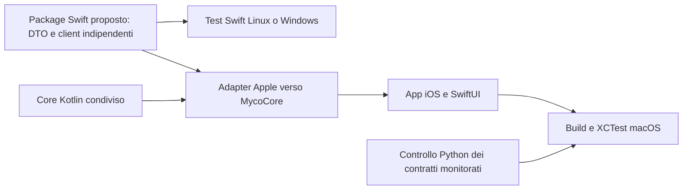

# Architettura Swift e verifica locale dei contratti KMP

Aggiornamento: 2026-10-06. I controlli locali riducono il tempo di feedback; non garantiscono l'assenza di errori Swift. Questo documento distingue strumenti operativi, verifiche native e proposte architetturali.

## 1. Incidente e causa del controllo mancato

Nel commit `c67525f`, il core aveva rinominato il parametro pubblico di `MycoAnalysisEngine.analyze` da `input` a `rawInput`. Kotlin accettava le chiamate posizionali, ma il framework KMP esportava `analyze(rawInput:)`; il ViewModel Swift continuava a chiamare `analyze(input:)`.

Il controllo locale e il pre-commit erano stati eseguiti, ma non verificavano questa firma. Lo script controllava proprietà e costruttori selezionati mediante ricerche testuali, senza leggere le dichiarazioni di questo metodo né compilare Swift. Xcode ha scoperto il difetto: [CI iOS iniziale](https://github.com/naturewhisp/myco/actions/runs/37496618216).

Il commit `caca881` ripristina il contratto pubblico e mantiene la preparazione degli input in un metodo privato. Una prova con la precedente firma conferma ora il fallimento del controllo locale. La nuova esecuzione nativa resta distinta dalla prova statica: [CI iOS correttiva](https://github.com/naturewhisp/myco/actions/runs/37498011367).

## 2. Verifiche operative e valore probatorio

| Livello | Cosa verifica | Cosa non dimostra |
| --- | --- | --- |
| Controllo Python | Contratti monitorati e alcune regole di isolamento/sintassi | Type-checking Swift completo, risoluzione dei receiver, overload arbitrari, comportamento runtime |
| Test Python del controllo | Firma storica, argomenti mancanti/extra/invertiti, dichiarazioni private/commentate, chiamate annidate, stringhe e parentesi non chiuse | Completezza di un parser Kotlin o Swift |
| Gradle su Windows | Build/test Android e compilazione delle klib comuni iOS quando disponibile | Link framework Apple, build app iOS, XCTest |
| CI KMP su macOS | Link framework device/simulatore e test core nativi | Compilazione UI e mapper Swift |
| Xcode su macOS | build-for-testing e test-without-building dell'app | Calibrazione biologica o prova storica del caso Mindino |

### Controlli aggiunti dopo l'incidente

Lo script ricava le liste dei parametri dalle dichiarazioni Kotlin pubbliche e confronta nomi e ordine con le chiamate Swift per:

- `MycoAnalysisEngine.analyze`, tramite il receiver produttivo `analysisEngine`;
- `MycoAlgorithms.evaluateHabitat` e `extractHabitatEvidence`;
- `WeatherAggregation.aggregate`;
- i costruttori `AnalysisInputs`, `WeatherHour`, `ExpectedDayHours`, `DailyWeatherCode`, `OsmHabitatElement` e `OsmSurface`.

I default Kotlin non sono considerati omissioni ammesse in Swift. Commenti e stringhe normali sono mascherati per evitare falsi riscontri; liste annidate e generici Kotlin sono gestiti separatamente. Il messaggio di successo specifica **contratti statici monitorati**, anziché affermare una verifica completa di Swift.

Il perimetro è esplicito: alias dei receiver, annotazioni personalizzate di esportazione, interpolazioni Swift, stringhe raw e commenti annidati non sono analizzati semanticamente. Nuove API o forme sintattiche richiedono ampliamento del controllo e prove dedicate. Xcode resta il controllo definitivo dei binding generati.

### Esecuzione locale

```powershell
py -3 -m unittest discover -s scripts -p test_check_swift_contracts.py
py -3 scripts/check_swift_contracts.py
```

In ambienti con python3, usare lo stesso interprete per entrambi i comandi. Il controllo contratti è agganciato a `scripts/hooks/pre-commit` e `:app:preBuild`. Il pre-commit ora fallisce se Python manca, anziché saltare la verifica. La CI iOS esegue test Python e controllo su Ubuntu prima del job macOS.

Il hook analizza i file del working tree. Con staging parziale possono differire dall'indice Git: verificare il diff staged e non considerare il hook prova del contenuto staged. La CI verifica il checkout del commit pubblicato. Non usare --no-verify per dichiarare un commit verificato.

## 3. Inventario architetturale osservato

| Componente | Dipendenze rilevanti | Portabilità locale |
| --- | --- | --- |
| Data/APIClient.swift | Foundation, networking | Candidato a package; verificare FoundationNetworking sui target non Apple |
| OpenMeteoClient, NominatimClient, OverpassClient | Foundation, MycoCore | Non compilabili come semplice package Linux/Windows finché importano il framework Apple KMP |
| OpenMeteoDomainMapper | Foundation, MycoCore | Bridge da verificare su macOS; aggregazione meteo nel core condiviso |
| CacheStore, SavedPlacesStore | Foundation, SwiftData | Persistenza Apple da separare dalla logica pura |
| SpunBundleService | Foundation, Compression, MycoCore | Compressione e bridge richiedono adapter prima dell'estrazione |
| CoreLocationService, AppleMapsNavigator | Framework Apple hardware/mappe | Restano nello strato Apple |
| MycoViewModel, viste e mappe | MycoCore, Observation/SwiftUI/MapKit | Compilazione e test app tramite Xcode |

GeoCoordinates è un value object condiviso nel core; CoreLocation è isolato negli adapter consentiti. Questa separazione migliora l'architettura, ma MycoCore resta una dipendenza Apple nei client Swift attuali. Non è stata misurata una percentuale di codice già compilabile su Windows/Linux.

## 4. Proposta MycoDataKit: stato e limiti

Nel repository non esistono ancora `iosApp/MycoDataKit/Package.swift` né l'adapter proposto `KmpBridgeAdapter.swift`. I precedenti comandi swift test --package-path iosApp/MycoDataKit erano esempi futuri, non verifiche eseguibili del progetto attuale. Disponibilità e versioni di WSL, Docker o Swift Windows vanno verificate sull'host; non sono prerequisiti garantiti dal repository.

Un package puro può anticipare errori di decodifica, networking e logica Swift indipendente, ma non può validare il binding reale KMP usando tipi Swift sostitutivi. Il framework Kotlin/Native Apple e i framework UI richiedono comunque macOS.



### Roadmap verificabile

1. **Operativo:** controllo statico ampliato con regressioni e gate CI prima della build nativa.
2. **Proposto:** estrarre DTO e client Foundation senza MycoCore, SwiftData, Compression o UI; introdurre adapter per networking e risorse. Nessuna duplicazione degli algoritmi scientifici Kotlin.
3. **Proposto:** creare il package, collegarlo a Xcode e verificare gli stessi fixture JSON nei target supportati. Solo dopo introdurre un job Linux swift test e misurarne tempi/copertura.
4. **Da approfondire:** verificare gli header Objective-C realmente generati da KMP su macOS e confrontarne il contratto nel job nativo, coprendo annotazioni di esportazione e trasformazioni che il controllo sui sorgenti non può certificare.
5. **Sempre richiesto:** build e XCTest su macOS sul commit finale, mantenendo distinti risultati statici e nativi.

La presenza di un adapter, la continuità matematica e il superamento dei contratti testuali non certificano l'app o il modello biologico.
