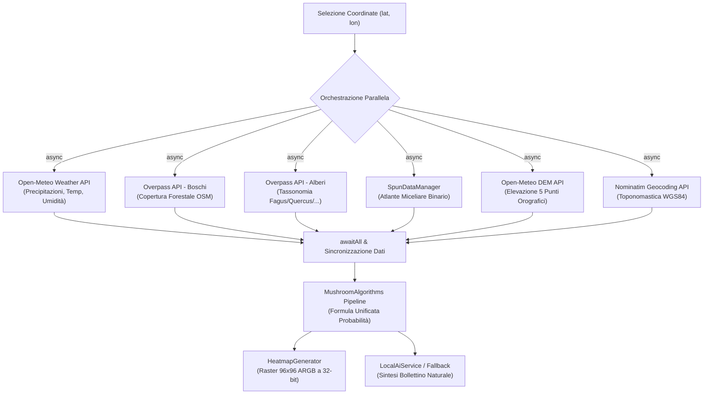
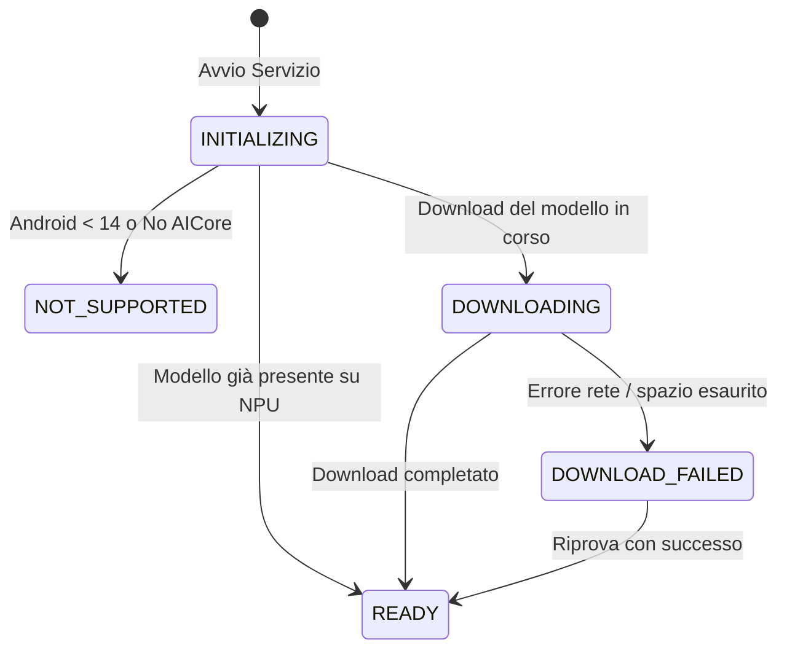
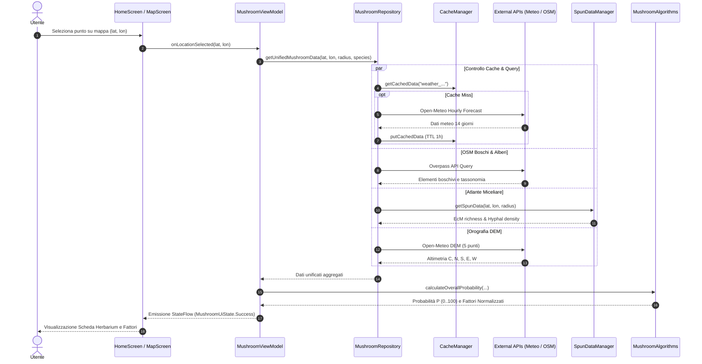
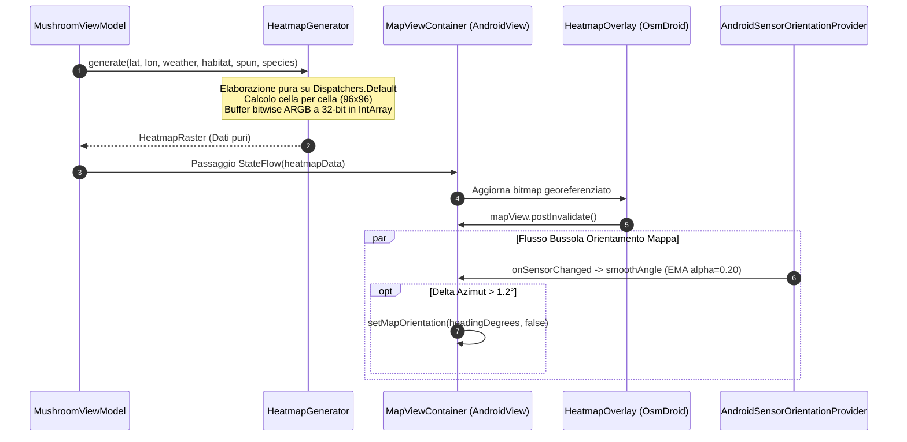
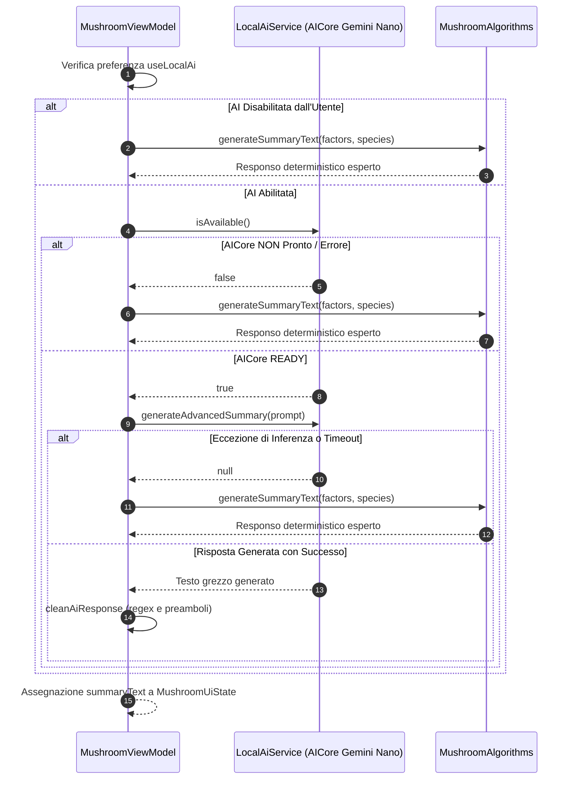

# Documentazione Tecnica e Architetturale del Progetto Myco

**Progetto:** Myco (`github.naturewhisp.myco`)  
**Piattaforma:** Android (minSdk 31, targetSdk 36, compileSdk 36, Java 17) & macOS (Ready via Hexagonal Architecture)  
**Versione Documento:** 1.0.0  
**Data:** 2026-09-09  
**Stato:** Ufficiale / Architettura e Governance  

---

## Indice Generale

1. [Sintesi Esecutiva & Panoramica del Sistema](#1-sintesi-esecutiva--panoramica-del-sistema)
   - 1.1 Missione e Dominio
   - 1.2 Stack Tecnologico
   - 1.3 Zero Diagnostic Policy (Strict)
2. [Architettura del Software & Mappa dei Package](#2-architettura-del-software--mappa-dei-package)
   - 2.1 Pattern Architetturale Complessivo
   - 2.2 Censimento Completo dei Package e Classi
   - 2.3 Diagramma Architetturale Mermaid (Core & Ports)
3. [Layer Hexagonal Ports & Adapters (`platform`)](#3-layer-hexagonal-ports--adapters-platform)
   - 3.1 Principio di Inversione delle Dipendenze
   - 3.2 Contratti delle Porte Piattaforma
   - 3.3 Implementazioni Android Esistenti
   - 3.4 Predisposizione al Porting macOS e Roadmap Multiplatform
4. [Pipeline di Calcolo ed Inferenza Micologica](#4-pipeline-di-calcolo-ed-inferenza-micologica)
   - 4.1 Catalogo Tassonomico e Profili Ecologici
   - 4.2 Formula Unificata di Calibrazione della Probabilità
   - 4.3 Curve di Risposta Biologica Continue
   - 4.4 Shock Termico Induttivo dei Primordi
   - 4.5 Modellazione Orografica DEM a 5 Punti & Insolazione
   - 4.6 Fasi Fenologiche e Ciclo Sinodico Lunare
   - 4.7 Motore Raster della Mappa di Calore (`HeatmapRaster`)
5. [Sottosistema Cartografico OsmDroid](#5-sottosistema-cartografico-osmdroid)
   - 5.1 Ciclo di Vita e Integrazione Jetpack Compose (`MapViewContainer`)
   - 5.2 Invarianti Cartografiche Obbligatorie
   - 5.3 Gerarchia e Z-Ordering degli Overlay
   - 5.4 Navigazione da Campo, Bussola EMA e Deadband Anti-Jitter
6. [Data Management, Repository e Strategie di Caching](#6-data-management-repository-e-strategie-di-caching)
   - 6.1 Orchestrazione delle Query Parallele (`MushroomViewModel`)
   - 6.2 Ridondanza e Failover Overpass API
   - 6.3 Atlante Miceliare SPUN (Formato Binario `spun_italy.bin`)
   - 6.4 Matrice TTL della Cache Multi-Livello (`CacheManager`)
   - 6.5 Gestione Luoghi Recenti e Prefetch Silenzioso dei Preferiti
7. [Motore AI On-Device (Google AI Edge AICore)](#7-motore-ai-on-device-google-ai-edge-aicore)
   - 7.1 Architettura e Requisiti di Sistema (Gemini Nano)
   - 7.2 Macchina a Stati del Ciclo di Vita del Modello
   - 7.3 Catena di Fallback Deterministica
   - 7.4 Prompt Engineering e Sanitizzazione Post-Processing
8. [Diagrammi di Flusso Dati e Componenti (Mermaid)](#8-diagrammi-di-flusso-dati-e-componenti-mermaid)
   - 8.1 Flusso di Reperimento Dati ed Inferenza Ecologica
   - 8.2 Flusso di Rendering Raster e Cartografico
   - 8.3 Flusso di Generazione AI e Fallback Deterministico
9. [Linee Guida di Manutenzione, Governance & Standard KDoc](#9-linee-guida-di-manutenzione-governance--standard-kdoc)
   - 9.1 Standard di Documentazione KDoc
   - 9.2 Regole di Purezza Architetturale
   - 9.3 Contratti dei Layout Compose (Prevenzione Starvation)
   - 9.4 Token Visivi e Risorse
   - 9.5 Checklist Obbligatoria per Pull Request (PR)
   - 9.6 Protocollo di Sincronizzazione Documentale

---

## 1. Sintesi Esecutiva & Panoramica del Sistema

### 1.1 Missione e Dominio
**Myco** è un'applicazione mobile nativa per Android (progettata secondo un'architettura esagonale predisposta all'estensione multiplatform desktop su macOS) finalizzata alla stima scientifica e alla modellazione probabilistica dell'accrescimento e della fruttificazione dei funghi epigei, con particolare specializzazione per il genere *Boletus* (porcini) ed altre specie commestibili pregiate dell'areale biogeografico europeo e mediterraneo.

Il sistema supera gli approcci aneddotici tradizionali mediante l'integrazione sinergica di sei fonti informative eterogenee:
1. **Dati Meteorologici Orari e Storici:** Monitoraggio delle precipitazioni cumulate a 14 giorni, temperature medie a 5 giorni, umidità relativa e crollo termico repentino (shock induttivo) interrogati tramite Open-Meteo.
2. **Copertura Forestale e Tassonomia Arborea:** Mappatura in tempo reale di boschi e generi arborei simbionti (*Fagus*, *Castanea*, *Quercus*, *Picea*, *Abies*, *Pinus*) ottenuti da OpenStreetMap tramite Overpass API.
3. **Biodiversità e Biomassa Sotterranea del Micelio:** Ricchezza ectomicorrizica (EcM) e densità di biomassa fungina estratte dall'atlante scientifico globale SPUN (*Society for the Protection of Underground Networks*) codificate in formato binario zlib proprietario compresso.
4. **Morfologia Orografica DEM a 5 Punti:** Calcolo vettoriale della pendenza ed esposizione dei versanti (*solatìo* a sud vs *bacìo* a nord) mediante differenze finite centrate su quote altimetriche digitali.
5. **Inferenza AI su Dispositivo:** Sintesi analitica del bollettino micologico eseguita in locale tramite Google AI Edge AICore (Gemini Nano) su Android 14+, a garanzia di riservatezza assoluta e assenza di costi infrastrutturali cloud.
6. **Cartografia Georeferenziata e Bussola da Campo:** Rappresentazione della densità di probabilità tramite raster continuo ARGB a 32-bit proiettato su OsmDroid con orientamento dinamico e filtro passa-basso anti-oscillazione.

### 1.2 Stack Tecnologico
* **Linguaggio & SDK:** Kotlin 2.x, Android SDK (minSdk 31 - Android 12, targetSdk 36, compileSdk 36, Java 17).
* **Build System:** Gradle 9.7.1, Android Gradle Plugin 9.3.2 (AGP 9+ con supporto nativo Kotlin).
* **Interfaccia Utente:** 100% Jetpack Compose Material 3 (Zero Frammenti XML, Single Activity).
* **Networking & Serializzazione:** Retrofit 2, OkHttp 3 (con connection pooling), Gson.
* **Cartografia:** OsmDroid 6.1.20 (OpenStreetMap, Mapnik & OpenTopoMap).
* **Machine Learning On-Device:** Google AI Edge AICore (`com.google.ai.edge.aicore`), Gemini Nano.
* **Architettura:** Modern Android Architecture (MVVM + Repository + Hexagonal Ports & Adapters).

### 1.3 Zero Diagnostic Policy (Strict)
Il progetto Myco impone la conformità assoluta alla **Zero Diagnostic Policy**:
* **0 Errori del Compilatore Kotlin**
* **0 Warning del Compilatore Kotlin**
* **0 Warning o Errori Lint Android** (`app/lint.xml`)
* I check di validazione devono essere superati prima di qualsiasi merge:
  ```pwsh
  .\gradlew.bat compileDebugKotlin
  .\gradlew.bat lintDebug
  .\gradlew.bat testDebugUnitTest
  ```
Violazioni di severità elevata (tra cui `DefaultLocale`, `UnusedResources`, `ObsoleteSdkInt`, `UseKtx`, `Security`) bloccano la compilazione.

---

## 2. Architettura del Software & Mappa dei Package

### 2.1 Pattern Architetturale Complessivo
L'applicazione è strutturata secondo i canoni della **Clean Architecture** e dei **Ports & Adapters (Architettura Esagonale)**. La logica di dominio e gli algoritmi di calcolo risiedono nel nucleo agnostico privo di dipendenze verso `android.*`. Il framework Android viene relegato agli adapter periferici.

```
                    ┌────────────────────────────────────────────────────────┐
                    │                      UI LAYER                          │
                    │   Jetpack Compose M3 (Screens, Components, Theme)      │
                    └───────────────────────────┬────────────────────────────┘
                                                │ osserva StateFlow
                                                ▼
                    ┌────────────────────────────────────────────────────────┐
                    │                   VIEWMODEL LAYER                      │
                    │     MushroomViewModel (State Holder & Coroutines)      │
                    └───────────┬───────────────────────────────┬────────────┘
                                │ chiama                        │ usa
                                ▼                               ▼
┌──────────────────────────────────────────────────┐  ┌──────────────────────┐
│                REPOSITORY LAYER                  │  │    PLATFORM PORTS    │
│  MushroomRepository, SpunDataManager, CacheMgr   │  │  (Interfacce Pure)   │
└───────────┬──────────────────────────┬───────────┘  └──────────▲───────────┘
            │ usa                      │ usa                     │ implementano
            ▼                          ▼                         │
┌────────────────────────┐   ┌─────────────────────┐  ┌──────────┴───────────┐
│     NETWORK LAYER      │   │   ALGORITHMS CORE   │  │   PLATFORM ADAPTERS  │
│ Retrofit APIs, OkHttp  │   │ MushroomAlgorithms, │  │ Android (Sensors,    │
│                        │   │  HeatmapGenerator   │  │ SharedPrefs, Fused)  │
│                        │   │  (Pure Kotlin)      │  │ macOS (Futuro Core)  │
└────────────────────────┘   └─────────────────────┘  └──────────────────────┘
```

### 2.2 Censimento Completo dei Package e Classi

La base di codice è organizzata sotto il namespace principale `github.naturewhisp.myco`:

| Package | File Principali | Responsabilità e Contratti |
|---|---|---|
| **Root** | `MainActivity.kt` | Single Activity (`ComponentActivity`), punto di ingresso dell'applicazione e configurazione della finestra a tutto schermo (*edge-to-edge*). |
| `model` | `DailyOutlook.kt`<br>`Factor.kt`<br>`GeocodingModel.kt`<br>`HeatmapModel.kt`<br>`MushroomSpecies.kt`<br>`OverpassModel.kt`<br>`PlaceName.kt`<br>`SavedLocation.kt`<br>`SpunModel.kt`<br>`TerrainModel.kt`<br>`WeatherModel.kt` | **Dominio Puro:** Data classes, DTO per le API remote, strutture dati immutabili. `HeatmapRaster` definisce il buffer 32-bit grezzo agnostico. `MushroomSpecies` racchiude il catalogo tassonomico delle 10 specie. Nessuna dipendenza dal framework Android. |
| `platform` | `AssetProvider.kt`<br>`KeyValueStorage.kt`<br>`PlatformAiEngine.kt`<br>`PlatformLocationProvider.kt`<br>`PlatformNavigator.kt`<br>`PlatformOrientationProvider.kt`<br>`UserLocation.kt` | **Porte Agnostiche:** Interfacce del pattern esagonale che disaccoppiano l'accesso all'hardware e al file system. I modelli associati (`UserLocation`, `DeviceHeading`, `MapOrientationMode`) contengono 0 import di sistema. |
| `platform.android` | `AndroidAssetProvider`<br>`AndroidSharedPreferencesStorage`<br>`AndroidLocationProvider.kt`<br>`AndroidSensorOrientationProvider.kt`<br>`AndroidPlatformNavigator` | **Adapter Android:** Implementazioni concrete collegate alle API di Google Play Services, Android `SensorManager`, `AssetManager` e `SharedPreferences`. |
| `network` | `ApiServices.kt`<br>`LocalAiService.kt`<br>`NetworkClient.kt` | Client HTTP Retrofit per Open-Meteo, Nominatim e Overpass API; adapter locale Google AI Edge AICore per Gemini Nano. |
| `repository` | `CacheManager.kt`<br>`MushroomRepository.kt`<br>`SpunDataManager.kt` | Aggregazione di fonti dati concorrenti, caching multi-livello indicizzato per coordinate e tempo, lettura e decompressione zlib dell'atlante miceliare SPUN. |
| `ui.components` | `AnomalyNotice.kt`<br>`CompassRoseDial.kt`<br>`DayRow.kt`<br>`EmptyState.kt`<br>`FactorRow.kt`<br>`FieldNote.kt`<br>`HeatmapOverlay.kt`<br>`MapViewContainer.kt`<br>`MushroomComponents.kt`<br>`MycoDivider.kt`<br>`ProbabilityBar.kt`<br>`ProbabilityHeadline.kt`<br>`RenameFavoriteDialog.kt`<br>`SpeciesSelectionSheet.kt`<br>`TrendCurve.kt`<br>`UserBearingOverlay.kt` | Componenti Compose modulari, atomici e riutilizzabili. Layout tabulari con protezione da starvation orizzontale. Bridge AndroidView per OsmDroid MapView. |
| `ui.screens` | `ForecastScreen.kt`<br>`HomeScreen.kt`<br>`MapScreen.kt`<br>`MushroomApp.kt`<br>`SettingsScreen.kt` | Schermate principali di navigazione: registro fenologico giornaliero, tavola cartografica interattiva, impostazioni e scaffold applicativo. |
| `ui.theme` | `Color.kt`<br>`MycoColors.kt`<br>`Shape.kt`<br>`Theme.kt`<br>`ThemePreference.kt`<br>`Type.kt` | Design System *Herbarium*: token cromatici botanici, tipografia editoriale (Newsreader, Inter, CodeTech) e persistenza del tema chiaro/scuro via DataStore. |
| `ui.viewmodel` | `MushroomViewModel.kt` | State Holder centrale dell'applicazione: orchestrazione coroutine su `viewModelScope`, calcoli paralleli, gestione preferiti, cronologia e sanitizzazione AI. |
| `utils` | `HeatmapGenerator.kt`<br>`MushroomAlgorithms.kt`<br>`NavigationHelper.kt` | Motori matematici puri: calcolo curve di crescita biologica, orografia DEM a 5 punti, fasi lunari e generatore raster $96 \times 96$ a pixel ARGB. |

### 2.3 Diagramma Architetturale Mermaid (Core & Ports)

```mermaid
graph TD
    subgraph UI_Layer ["Presentazione (Jetpack Compose Material 3)"]
        MA[MushroomApp - Scaffold & Tabs]
        HS[HomeScreen - Tavola Micologica]
        FS[ForecastScreen - Andamento Fenologico]
        MS[MapScreen - Cartografia & Bussola]
        SS[SettingsScreen - Parametri & Cache]
        MVC[MapViewContainer - OsmDroid Bridge]
    end

    subgraph State_Layer ["State Holder & Orchestrazione"]
        VM[MushroomViewModel]
    end

    subgraph Domain_Core ["Core di Dominio & Algoritmi (Pure Kotlin)"]
        ALG[MushroomAlgorithms]
        HG[HeatmapGenerator]
        HR[HeatmapRaster]
        SPEC[MushroomSpecies Catalog]
        MODELS[Data Models: Weather, Spun, Terrain]
    end

    subgraph Repository_Layer ["Repository & Storage"]
        REP[MushroomRepository]
        SPUN[SpunDataManager]
        CACHE[CacheManager]
    end

    subgraph Platform_Ports ["Platform Ports (Interfacce Agnostiche)"]
        AP[AssetProvider]
        KV[KeyValueStorage]
        AI[PlatformAiEngine]
        LOC[PlatformLocationProvider]
        ORI[PlatformOrientationProvider]
        NAV[PlatformNavigator]
    end

    subgraph Android_Adapters ["Android Platform Adapters"]
        A_AP[AndroidAssetProvider]
        A_KV[AndroidSharedPreferencesStorage]
        A_AI[LocalAiService - AICore Gemini Nano]
        A_LOC[AndroidLocationProvider - Fused]
        A_ORI[AndroidSensorOrientationProvider - SensorManager]
        A_NAV[AndroidPlatformNavigator - geo: Intent]
    end

    MA --> HS & FS & MS & SS
    HS & FS & MS & SS --> VM
    MS --> MVC
    VM --> REP
    VM --> ALG
    VM --> HG
    VM --> LOC
    VM --> ORI
    VM --> NAV
    VM --> AI

    REP --> CACHE
    REP --> SPUN
    REP --> MODELS
    SPUN --> AP
    CACHE --> KV
    HG --> HR

    A_AP -.->|implements| AP
    A_KV -.->|implements| KV
    A_AI -.->|implements| AI
    A_LOC -.->|implements| LOC
    A_ORI -.->|implements| ORI
    A_NAV -.->|implements| NAV
```



---

## 3. Layer Hexagonal Ports & Adapters (`platform`)

### 3.1 Principio di Inversione delle Dipendenze
La stabilità scientifica del modello micologico richiede che l'algoritmo non sia legato alle API di uno specifico sistema operativo. I moduli del core di business comunicano con l'esterno unicamente tramite **porte** (interfacce Kotlin nel package `github.naturewhisp.myco.platform`). 

In questo modo, la logica di calcolo, la gestione dei dati SPUN e l'elaborazione del raster possono essere compilate indifferentemente per **Android**, **macOS Desktop** o come test unitario su JVM senza necessità di framework di mocking complessi come Robolectric.

### 3.2 Contratti delle Porte Piattaforma

#### 1. `AssetProvider` (`platform/AssetProvider.kt`)
Consente la lettura di file statici inclusi nel bundle o negli asset dell'applicazione:
```kotlin
fun interface AssetProvider {
    @Throws(IOException::class)
    fun open(path: String): InputStream
}
```

#### 2. `KeyValueStorage` (`platform/KeyValueStorage.kt`)
Incapsula il motore di persistenza chiave-valore per preferenze utente, stato della cache e coordinate salvate:
```kotlin
interface KeyValueStorage {
    fun getString(key: String, defValue: String?): String?
    fun putString(key: String, value: String?)
    fun getInt(key: String, defValue: Int): Int
    fun putInt(key: String, value: Int)
    fun getBoolean(key: String, defValue: Boolean): Boolean
    fun putBoolean(key: String, value: Boolean)
    fun remove(key: String)
    fun clear()
    fun getAll(): Map<String, *>
}
```

#### 3. `PlatformAiEngine` (`platform/PlatformAiEngine.kt`)
Astrazione del motore di intelligenza artificiale on-device per la sintesi testuale dei bollettini fenologici:
```kotlin
enum class AiEngineStatus {
    NOT_SUPPORTED,
    INITIALIZING,
    DOWNLOADING,
    DOWNLOAD_FAILED,
    READY
}

interface PlatformAiEngine {
    val status: StateFlow<AiEngineStatus>
    fun isAvailable(): Boolean
    suspend fun generateAdvancedSummary(prompt: String): String?
}
```

#### 4. `PlatformLocationProvider` (`platform/PlatformLocationProvider.kt`)
Gestisce la geolocalizzazione live dell'utente:
```kotlin
data class LocationCoordinates(val latitude: Double, val longitude: Double)

interface PlatformLocationProvider {
    suspend fun getCurrentLocation(): LocationCoordinates?
    fun locationUpdates(): Flow<UserLocation>
}
```

#### 5. `PlatformOrientationProvider` (`platform/PlatformOrientationProvider.kt`)
Fornisce il flusso continuo di orientamento magnetico da sensori hardware:
```kotlin
interface PlatformOrientationProvider {
    fun headingUpdates(): Flow<DeviceHeading>
    fun isSupported(): Boolean
}
```

#### 6. `PlatformNavigator` (`platform/PlatformNavigator.kt`)
Delega al sistema operativo l'apertura delle coordinate geografiche verso applicazioni cartografiche terze (Google Maps, OsmAnd, Apple Maps):
```kotlin
interface PlatformNavigator {
    fun navigateTo(latitude: Double, longitude: Double, label: String = "Punto Funghi")
}
```

### 3.3 Implementazioni Android Esistenti
Le classi nel package `github.naturewhisp.myco.platform.android` collegano le porte astratte alle API native Android:
* `AndroidAssetProvider`: Delega ad `android.content.res.AssetManager.open(path)`.
* `AndroidSharedPreferencesStorage`: Incapsula `SharedPreferences` con estensioni `androidx.core.content.edit`.
* `AndroidLocationProvider`: Sfrutta `com.google.android.gms.location.FusedLocationProviderClient` con gestione automatica delle autorizzazioni a runtime (`ACCESS_FINE_LOCATION`).
* `AndroidSensorOrientationProvider`: Sfrutta `SensorManager` con sensore hardware `Sensor.TYPE_ROTATION_VECTOR` (o fallback su `TYPE_GEOMAGNETIC_ROTATION_VECTOR`), applicando un filtro passa-basso EMA sull'angolo.
* `AndroidPlatformNavigator`: Costruisce e avvia un Intent nativo con schema URI `geo:lat,lon?q=lat,lon(label)`.
* `LocalAiService`: Implementazione Android di `PlatformAiEngine` basata su Google AI Edge AICore (`com.google.ai.edge.aicore`).

### 3.4 Predisposizione al Porting macOS e Roadmap Multiplatform
In conformità a `docs/MACOS_ARCHITECTURE.md`, Myco è predisposta per il riutilizzo del 100% della logica di calcolo su macOS. Il disaccoppiamento richiede unicamente la fornitura degli adapter specifici:

| Porta Piattaforma | Implementazione Android Attuale | Implementazione macOS Prevista |
|---|---|---|
| `AssetProvider` | `context.assets.open(path)` | `Bundle.main.resourceURL` / FileSystem locale |
| `KeyValueStorage` | `SharedPreferences` via KTX | `NSUserDefaults` o file `.properties` / JSON |
| `PlatformAiEngine` | Google AICore (Gemini Nano) | Apple Intelligence / CoreML / MLX / Ollama |
| `PlatformLocationProvider` | Google Play Services Fused Location | Apple `CoreLocation` (`CLLocationManager`) |
| `PlatformOrientationProvider`| Android `SensorManager` | Bearing calcolato da GPS / Bussola Mac (se presente) |
| `PlatformNavigator` | Android `Intent("geo:...")` | `NSWorkspace.open("maps://?ll=lat,lon")` |
| **Interfaccia Grafica** | Jetpack Compose M3 (Android) | Compose Multiplatform Desktop o Swift/SwiftUI |

---

## 4. Pipeline di Calcolo ed Inferenza Micologica

### 4.1 Catalogo Tassonomico e Profili Ecologici
La stima della probabilità di fruttificazione è differenziata in base alle caratteristiche biologiche di 10 profili micologici (`MushroomSpecies.kt`):

1. **Modello Generale Polifito** (`general`): Modello standard per la stima cumulativa del bosco misto collinare/montano.
2. **Porcino comune** (*Boletus edulis*): Simbionte ectomicorrizico di faggio, abete rosso, castagno e pino; altitudine 300–1800 m s.l.m., temperatura ideale 13–20°C, pioggia target 35 mm.
3. **Porcino nero / Bronzino** (*Boletus aereus*): Termofilo collinare (50–1000 m s.l.m., 18–26°C), predilige querce, lecci e castagni; richiede 20 mm di pioggia.
4. **Porcino rosso** (*Boletus pinophilus*): Microtermo montano (300–1900 m s.l.m., 11–19°C), associato a pino silvestre, mirtillo e faggio; pioggia target 30 mm.
5. **Porcino estatino** (*Boletus reticulatus*): Mesofilo precoce (100–1400 m s.l.m., 16–24°C), tipico di querce e castagneti asciutti; pioggia target 25 mm.
6. **Finferlo / Gallinaccio** (*Cantharellus cibarius*): Ectomicorrizico igrofilo (200–1700 m s.l.m.), necessita di abbondanti piogge (40 mm target) e suoli coperti da muschio.
7. **Ovolo buono** (*Amanita caesarea*): Fortemente termofilo (50–900 m s.l.m., 18–26°C), predilige boschi aperti di quercia e castagno esposti a mezzogiorno (*solatìo*).
8. **Steccherino dorato** (*Hydnum repandum*): Specie tardo-autunnale e resistente alle prime gelate (200–1500 m s.l.m., 8–16°C), boschi misti di latifoglie e conifere.
9. **Mazza di tamburo** (*Macrolepiota procera*): Saprotrofo praticolo delle radure, pascoli e margini boschivi; non dipende da alberi simbionti ma da lettiera e calore.
10. **Chiodino** (*Armillaria mellea*): Parassita e saprotrofo lignicolo autunnale; cresce su ceppaie di latifoglie con temperature fresche (10–18°C).

### 4.2 Formula Unificata di Calibrazione della Probabilità
In conformità a `AGENTS.md` (Sezione 4.7), la probabilità di fruttificazione finale $P \in [0, 100]$ viene calcolata moltiplicando la componente meteorologica pesata per i fattori moltiplicatori ecologici continui:

$$P = \text{clamp}\left(100 \times \left(\frac{W}{100}\right)^{1.2} \times H \times A \times S \times T,\; 0,\; 100\right)$$

Dove:
* **$W \in [0, 100]$:** Punteggio meteorologico combinato. L'esponente **$1.2$** introduce una risposta biologica super-lineare: condizioni meteo mediocri vengono attenuate, mentre la coincidenza di piogge ideali e temperature ottimali viene premiata in modo esponenziale.
* **$H \in [0.10, 1.00]$:** Punteggio dell'habitat forestale e micorrizico (OSM e SPUN).
* **$A \in [0.40, 1.00]$:** Punteggio altitudinale specifico della specie (`calculateSpeciesAltitudeScore`).
* **$S \in [0.10, 1.00]$:** Punteggio fenologico stagionale del mese in corso (`calculateSpeciesSeasonalityScore`).
* **$T \in [0.50, 1.10]$:** Modificatore continuo del versante orografico (pendenza ed esposizione solare).

### 4.3 Curve di Risposta Biologica Continue
Tutte le variabili ambientali sono modellate mediante funzioni continue definite nell'intervallo $[0.0, 1.0]$, eliminando qualsiasi gradino discontinuo.

#### A. Risposta Termica ($S_T$, `tempScoreSmooth`, `MushroomAlgorithms.kt:643`)
Dato il range ottimale $[T_{\text{id,min}}, T_{\text{id,max}}]$ e il range di tolleranza biologica $[T_{\text{tol,min}}, T_{\text{tol,max}}]$:

$$S_T(T) = \begin{cases}
0.0 & \text{se } T < T_{\text{tol,min}} \lor T > T_{\text{tol,max}} \\
1.0 & \text{se } T_{\text{id,min}} \le T \le T_{\text{id,max}} \\
\frac{T - T_{\text{tol,min}}}{T_{\text{id,min}} - T_{\text{tol,min}}} & \text{se } T_{\text{tol,min}} \le T < T_{\text{id,min}} \\
\frac{T_{\text{tol,max}} - T}{T_{\text{tol,max}} - T_{\text{id,max}}} & \text{se } T_{\text{id,max}} < T \le T_{\text{tol,max}}
\end{cases}$$

#### B. Precipitazioni Cumulate ($S_R$, `rainScoreSmooth`, `MushroomAlgorithms.kt:659`)
Calcolata sulle piogge cadute nella finestra da 10 a 2 giorni prima ($R_{10-2}$), periodo necessario per l'idratazione e la differenziazione dei primordi:

$$S_R(R) = \min\left(1.0,\; \frac{R}{R_{\text{target}}}\right)$$

dove $R_{\text{target}}$ è la pioggia minima necessaria per la specie (es. 35 mm per *B. edulis*, 40 mm per *C. cibarius*).

#### C. Umidità Relativa Media ($S_H$, `humidityScoreSmooth`, `MushroomAlgorithms.kt:670`)
Calcolata sugli ultimi 3 giorni di rilievo:

$$S_H(H) = \begin{cases}
0.0 & \text{se } H < 50\% \\
\frac{H - 50}{35} & \text{se } 50\% \le H < 85\% \\
1.0 & \text{se } H \ge 85\%
\end{cases}$$

### 4.4 Shock Termico Induttivo dei Primordi
I carpofori della maggior parte dei funghi micorrizici necessitano di uno shock induttivo (*cold shock*) per avviare la fruttificazione, consistente in un brusco abbassamento delle temperature a seguito di temporali estivi o autunnali (`MushroomAlgorithms.kt:280`):
* Si verifica la presenza di pioggia cumulativa a 10 giorni $R_{10} \ge 12\text{ mm}$.
* Si calcola il gradiente termico tra il quarto giorno precedente e il giorno precedente: $\Delta T = T_{d-4} - T_{d-1}$.
* La soglia minima di shock $\Delta T_{\min}$ è pari a $2.0^\circ\text{C}$ in presenza di un micelio SPUN denso ($\ge 5.0\text{ m/cm}^3$), oppure $3.0^\circ\text{C}$ in condizioni ordinarie.
* La componente di shock termico vale:
  $$\text{shockScore} = 15.0 \times \text{clamp}\left(\frac{\Delta T - \Delta T_{\min}}{3.0},\; 0,\; 1\right) \times \text{clamp}\left(\frac{R_{10}}{25.0},\; 0,\; 1\right)$$

#### Punteggio Meteo Composito Pesato ($W$, `calculateWeatherScore`, `MushroomAlgorithms.kt:225`)
$$W = \text{clamp}\left(40 \cdot S_R + 30 \cdot S_T + 15 \cdot S_H + \text{shockScore} + \text{SPUN}_{\text{mod}},\; 0,\; 100\right)$$
dove $\text{SPUN}_{\text{mod}} = +6$ se densità ifale $\ge 5.0\text{ m/cm}^3$ e pioggia $\ge 12\text{ mm}$; $-4$ se densità ifale $< 2.5\text{ m/cm}^3$.

### 4.5 Modellazione Orografica DEM a 5 Punti & Insolazione
Per valutare il microclima e l'insolazione del versante boschivo, il sistema campiona 5 quote altimetriche digitali distanziate di $\Delta = 75\text{ metri}$ rispetto al punto di interesse:
* $z_C$: Centro $(\text{lat}, \text{lon})$
* $z_N$: Nord $(\text{lat} + \Delta\text{lat}, \text{lon})$
* $z_S$: Sud $(\text{lat} - \Delta\text{lat}, \text{lon})$
* $z_E$: Est $(\text{lat}, \text{lon} + \Delta\text{lon})$
* $z_W$: Ovest $(\text{lat}, \text{lon} - \Delta\text{lon})$

```
                  Nord (zN)
                     │  Δ = 75m
                     │
Ovest (zW) ──────── Centro (zC) ──────── Est (zE)
                     │
                     │  Δ = 75m
                  Sud (zS)
```

Le derivate parziali spaziali del terreno sono calcolate tramite differenze finite centrate:
$$\frac{\partial z}{\partial x} = \frac{z_E - z_W}{2\Delta}, \qquad \frac{\partial z}{\partial y} = \frac{z_N - z_S}{2\Delta}$$

* **Pendenza Orografica (Slope):**
  $$\text{slopeRatio} = \sqrt{\left(\frac{\partial z}{\partial x}\right)^2 + \left(\frac{\partial z}{\partial y}\right)^2}, \qquad \text{slopeDeg} = \arctan(\text{slopeRatio}) \times \frac{180}{\pi}$$

* **Esposizione del Versante (Aspect):**
  Il vettore di massima discesa del pendio vale $(v_x = -\partial z/\partial x,\; v_y = -\partial z/\partial y)$. L'angolo azimutale rispetto al Nord è:
  $$\text{aspectDeg} = \left(\text{atan2}(v_x, v_y) \times \frac{180}{\pi}\right) \bmod 360^\circ$$

* **Valutazione Ecologica del Versante (`evaluateTerrainAspect`, `MushroomAlgorithms.kt:413`):**
  * **Specie Termofile** (*B. aereus*, *A. caesarea*): I versanti a *Solatìo* (Sud, Sud-Est, Sud-Ovest) ricevono un moltiplicatore premiante fino a $1.05$ (+5%), mentre i versanti a *Bacìo* (Nord) subiscono una penalizzazione fino a $0.90$ (-10%).
  * **Stagione Estiva Arida (Luglio - Agosto):** I versanti a *Bacìo* (Nord) preservano l'umidità del sottobosco dall'evapotraspirazione $\to$ bonus $1.05$; i versanti a *Solatìo* soffrono il disseccamento $\to$ malus $0.90$.
  * **Pendenze Estreme ($> 38^\circ$):** Il ruscellamento superficiale impedisce all'acqua piovana di penetrare nella lettiera $\to$ moltiplicatore orografico plafonato tassativamente a $0.92$.

### 4.6 Fasi Fenologiche e Ciclo Sinodico Lunare
* **Macchina a stati della fase di crescita (`calculateGrowthPhase`, `MushroomAlgorithms.kt:297`):**
  Rileva il giorno scatenante (*trigger day*) con precipitazione $\ge 12\text{ mm}$ o 3 giorni cumulati $\ge 18\text{ mm}$:
  * $\le 3\text{ giorni}$: *Idratazione miceliare* (attivazione metabolica del micelio).
  * $4 \dots 7\text{ giorni}$: *Incubazione primordi* (differenziazione dei carpofori).
  * $8 \dots 14\text{ giorni}$: *Buttata attiva* (finestra ottimale di raccolta e massima probabilità).
  * $> 14\text{ giorni}$: *Flusso in esaurimento* (necessità di nuove piogge scatenanti).
* **Fase Lunare (`getMoonPhase`, `MushroomAlgorithms.kt:166`):**
  Calcolata sul ciclo sinodico lunare di $29.53058867\text{ giorni}$ riferito al novilunio del `2000-01-06T18:14:00Z`. La tradizione micologica popolare considera favorevoli la *Luna Nuova* e la *Luna Crescente* (primi 5.5 giorni).

### 4.7 Motore Raster della Mappa di Calore (`HeatmapRaster`)
La distribuzione geografica della probabilità su scala territoriale è calcolata da `HeatmapGenerator.kt` e incapsulata in `HeatmapRaster` (`model/HeatmapModel.kt`):
* **Dimensioni della Griglia:** $96 \times 96 = 9216\text{ celle}$.
* **Raggio Territoriale:** Raggio circolare di $35\text{ km}$ attorno alle coordinate selezionate (copertura complessiva di $70 \times 70\text{ km}$).
* **Risoluzione Territoriale:** $\sim 700\text{ metri}$ lineari per cella.
* **Throughput Computazionale:** Tempo di elaborazione medio $< 2\text{ ms}$ su `Dispatchers.Default`.
* **Pixel Buffering Bitwise:** Genera un array primitivo `IntArray` con codifica ARGB a 32-bit:
  ```kotlin
  val argb = (alpha shl 24) or (r shl 16) or (g shl 8) or b
  ```
  Nessun oggetto grafico Android (`android.graphics.Bitmap`, `Canvas`, `Color`) viene allocato durante il calcolo.
* **Palette Minerale Botanica Herbarium:**
  * $0\% \dots 16\%$: Trasparenza totale (nessuna attività biologica rilevata).
  * $16\% \dots 40\%$: Salvia Viva / Lichene Luminoso (`#4E9648` / `#62B058`).
  * $40\% \dots 65\%$: Ocra Dorata / Ambra Solare (`#D49B24` / `#FAB22A`).
  * $65\% \dots 80\%$: Terracotta Cinabro (`#C86430` / `#EB6E34`).
  * $> 80\%$: Ruggine Granato Hotspot (`#9E262C` / `#D8343E`).
* **Sfumatura Morbida (Feathering Radiale):** Sull'ultimo 25% del raggio esterno ($r \in [26.25, 35.0]\text{ km}$), l'opacità viene gradualmente azzerata tramite la funzione di transizione $C^1$ smoothstep $S(t) = 3t^2 - 2t^3$.
* **Finestra di Opacità Dinamica Bilanciata:** L'opacità scala tra $115$ e $180$ ($\sim 45\% \dots 70\%$) garantendo leggibilità sia delle curve di livello topografiche sottostanti sia delle zone a massima probabilità.

---

## 5. Sottosistema Cartografico OsmDroid

### 5.1 Ciclo di Vita e Integrazione Jetpack Compose (`MapViewContainer`)
L'interoperabilità tra la libreria OpenStreetMap (OsmDroid) e Jetpack Compose avviene tramite il composable `AndroidView` all'interno di `MapViewContainer.kt`:

1. **Fase Factory (Inizializzazione):**
   * Configurazione della telecamera: abilitazione gesture multi-touch (`setMultiTouchControls(true)`).
   * Applicazione dei vincoli di zoom: `minZoomLevel = 4.0`, `maxZoomLevel = 20.0`.
   * Disattivazione della ripetizione verticale: `isVerticalMapRepetitionEnabled = false`.
   * Selezione dello strato cartografico: `TileSourceFactory.MAPNIK` o `TileSourceFactory.OpenTopo`.
   * Inserimento ordinato degli overlay della mappa.
2. **Fase Update (Reattività):**
   * Controllo delle variazioni di tile source (`mapStyle`).
   * Aggiornamento del bitmap della heatmap tramite `postInvalidate()`.
   * Aggiornamento del fascio di orientamento e posizione GPS utente.
   * Rotazione della mappa con deadband anti-oscillazione.
3. **Gestione del Ciclo di Vita:**
   * Registrazione dei callback `onResume()`, `onPause()` e `onDetach()` per rilasciare i thread di caricamento dei tile e liberare la cache dei bitmap.

### 5.2 Invarianti Cartografiche Obbligatorie
In conformità a `AGENTS.md` (Sezione 4.6), ogni istanza di `MapView` deve rispettare:
1. **Disattivazione ripetizione verticale:** `mapView.isVerticalMapRepetitionEnabled = false` (evita sdoppiamenti e anomalie grafiche su display moderni a 20:9).
2. **Clamping dello Zoom:** Bounded range $[4.0, 20.0]$.
3. **Inizializzazione Geografica Protetta:** Se le coordinate selezionate sono nulle, la mappa si posiziona sul baricentro dell'Italia Centrale `GeoPoint(42.5, 12.5)` a zoom 6.0 anziché a zoom 0.0 nelle coordinate nulle dell'Oceano Atlantico.

### 5.3 Gerarchia e Z-Ordering degli Overlay
Gli overlay cartografici sono inseriti in una pipeline rigida a quattro livelli:

| Livello Z | Classe Overlay | Responsabilità |
|---|---|---|
| **Base** | Mattonelle OSM | Raster topografico di base (Mapnik stradale o OpenTopo curve di livello). |
| **Z = 0** | `MapEventsOverlay` | Intercettazione degli eventi di tocco (tap su mappa per geocodifica inversa). |
| **Z = 1** | `HeatmapOverlay` | Disegno su Canvas del bitmap georeferenziato generato da `HeatmapRaster`. |
| **Z = 2** | `UserBearingOverlay` | Visualizzazione del punto di posizione GPS, cerchio di accuratezza e fascio bussola. |
| **Z = 3** | `Marker` (OsmDroid) | Segnaposto botanico del punto selezionato con etichetta toponomastica. |

### 5.4 Navigazione da Campo, Bussola EMA e Deadband Anti-Jitter
Il sistema supporta due modalità di fruizione cartografica:
* **`NORTH_UP` (Predefinita):** La mappa mantiene costantemente il Nord verso l'alto dello schermo ($0^\circ$).
* **`HEADING_UP` (Bussola da campo):** La mappa ruota automaticamente nella direzione verso cui punta il dispositivo:
  $$\text{rotazioneMappa} = (360^\circ - \text{azimuth}) \bmod 360^\circ$$

#### Filtro Passa-Basso EMA (Exponential Moving Average)
In `AndroidSensorOrientationProvider.kt:90`, per smorzare il rumore ad alta frequenza del magnetometro senza introdurre latenze percettibili, l'angolo di azimut viene filtrato esponenzialmente con fattore di smoothing $\alpha = 0.20$:

```kotlin
internal fun smoothAngle(current: Float, target: Float, alpha: Float): Float {
    var diff = (target - current) % 360f
    if (diff > 180f) diff -= 360f
    if (diff < -180f) diff += 360f
    var result = current + diff * alpha
    if (result < 0f) result += 360f
    if (result >= 360f) result -= 360f
    return result
}
```

#### Deadband Anti-Jitter a Due Livelli
1. **Livello Sensore:** L'adapter emette aggiornamenti via Flow solo se la variazione angolare $\Delta \ge 0.75^\circ$, oppure $\Delta \ge 0.25^\circ$ con intervallo temporale $\ge 120\text{ ms}$.
2. **Livello Cartografico (`MapViewContainer.kt:172`):** La mappa OsmDroid viene ruotata unicamente se la discrepanza angolare supera **$1.2^\circ$**:
   ```kotlin
   if (orientationDiff > 1.2f) {
       mapView.setMapOrientation(mapOrientationDegrees, false)
   }
   ```
   Ciò previene ridisegni continui su micro-oscillazioni della mano dell'utente, azzerando il consumo anomalo della batteria.

---

## 6. Data Management, Repository e Strategie di Caching

### 6.1 Orchestrazione delle Query Parallele (`MushroomViewModel`)
Alla selezione di un punto geografico o all'avvio della ricerca, `MushroomViewModel.kt` avvia l'aggregazione parallela tramite coroutine concorrenti (`async` su `Dispatchers.IO`):



### 6.2 Ridondanza e Failover Overpass API
Per garantire continuità di servizio durante i frequenti blocchi per manutenzione o rate-limit dei server OpenStreetMap, `MushroomRepository.kt` implementa una rotazione con failover automatico su tre endpoint geograficamente indipendenti:
1. `https://overpass-api.de/` (Server centrale tedesco)
2. `https://overpass.kumi.systems/` (Mirror europeo ad alta capacità)
3. `https://overpass.openstreetmap.fr/` (Mirror francese ad alta affidabilità)

### 6.3 Atlante Miceliare SPUN (Formato Binario `spun_italy.bin`)
I dati scientifici sulla biomassa e ricchezza ectomicorrizica sono codificati nel file `spun/spun_italy.bin` memorizzato negli asset applicativi (`SpunDataManager.kt`).

#### Struttura dell'Header Binario (32 Byte, Big-Endian)
```
┌─────────────────┬──────────────────┬─────────────────┬──────────────────┐
│  Magic (4B)     │  Version (2B)    │ RegionCode (4B) │ minLat (Float 4B)│
│  "SPUN" (ASCII) │  uint16 = 1      │ "ALP\0" (ASCII) │ IEEE 754 = 35.0f │
├─────────────────┼──────────────────┼─────────────────┼──────────────────┤
│ maxLat (F 4B)   │ minLon (F 4B)    │ maxLon (F 4B)   │ width (uint16)   │
│ IEEE 754 = 48.5 │ IEEE 754 = 5.0f  │ IEEE 754 = 19.0 │ Dimensioni X     │
├─────────────────┼──────────────────┼─────────────────┼──────────────────┤
│ height (uint16) │ stepArcSec (u16) │  [Reserved 2B]  │                  │
│ Dimensioni Y    │ Risoluzione arco │  Padding/Allign │                  │
└─────────────────┴──────────────────┴─────────────────┴──────────────────┘
```

#### Decompressione del Payload zlib e Matrici
* **Decompressione:** Il payload compresso viene decompressa tramite `InflaterInputStream` e caricato in memoria mediante `DataInputStream.readFully()`.
* **Dimensione Griglia:** $\text{gridSize} = \text{width} \times \text{height}$.
* **Matrice `ecmData`:** $\text{gridSize}$ byte contenenti la ricchezza delle specie ectomicorriziche ($0 \dots 255$ uint8).
* **Matrice `hyphalData`:** $\text{gridSize}$ byte contenenti la biomassa fungina sotterranea. Il valore uint8 diviso per $20.0$ esprime la densità di ife in metri lineari per centimetro cubo di suolo ($\text{m/cm}^3$).
* **Smoothing Spaziale ad Area Circolare:** Per prevenire artefatti dovuti a celle isolate, la funzione `getSpunData(lat, lon, radiusMeters)` campiona le celle nel raggio prescelto e calcola l'**80° percentile ponderato**, restituendo una stima robusta della macchia forestale circostante.

### 6.4 Matrice TTL della Cache Multi-Livello (`CacheManager`)
Ogni tipologia di dato possiede un periodo di validità (Time-To-Live) commisurato alla frequenza di mutamento naturale della sorgente:

| Tipologia di Dato | Durata di Validità (TTL) | Chiave di Indicizzazione | Razionale Scientifico |
|---|---|---|---|
| **Previsioni Meteo** | **1 Ora** ($3600\text{ s}$) | `weather_lat_lon` (arrotondato 2 decimali) | Dinamicità rapida delle precipitazioni e temperature. |
| **Habitat Boschivo OSM** | **24 Ore** ($86400\text{ s}$) | `habitat_lat_lon` | Variazioni catastali forestali quasi nulle nel breve periodo. |
| **Alberi Simbionti OSM** | **24 Ore** ($86400\text{ s}$) | `habitat_trees_lat_lon` | Tassonomia arborea stabile. |
| **Geocodifica Inversa** | **7 Giorni** | `geocoding_lat_lon` (arrotondato 3 decimali) | Toponomastica WGS84 invariante. |
| **Orografia Altimetrica DEM** | **30 Giorni** | `dem_lat_lon` | Morfologia orografica e quota immutabili nel tempo umano. |
| **Dati Miceliali SPUN** | **Permanente (Offline)** | File binario decompresso in memoria RAM | Asset scientifico fisso di riferimento. |

### 6.5 Gestione Luoghi Recenti e Prefetch Silenzioso dei Preferiti
* **Deduplicazione Spaziale:** Le coordinate salvate vengono deduplicate a una precisione di 3 cifre decimali ($\sim 111\text{ metri}$), evitando registrazioni ridondanti dello stesso versante boschivo.
* **Cronologia Recenti (LRU):** Mantiene fino a un massimo di 8 elementi, con esclusione automatica dei toponimi generici ("Punto selezionato", "Posizione GPS").
* **Prefetch Silenzioso:** All'avvio dell'applicazione, `prefetchFavorites()` verifica l'età della cache meteo dei luoghi salvati tra i preferiti: se il dato ha un'età superiore a $45\text{ minuti}$, viene aggiornato in background in modo che la consultazione successiva sia istantanea e fruibile anche in assenza di copertura cellulare nel bosco.

---

## 7. Motore AI On-Device (Google AI Edge AICore)

### 7.1 Architettura e Requisiti di Sistema (Gemini Nano)
La sintesi descrittiva delle condizioni di raccolta è affidata al modello di linguaggio **Gemini Nano** eseguito localmente tramite **Google AI Edge AICore** (`LocalAiService.kt`):
* **Requisiti Hardware/OS:** Android 14+ (API level 34, Upside Down Cake) con supporto AICore abilitato nel sistema operativo.
* **Privacy Assoluta:** L'inferenza avviene integralmente sulla NPU/GPU del dispositivo. Nessuna coordinata geografica, toponimo o dato utente viene trasmesso a server cloud.
* **Funzionamento Offline:** Il modello è in grado di operare a pieno regime anche in assenza di connettività di rete (in profonde vallate montane).

### 7.2 Macchina a Stati del Ciclo di Vita del Modello
L'integrazione di `PlatformAiEngine` gestisce il ciclo di vita del modello attraverso uno `StateFlow<AiEngineStatus>`:



### 7.3 Catena di Fallback Deterministica
Qualora AICore non sia pronto, non sia supportato dal dispositivo, il download sia in corso o l'utente abbia disattivato l'AI nelle impostazioni, il sistema esegue un fallback istantaneo su `MushroomAlgorithms.generateSummaryText()`. 

Questo motore produce una sintesi ecologica deterministica basata su regole micologiche esperte, garantendo che l'utente riceva sempre un responso completo in qualsiasi condizione.

### 7.4 Prompt Engineering e Sanitizzazione Post-Processing
* **Configurazione di Generazione:**
  ```kotlin
  val config = generationConfig {
      temperature = 0.2f // Bassa temperatura per azzerare le allucinazioni tassonomiche
      topK = 16
      maxOutputTokens = 512
  }
  ```
* **Vincoli Ingegnerizzati nel Prompt:**
  1. Divieto assoluto di sintassi Markdown (`**`, `#`, elenchi puntati o numerati).
  2. Divieto di preamboli o saluti introduttivi ("Certamente, ecco l'analisi...", "In base ai dati...").
  3. Limite di lunghezza a massimo 3–4 frasi concise e altamente professionali.
* **Sanitizzazione Post-Processing (`cleanAiResponse`, `MushroomViewModel.kt:1076`):**
  Un motore di pulizia con espressioni regolari e lista di preamboli scarta eventuali residui meta-testuali sfuggiti al vincolo del modello prima della visualizzazione a schermo.

---

## 8. Diagrammi di Flusso Dati e Componenti (Mermaid)

### 8.1 Flusso di Reperimento Dati ed Inferenza Ecologica



### 8.2 Flusso di Rendering Raster e Cartografico



### 8.3 Flusso di Generazione AI e Fallback Deterministico



---

## 9. Linee Guida di Manutenzione, Governance & Standard KDoc

### 9.1 Standard di Documentazione KDoc
Per garantire che il codice rimanga pienamente leggibile e auto-documentante nel tempo, ogni nuova classe, interfaccia o metodo pubblico deve aderire ai seguenti criteri:

1. **Classi e Interfacce:**
   * Dichiarare esplicitamente lo scopo architetturale (es. porta astratta, adapter di piattaforma, DTO di dominio).
   * Documentare le garanzie di thread-safety e il dispatcher previsto per le chiamate sospese (`suspend fun`).
2. **Funzioni Matematiche ed Algoritmiche:**
   * `@param`: Indicare tassativamente l'**unità di misura** fisica o convenzionale (es. `elevation` in metri s.l.m., `rain10Days` in millimetri, `alpha` coefficiente adimensionale $0.0 \dots 1.0$, `deltaMeters` in metri).
   * `@return`: Esplicitare il **range numerico atteso** (es. valore normalizzato $0.0 \dots 1.0$, intero percentuale $0 \dots 100$, azimut $0.0^\circ \dots 359.9^\circ$).
   * Includere un riassunto del razionale biologico/micologico alla base della formula.
3. **Formule e Derivazioni:** In caso di algoritmi complessi (differenze finite DEM, curve smoothstep), riportare la notazione matematica direttamente nel blocco KDoc.

### 9.2 Regole di Purezza Architetturale
1. **Isolamento del Core:**
   * I package `github.naturewhisp.myco.model`, `github.naturewhisp.myco.utils`, `github.naturewhisp.myco.repository` (escluse le factory Android) non devono **mai** importare simboli appartenenti a `android.*`.
   * L'accesso a file, risorse, sensori e preferenze deve transitare esclusivamente tramite le interfacce in `platform`.
2. **Buffer Grafici Bitwise:**
   * I motori di rendering e calcolo raster devono lavorare esclusivamente con array primitivi (`IntArray` ARGB a 32-bit). È vietato allocare o manipolare oggetti `android.graphics.Bitmap` o `android.graphics.Canvas` all'interno della logica algoritmica.

### 9.3 Contratti dei Layout Compose (Prevenzione Starvation)
In conformità a `AGENTS.md` (Sezione 4.4):
* **Protezione da Starvation Orizzontale:** Nelle righe tabulari a due colonne con etichetta a sinistra e valore a destra (`Row`):
  * La colonna di sinistra deve dichiarare `Modifier.weight(1f, fill = true)`.
  * Il testo di destra deve impostare `textAlign = TextAlign.End` e ricevere esclusivamente token compatti e atomici (es. `"Sud"`, `"1422 m"`, `"20.0°C"`, non descrizioni discorsive).
  * L'altezza minima della riga deve garantire un ritmo verticale uniforme (`Modifier.heightIn(min = 48.dp)`).
* **Prevenzione Collisioni Intestazione/Azione:** Nelle card in cui un titolo è affiancato a un pulsante di azione:
  * Il titolo deve dichiarare `Modifier.weight(1f, fill = false)` o `Modifier.weight(1f)`.
  * Deve essere inserito un separatore esplicito `Spacer(Modifier.width(8.dp))` tra etichetta e pulsante.

### 9.4 Token Visivi e Risorse
* **Zero Hardcoded Colors:** È rigorosamente vietato inserire definizioni esadecimali dirette `Color(0x...)` nei file composable. Tutti i colori devono provenire da `ui/theme/Color.kt` o essere risolti tramite `MaterialTheme.colorScheme` / `HerbariumTheme`.
* **Zero Emojis nei Sorgenti Kotlin:** Non utilizzare emoji Unicode all'interno dei file sorgente `.kt`. Utilizzare esclusivamente icone vettoriali Material 3 (`Icons.Outlined.*`, `Icons.Filled.*`) o glifi tipografici editoriali (`✳`, `▲`, `▼`).
* **Igiene dei File di Risorsa:** Poiché la regola `UnusedResources` è elevata a errore fatale nel linter, non aggiungere stringhe speculative in `res/values/strings.xml` se non sono attivamente referenziate nel codice.

### 9.5 Checklist Obbligatoria per Pull Request (PR)

Prima di richiedere o approvare il merge di qualsiasi modifica al codice, lo sviluppatore o l'agente AI deve verificare punto per punto la seguente checklist:

- [ ] **1. Zero Diagnostic Policy Check:**
  - [ ] Esecuzione di `.\gradlew.bat compileDebugKotlin` con 0 errori e 0 warning.
  - [ ] Esecuzione di `.\gradlew.bat lintDebug` con 0 errori e 0 warning.
  - [ ] Esecuzione di `.\gradlew.bat testDebugUnitTest` con 100% test superati.
- [ ] **2. Purezza Architetturale:**
  - [ ] Nessun import `android.*` aggiunto ai package `model/`, `utils/`, o alle interfacce di `platform/`.
  - [ ] Algoritmi raster operanti esclusivamente su `IntArray` ARGB senza allocazioni `android.graphics.*`.
  - [ ] Accesso a storage ed asset veicolato unicamente tramite `KeyValueStorage` e `AssetProvider`.
- [ ] **3. Rispetto dei Contratti di Layout UI:**
  - [ ] Tutte le righe tabulari a due colonne hanno `weight(1f, fill = true)` a sinistra e token atomici con `TextAlign.End` a destra.
  - [ ] Nessuna sovrapposizione tra titoli e controlli di azione (presenza di `Spacer(Modifier.width(8.dp))`).
- [ ] **4. Design Tokens & Igiene Risorse:**
  - [ ] 0 colori esadecimali hardcoded al di fuori di `ui/theme/Color.kt`.
  - [ ] 0 emoji Unicode nel codice Kotlin.
  - [ ] 0 stringhe o risorse inutilizzate in `res/values/strings.xml`.
- [ ] **5. Invarianti Cartografiche OsmDroid:**
  - [ ] `isVerticalMapRepetitionEnabled = false` configurato su ogni nuova istanza di `MapView`.
  - [ ] Zoom rigorosamente compreso nell'intervallo $[4.0, 20.0]$.
  - [ ] Coordinate di fallback centrate sull'Italia centrale `GeoPoint(42.5, 12.5)` a zoom 6.0.
  - [ ] Deadband anti-oscillazione bussola $\ge 1.2^\circ$.
- [ ] **6. Completezza KDoc:**
  - [ ] Tutte le nuove funzioni pubbliche corredate da KDoc con `@param` (e relative unità di misura) e `@return` (con range atteso).

### 9.6 Protocollo di Sincronizzazione Documentale
Qualsiasi variazione introdotta nella logica applicativa comporta l'obbligo di sincronizzazione documentale:
1. Se vengono ricalibrati pesi, esponenti, soglie o formule ecologiche in `MushroomAlgorithms.kt`, i valori devono essere contestualmente aggiornati nella Sezione 4 del presente documento (`docs/TECHNICAL_DOCUMENTATION.md`).
2. Se vengono introdotte nuove porte piattaforma o adapter hardware, la matrice della Sezione 3 e il diagramma architetturale devono essere tempestivamente integrati.
3. Se vengono modificate le durate di validità della cache in `CacheManager.kt`, la tabella della Sezione 6.4 deve essere allineata.
